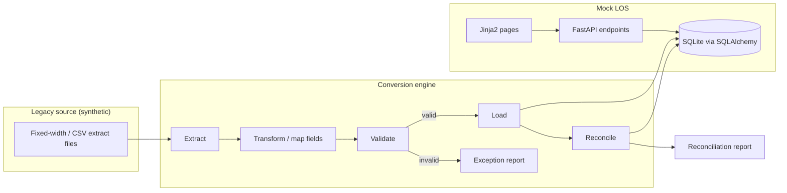
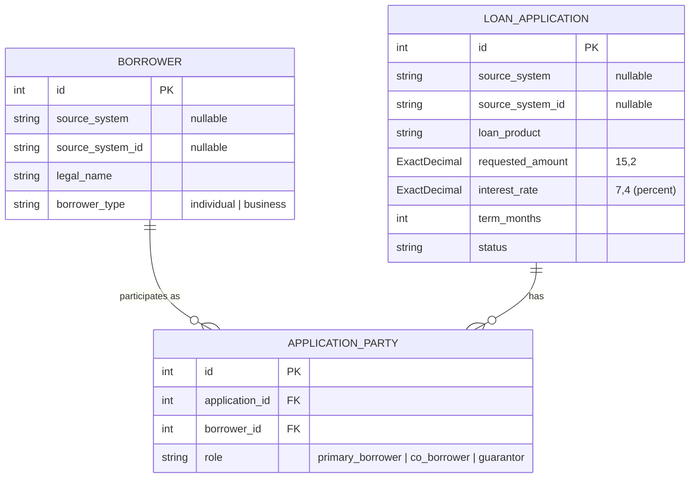

# Architecture

This lab models a common banking scenario: a lender is moving loan records off an older (legacy) system and onto a newer loan origination system. The lab has two halves that meet at a shared database.

> All data is synthetic. Nothing here reflects any real institution, vendor product, or proprietary schema.

## High-level view



## Components

### Mock LOS (`loan_lab.main`, `loan_lab.models`, `loan_lab.web`)

The system of record for loans after conversion. It will eventually support viewing borrowers, applications, and loans.

- **FastAPI** exposes JSON endpoints. Currently only `GET /health` exists.
- **SQLAlchemy 2.x** models (in `models/`) define the target schema stored in SQLite. See
  [LOS data model](#los-data-model) below.
- **Jinja2** templates (in `web/`) will render simple server-side pages.

### Conversion engine (`loan_lab.conversion`)

Moves data from the legacy format into the LOS schema in stages:

1. **Extract** — read synthetic legacy files (e.g., fixed-width or CSV) into raw records.
2. **Transform** — map legacy field names, codes, and formats (dates, amounts, status codes) to the LOS model.
3. **Load** — write transformed records into the LOS database, ideally inside a transaction per batch.

### Validation (`loan_lab.validation`)

Rules applied between transform and load, for example: required fields present, dates parse correctly, amounts are non-negative, codes map to known values. Failed records go to an exception report rather than the database.

### Reconciliation (`loan_lab.reconciliation`)

Proves the conversion was complete and accurate by comparing source and target:

- **Record counts** — records read = records loaded + records rejected.
- **Control totals** — e.g., sum of principal balances in source vs. target.
- **Field-level spot checks** — sampled records compared value by value.

## LOS data model

The initial model (`loan_lab.models`) has three tables:



### Assumptions and limitations

1. **"Borrower" means any party on an application.** A `Borrower` row is an individual or a legal
   entity (`borrower_type` = `individual` or `business`) participating in an application in any role,
   **including guarantors**, who are not borrowers in the lending sense. The name is kept for now for
   simplicity; a future general `Party` model may replace this terminology.

2. **Multiple parties, at most one primary borrower.** An application may have any number of parties
   through `ApplicationParty`. The database enforces:
   - at most one `primary_borrower` per application (a partial unique index), and
   - at most one role per borrower per application (a unique constraint on
     `application_id, borrower_id`).

   It does **not** require an application to have a primary borrower. An application with no parties
   is valid at the database level. Requiring a primary borrower before an application can be
   processed will be enforced later by workflow validation, not by the schema.

3. **No status transition rules.** `status` is limited to a fixed set of values (`draft`,
   `submitted`, `in_review`, `approved`, `declined`, `withdrawn`) and defaults to `draft`, but any
   status can currently be changed to any other. Allowed transitions (for example, a `declined`
   application cannot become `approved`) will be implemented in the application service layer.

4. **Source-system identity is scoped to the originating system.** A borrower's
   `source_system_id` is unique only together with its `source_system` (a unique constraint on the
   pair). The same identifier may appear in different source systems and refer to different people or
   entities. Both fields are optional (records created directly in the LOS have neither), but if one
   is set the other must be too. `LoanApplication` follows the same rule.

5. **Loan products are placeholders.** The `LoanProduct` values (`consumer_auto`,
   `consumer_personal`, `residential_mortgage`, `home_equity`, `commercial_term`,
   `commercial_real_estate`) are demonstration values defined in code. They may later become
   configurable per institution, for example as a reference table.

6. **Synthetic schema.** These models were designed for this lab. They do not represent, derive
   from, or mirror any proprietary vendor, core-banking, or institution schema. All data used with
   them is synthetic.

## Exact decimal storage (`ExactDecimal`)

Money and rates are `Decimal` in Python and are declared with `ExactDecimal(precision, scale)`
(`loan_lab.models.column_types`). SQLite has no exact decimal type — a `NUMERIC` column stores
values as 64-bit floating point — so on SQLite `ExactDecimal` stores a **scaled integer**:

```
stored INTEGER = value × 10^scale
```

| Column | Type | Python value | Stored in SQLite |
| --- | --- | --- | --- |
| `loan_application.requested_amount` | `ExactDecimal(15, 2)` | `Decimal("250000.00")` | `25000000` |
| `loan_application.requested_amount` | `ExactDecimal(15, 2)` | `Decimal("-0.01")` | `-1` |
| `loan_application.interest_rate` | `ExactDecimal(7, 4)` | `Decimal("6.1250")` (6.125%) | `61250` |

On other databases (for example PostgreSQL) the same column is a native `NUMERIC(precision, scale)`.

### Guarantees

- Writes reject `float`, `bool`, NaN, Infinity, values with more than `scale` decimal places, values
  with more than `precision - scale` integer digits, and (on SQLite) scaled values outside the signed
  64-bit range `-2^63 … 2^63 - 1`. Nothing is silently rounded.
- Reads on SQLite reject anything that is not an in-range integer (for example a REAL written by raw
  SQL), instead of reinterpreting it.
- All arithmetic uses a private exact `decimal.Context`, so results do not depend on the caller's
  `decimal.getcontext()` precision or rounding mode.

### Writing SQL against SQLite

Queries built with SQLAlchemy column expressions handle the scale automatically — bound parameters and
results (including `func.sum(LoanApplication.requested_amount)`) pass through `ExactDecimal`:

```python
select(func.sum(LoanApplication.requested_amount))            # -> Decimal("100.35")
select(LoanApplication).where(LoanApplication.requested_amount > Decimal("100.00"))
```

**Raw SQL (`text(...)`, the `sqlite3` shell, DB browsers, reports) sees the scaled integers** and must
apply the scale itself:

```sql
-- Totals come back in minor units (cents for scale 2):
SELECT SUM(requested_amount) FROM loan_application;                 -- 10035 means 100.35

-- Compare against scaled literals:
SELECT * FROM loan_application WHERE requested_amount > 10000;      -- > 100.00
SELECT * FROM loan_application WHERE interest_rate >= 60000;        -- >= 6.0000%

-- Insert scaled integers, never decimals or floats:
UPDATE loan_application SET requested_amount = 25000000 WHERE id = 1;  -- 250000.00
```

Avoid dividing in SQL (`requested_amount / 100.0`) for anything that is reconciled or stored: that
produces a float. Fetch the integer and convert in Python with
`Decimal(raw).scaleb(-scale)`, or let SQLAlchemy do it by selecting the typed column.

## Design principles

- **Separation of concerns** — each stage is its own package and can be tested in isolation.
- **Idempotent, repeatable runs** — the conversion can be rerun against a fresh database.
- **Auditability** — every rejected record and every reconciliation difference is reported, not silently dropped.
- **Synthetic data only** — sample data is generated or hand-written for the lab.

## Current status

Implemented: the application skeleton, `GET /health`, and the initial LOS data model (`Borrower`,
`LoanApplication`, `ApplicationParty`) with exact decimal storage. Not yet implemented: database
migrations, workflow validation and status transitions, conversion stages, reconciliation, and UI.
