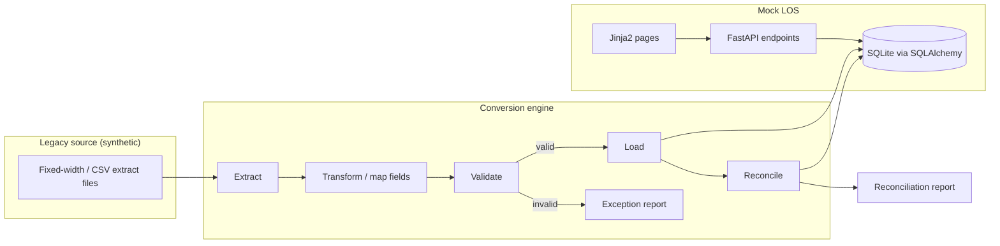

# Architecture

This lab models a common banking scenario: a lender is moving loan records off an older (legacy) system and onto a newer loan origination system. The lab has two halves that meet at a shared database.

> All data is synthetic. Nothing here reflects any real institution, vendor product, or proprietary schema.

## High-level view

## Components

### Mock LOS (`loan_lab.main`, `loan_lab.models`, `loan_lab.web`)

The system of record for loans after conversion. It will eventually support viewing borrowers, applications, and loans.

- **FastAPI** exposes JSON endpoints. Currently only `GET /health` exists.
- **SQLAlchemy 2.x** models (in `models/`) will define the target schema stored in SQLite.
- **Jinja2** templates (in `web/`) will render simple server-side pages.

### Conversion engine (`loan_lab.conversion`)

Moves data from the legacy format into the LOS schema in stages:

1. **Extract** — read synthetic legacy files (e.g., fixed-width or CSV) into raw records.
2. **Transform** — map legacy field names, codes, and formats (dates, amounts, status codes) to the LOS model.
3. **Load** — write transformed records into the LOS database, ideally inside a transaction per batch.

### Validation (`loan_lab.validation`)

Rules applied between transform and load, for example: required fields present, dates parse correctly, amounts are non-negative, codes map to known values. Failed records go to an exception report rather than the database.

### Reconciliation (`loan_lab.reconciliation`)

Proves the conversion was complete and accurate by comparing source and target:

- **Record counts** — records read = records loaded + records rejected.
- **Control totals** — e.g., sum of principal balances in source vs. target.
- **Field-level spot checks** — sampled records compared value by value.

## Design principles

- **Separation of concerns** — each stage is its own package and can be tested in isolation.
- **Idempotent, repeatable runs** — the conversion can be rerun against a fresh database.
- **Auditability** — every rejected record and every reconciliation difference is reported, not silently dropped.
- **Synthetic data only** — sample data is generated or hand-written for the lab.

## Current status

Only the application skeleton and `GET /health` are implemented. Models, conversion stages, validation rules, reconciliation, and UI are planned.
