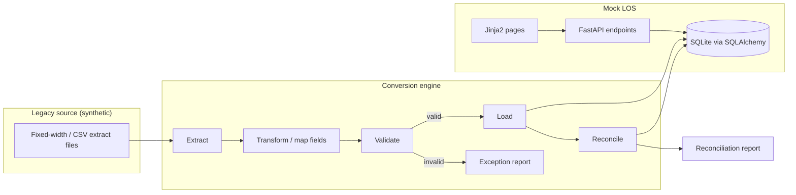
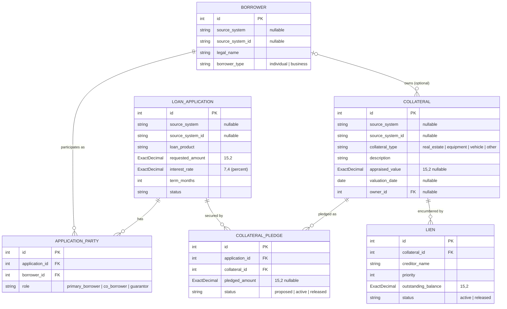
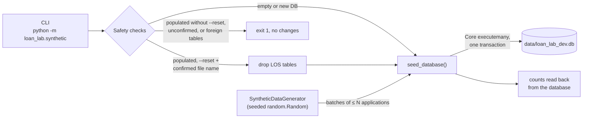

# Architecture

This lab models a common banking scenario: a lender is moving loan records off an older (legacy) system and onto a newer loan origination system. The lab has two halves that meet at a shared database.

> All data is synthetic. Nothing here reflects any real institution, vendor product, or proprietary schema.

## High-level view



## Components

### Mock LOS (`loan_lab.main`, `loan_lab.models`, `loan_lab.web`)

The system of record for loans after conversion. It will eventually support viewing borrowers, applications, and loans.

- **FastAPI** exposes JSON endpoints. Currently only `GET /health` exists.
- **SQLAlchemy 2.x** models (in `models/`) define the target schema stored in SQLite. See
  [LOS data model](#los-data-model) below.
- **Jinja2** templates (in `web/`) render a read-only interface. See
  [Read-only web interface](#read-only-web-interface-loan_labweb) below.

### Conversion engine (`loan_lab.conversion`)

Moves data from the legacy format into the LOS schema in stages:

1. **Extract** — read synthetic legacy files (e.g., fixed-width or CSV) into raw records.
2. **Transform** — map legacy field names, codes, and formats (dates, amounts, status codes) to the LOS model.
3. **Load** — write transformed records into the LOS database, ideally inside a transaction per batch.

The source data contract for the first conversion (borrowers, applications, and party
relationships from a fictional legacy CSV extract) is defined in
[conversion-specification.md](conversion-specification.md). Sample files are in
`sample_data/legacy/`.

**Phase 1 (implemented): planning only.** `loan_lab.conversion.legacy` reads an extract, validates
it, and produces an immutable `ConversionPlan`. It never opens a database.

| Module | Responsibility |
| --- | --- |
| `contract.py` | File layouts, code tables, formats, and stable rule codes, expressed as data |
| `source.py` | Reads the files and applies the run-level checks (RUN-01 to RUN-06). Raises `SourceValidationError` so nothing is planned from a bad extract. |
| `transforms.py` | Pure, exact conversions: names, amounts, rates, terms |
| `planner.py` | Record-level stages in spec order: structure, duplicates, exclusions, source checks, mapping, references, conversion units, warnings |
| `loader.py` | Phase 2: RUN-07, schema creation, and the single load transaction (below) |
| `run.py` | Run lifecycle and evidence: reserves `output/conversion/<run_id>/`, archives the source, records validation failures, verifies the source (RUN-08), calls the loader, writes `manifest.json` and `reports/load_result.json`, and recovers, formally fails, or checks the readiness of a run |
| `cli.py` | `python -m loan_lab.conversion.legacy`: reserve a run, validate and plan the extract, then load it with evidence |
| `plan.py` | Frozen result types. Every source row gets one disposition, a dependent flag, rule codes, root causes, its raw line, and its mapped target values. Also holds conversion units, amount totals by disposition, and the unmapped-field inventory. |

```powershell
python -c "from pathlib import Path; from loan_lab.conversion.legacy import plan_conversion; p = plan_conversion(Path('sample_data/legacy')); print(p.amounts)"
```

**Phase 2 (implemented): transactional target loading.** `loader.py` consumes a `ConversionPlan`
unchanged and writes it to a new, isolated SQLite database (spec section 11):

| Step | Behavior |
| --- | --- |
| Run ID | Must be one safe path segment (`[A-Za-z0-9][A-Za-z0-9_-]{0,63}`); `new_run_id()` gives a UTC timestamp plus a random suffix. |
| RUN-07 | `data/conversion/<run_id>/` (and, through `run_load`, `output/conversion/<run_id>/`) must not exist; `loan_lab_conversion.db` is created exclusively and must contain no schema objects. Otherwise `TargetPreconditionError` is raised and no existing file is touched. |
| Schema | Created from the current models (`Base.metadata`) in its own transaction. |
| Load | One `BEGIN IMMEDIATE` transaction: borrowers, then applications, then parties, in batches (`batch_size`, default 1,000) with `INSERT ... RETURNING id`. Party foreign keys come from the in-memory crosswalks. |
| Failure | Any error after the database file is created (database constraint, inexact decimal, inconsistent plan, commit failure) rolls back and raises `LoadFailedError` with the run ID, database path, planned counts and amount, and the cause. The database keeps only its empty schema as evidence and the run ID is spent. |
| Result | `LoadResult`: counts, requested amount (exact `Decimal`), and read-only crosswalks `CUST_NO → Borrower.id`, `APPL_NO → LoanApplication.id`, and `(APPL_NO, CUST_NO) → ApplicationParty.id`. |

The loader makes no data decisions: it inserts exactly `plan.borrowers_to_load`,
`applications_to_load`, and `parties_to_load`. Valid customers with no converted application
(WN-01) load like any other customer. A party whose application or borrower is not in the plan
fails the load instead of being skipped. pysqlite normally runs DDL outside transactions and
begins them lazily, so the loader disables driver transaction handling and issues `BEGIN IMMEDIATE`
itself. That makes both the schema step and the load step atomic. There is no reset, overwrite,
or delete option; failed and successful run directories stay until someone deliberately removes
them.

**Run evidence.** `run_conversion(source_directory, run_id)` (used by the CLI) reserves the run,
archives and validates the source, plans it, and loads it. `run_load(plan, source_directory,
run_id)` does the same for a plan built beforehand. Both record every outcome under
`output/conversion/<run_id>/` (spec sections 2.2 and 13):

| Step | Behavior |
| --- | --- |
| Reserve | `output/conversion/<run_id>/` is created with `exist_ok=False` **before source validation**. If it exists, `TargetPreconditionError` (RUN-07) is raised and nothing is written anywhere. Every run ID, including a failed one, is spent. |
| Manifest | `manifest.json` is written at once with status `STARTED` (`VALIDATED` for `run_load`), and replaced at each later step. |
| Archive | Each source file that exists and is a regular file is streamed into `source/`, hashing the bytes read; the copy is hashed again. A missing or unreadable file is recorded with an `error`. |
| Validate | `run_conversion` only. A `SourceValidationError` (RUN-01 to RUN-06) makes the run `FAILED` at stage `validation`, with every issue in `validation.issues`, and raises `SourceRunFailedError`. No `data/conversion/<run_id>/` directory or database is created. |
| Verify (RUN-08) | The archived checksums must equal `plan.source_checksums`, which the planner recorded. Otherwise the run is `FAILED` (`verify_source`, RUN-08) before any database exists, and the archive keeps the changed bytes. |
| Loading | `LOADING`, `database_transaction: in_progress`, and the database path are written **before** `load_plan` starts. |
| Load | `load_plan` as above. A RUN-07 refusal for the database directory or a `LoadFailedError` is recorded as `FAILED` with the step (`reserve_database`, `create_schema`, `insert_borrowers`, `insert_applications`, `insert_parties`, or `commit`), or as `UNKNOWN` if read-back does not confirm the rollback. |
| Read-back | The database is then opened read-only (`mode=ro`, `PRAGMA query_only`) to count LOS rows, sum `requested_amount`, and hash the file, after success and after a failure alike. |
| Finish | `reports/load_result.json` and the final manifest. Status is `LOADED`, with `ready_for_reconciliation: true`, only after the load committed and both files were written. |

The manifest records the run `status`, the `database_transaction` state, and the `evidence.state`
separately. Every JSON file is written to a temporary file in the same directory, flushed with
`fsync`, and moved into place with `os.replace`, so an interrupted write leaves the previous
version. Failures raise `SourceRunFailedError` or `LoadRunFailedError` (both `RunFailedError`, with
`stage`, `step`, `rule`, and `reason`) after the evidence is written. Any other exception,
including `KeyboardInterrupt`, is settled by inspecting the database read-only (`FAILED` with
outcome `interrupted` if no business rows exist, `UNKNOWN` if that cannot be verified) and is then
re-raised.

**Evidence failure after commit.** If the load commits but the read-back, report, or final manifest
fails, the committed database is left exactly as it is. The manifest stays `LOADING` and, where it
can still be written, records `database_transaction: committed`, `evidence.state: incomplete`, and
`ready_for_reconciliation: false`. `EvidenceIncompleteError` is raised. Three functions then
operate on the evidence only, never on the database:

| Function | Behavior |
| --- | --- |
| `recover_run(run_id)` | Settles a `STARTED`, `VALIDATED`, `LOADING`, or `UNKNOWN` run. Classifies the run's database read-only: exactly the planned counts and amount, with no `-journal`/`-wal` file, gives `LOADED` (report rewritten, marked recovered); no database or no business rows gives `FAILED` (unless the run was recorded as committed); anything else gives `UNKNOWN` with evidence `unverified`. A final run is returned unchanged. |
| `fail_run(run_id, reason)` | Formally fails a non-final run (for example `UNKNOWN`) with step `formally_failed`. Refuses a run that is already `LOADED` or `FAILED`. |
| `check_ready(run_id)` | Lists every reason a run is not ready for reconciliation: status, transaction, evidence state, ready flag, source verification, the load report, and the database checksum. |

None of them reloads data, re-runs a run ID, or writes to a database. There is no command-line
entry point for them yet.

**Manual verification (Windows PowerShell, from the project root):**

```powershell
# 1. Record the development database checksum (it must not change).
$dev = (Get-FileHash data\loan_lab_dev.db).Hash

# 2. Plan and load the sample extract into a new run.
python -m loan_lab.conversion.legacy sample_data\legacy --run-id manual-check-1
#    Expect: Borrowers 16 read / 11 loaded / 1 excluded / 4 rejected,
#            Applications 13 / 6 / 2 / 5, Parties 20 / 10 / 3 / 7,
#            requested amount loaded 2281000.00, and WN-01 customers 00010008, 00010009, 00010015.

# 3. Query the new database independently.
@'
import sqlite3
db = sqlite3.connect("file:data/conversion/manual-check-1/loan_lab_conversion.db?mode=ro", uri=True)
for table in ("borrower", "loan_application", "application_party"):
    print(table, db.execute(f"SELECT count(*) FROM {table}").fetchone()[0])
print("requested", db.execute("SELECT sum(requested_amount) FROM loan_application").fetchone()[0])
print(db.execute("SELECT source_system, source_system_id, requested_amount, interest_rate "
                 "FROM loan_application ORDER BY id LIMIT 1").fetchone())
'@ | python -
#    Expect: 11, 6, 10; requested 228100000 (ExactDecimal stores cents as an integer);
#            ('LEGACY_LOS', '0000500101', 125000000, 65000), i.e. 1,250,000.00 at 6.5000%.

# 4. Inspect the evidence package.
Get-ChildItem -Recurse -File output\conversion\manual-check-1 | Select-Object FullName
Get-Content output\conversion\manual-check-1\reports\load_result.json
#    Expect: manifest.json, reports\load_result.json, and the four files under source\;
#            "success": true, "loaded" 11 / 6 / 10 with "requested_amount": "2281000.00",
#            and both transactions "committed". In manifest.json: "status": "LOADED" and
#            "verified": true for every source file.

# 5. The archived copies match the original files.
Get-ChildItem sample_data\legacy | ForEach-Object {
    (Get-FileHash $_.FullName).Hash -eq (Get-FileHash "output\conversion\manual-check-1\source\$($_.Name)").Hash
}   # True four times

# 6. Reusing the run ID is refused (exit code 3, RUN-07) and nothing changes.
python -m loan_lab.conversion.legacy sample_data\legacy --run-id manual-check-1; $LASTEXITCODE

# 7. The development database is untouched.
(Get-FileHash data\loan_lab_dev.db).Hash -eq $dev   # True

# 8. An invalid extract still leaves a FAILED run, but no database.
python -m loan_lab.conversion.legacy missing-folder --run-id manual-check-2; $LASTEXITCODE
#    Expect: exit code 2 and RUN-01 for each file.
Get-Content output\conversion\manual-check-2\manifest.json
#    Expect: "status": "FAILED", "failure" stage "validation", the RUN-01 issues under
#            "validation", and "database_transaction": "not_started".
Test-Path data\conversion\manual-check-2   # False

# 9. Readiness and recovery (library functions; no CLI yet).
@'
from loan_lab.conversion.legacy import check_ready, recover_run
print(check_ready("manual-check-1"))
print(recover_run("manual-check-1"))
'@ | python -
#    Expect: problems=() for the loaded run, and "The run is already final." with changed=False.
```

Exit codes: 0 loaded, 2 source validation failure (evidence only, no database), 3 RUN-07 refusal,
4 load failure (rolled back, or unverified), 5 source changed since planning (RUN-08), 6 the load
committed but its evidence is incomplete (recover the run). Remove `data\conversion\manual-check-1`
and `output\conversion\manual-check-1` and `manual-check-2` by hand when they are no longer needed.

Reconciliation, the exception, exclusion, warning, and unmapped-field reports, `run.log`, and
release approval are not implemented. The source files are only read, never moved or modified.

### Validation (`loan_lab.validation`)

Rules applied between transform and load, for example: required fields present, dates parse correctly, amounts are non-negative, codes map to known values. Failed records go to an exception report rather than the database.

### Reconciliation (`loan_lab.reconciliation`)

Proves the conversion was complete and accurate by comparing source and target:

- **Record counts** — records read = records loaded + records rejected.
- **Control totals** — e.g., sum of principal balances in source vs. target.
- **Field-level spot checks** — sampled records compared value by value.

## LOS data model

The model (`loan_lab.models`) has six tables: parties and applications, plus collateral.



### Assumptions and limitations

1. **"Borrower" means any party on an application.** A `Borrower` row is an individual or a legal
   entity (`borrower_type` = `individual` or `business`) participating in an application in any role,
   **including guarantors**, who are not borrowers in the lending sense. The name is kept for now for
   simplicity; a future general `Party` model may replace this terminology.

2. **Multiple parties, at most one primary borrower.** An application may have any number of parties
   through `ApplicationParty`. The database enforces:
   - at most one `primary_borrower` per application (a partial unique index), and
   - at most one role per borrower per application (a unique constraint on
     `application_id, borrower_id`).

   It does **not** require an application to have a primary borrower. An application with no parties
   is valid at the database level. Requiring a primary borrower before an application can be
   processed will be enforced later by workflow validation, not by the schema.

3. **No status transition rules.** `status` is limited to a fixed set of values (`draft`,
   `submitted`, `in_review`, `approved`, `declined`, `withdrawn`) and defaults to `draft`, but any
   status can currently be changed to any other. Allowed transitions (for example, a `declined`
   application cannot become `approved`) will be implemented in the application service layer.

4. **Source-system identity is scoped to the originating system.** A borrower's
   `source_system_id` is unique only together with its `source_system` (a unique constraint on the
   pair). The same identifier may appear in different source systems and refer to different people or
   entities. Both fields are optional (records created directly in the LOS have neither), but if one
   is set the other must be too. `LoanApplication` and `Collateral` follow the same rule.

5. **Loan products are placeholders.** The `LoanProduct` values (`consumer_auto`,
   `consumer_personal`, `residential_mortgage`, `home_equity`, `commercial_term`,
   `commercial_real_estate`) are demonstration values defined in code. They may later become
   configurable per institution, for example as a reference table.

6. **Synthetic schema.** These models were designed for this lab. They do not represent, derive
   from, or mirror any proprietary vendor, core-banking, or institution schema. All data used with
   them is synthetic.

### Collateral assumptions and limitations

1. **Collateral is independent of any one application.** A `Collateral` row describes an asset. It
   is linked to applications through `CollateralPledge`, so one application can be secured by
   several assets and the same asset can secure several applications. The database allows at most
   one pledge row per application-collateral pair. Collateral that is still pledged cannot be
   deleted. Deleting an application removes its pledges but keeps the collateral.

2. **Pledged amount is optional and unvalidated against value.** `pledged_amount`, when present,
   must be positive. It is **not** checked against `appraised_value`, the loan's `requested_amount`,
   or other pledges of the same asset, so pledges across applications may add up to more than the
   appraised value. Those are collateral policy rules and are not implemented.

3. **Valuation may be missing; at most one appraisal per asset.** `appraised_value` and
   `valuation_date` are both optional, independently of each other, so incomplete legacy collateral
   records can be imported as-is. A missing value is stored as `NULL`. No default value or date is
   ever filled in, and a missing appraisal must never be replaced with a placeholder such as `0` or
   the import date. When `appraised_value` is provided, it must be positive. Only the current
   valuation is kept. There is no valuation history, appraisal source, or staleness rule.
   `valuation_date` is a calendar date with no time zone.

   **A successful import does not mean a record is ready for underwriting.** The schema accepts
   collateral without a valuation, and that collateral can already be pledged to an application.
   Valuation requirements, such as requiring a current appraisal for certain collateral types or
   before an application moves past a given status, will be enforced later by workflow validation
   where applicable. Until then, code and reports must treat `NULL` as "unknown", not "zero". For
   example, a total of appraised values over records with missing valuations is incomplete, not
   lower.

4. **Owner is an optional reference to `Borrower`.** The owner does not have to be a party on the
   applications the asset secures (for example, a third-party pledgor). Joint or fractional ownership
   is not modeled. A borrower who owns collateral cannot be deleted.

5. **Lien priority is recorded data, not a computed legal ranking.** `priority` is the positive
   position number reported by the source (1 = first). It is **not unique** per collateral, so two
   liens may report the same position, and released liens keep their original number. The model does
   not infer that a lien with a higher number is legally subordinate. Actual priority can depend on
   recording dates, subordination agreements, and statutory liens such as taxes. `Collateral.liens`
   is ordered by insertion (`id`), not by `priority`.

6. **Lien balances are independent of loan amounts.** `outstanding_balance` (zero or more) is the
   balance reported for that lien. It is not derived from, or required to match, any application's
   `requested_amount`. A lien is not linked to a `LoanApplication`, including liens the lender itself
   might hold.

7. **Hard deletes are a prototype limitation.** Collateral and liens are physically deleted: deleting
   a `Collateral` row also deletes its liens, and a `Lien` row can be deleted on its own. Nothing keeps
   a deleted record, who deleted it, when, or why. Pledged collateral and borrowers who own
   collateral are protected from deletion, but that is referential integrity, not an audit trail. A
   production system needs audit and retention controls before collateral and lien data can be
   relied on, for example soft deletes or status-based retirement, change history, and retention
   rules. Until those exist, prefer marking records `released` over deleting them.

8. **Out of scope:** loan-to-value (LTV) calculations, valuation policy and valuation-requirement
   workflow, haircuts or advance rates, lien perfection or recording details, collateral status
   workflows, and audit/retention controls.

## Exact decimal storage (`ExactDecimal`)

Money and rates are `Decimal` in Python and are declared with `ExactDecimal(precision, scale)`
(`loan_lab.models.column_types`). SQLite has no exact decimal type — a `NUMERIC` column stores
values as 64-bit floating point — so on SQLite `ExactDecimal` stores a **scaled integer**:

```
stored INTEGER = value × 10^scale
```

| Column | Type | Python value | Stored in SQLite |
| --- | --- | --- | --- |
| `loan_application.requested_amount` | `ExactDecimal(15, 2)` | `Decimal("250000.00")` | `25000000` |
| `loan_application.requested_amount` | `ExactDecimal(15, 2)` | `Decimal("-0.01")` | `-1` |
| `loan_application.interest_rate` | `ExactDecimal(7, 4)` | `Decimal("6.1250")` (6.125%) | `61250` |

On other databases (for example PostgreSQL) the same column is a native `NUMERIC(precision, scale)`.

### Guarantees

- Writes reject `float`, `bool`, NaN, Infinity, values with more than `scale` decimal places, values
  with more than `precision - scale` integer digits, and (on SQLite) scaled values outside the signed
  64-bit range `-2^63 … 2^63 - 1`. Nothing is silently rounded.
- Reads on SQLite reject anything that is not an in-range integer (for example a REAL written by raw
  SQL), instead of reinterpreting it.
- All arithmetic uses a private exact `decimal.Context`, so results do not depend on the caller's
  `decimal.getcontext()` precision or rounding mode.

### Writing SQL against SQLite

Queries built with SQLAlchemy column expressions handle the scale automatically — bound parameters and
results (including `func.sum(LoanApplication.requested_amount)`) pass through `ExactDecimal`:

```python
select(func.sum(LoanApplication.requested_amount))            # -> Decimal("100.35")
select(LoanApplication).where(LoanApplication.requested_amount > Decimal("100.00"))
```

**Raw SQL (`text(...)`, the `sqlite3` shell, DB browsers, reports) sees the scaled integers** and must
apply the scale itself:

```sql
-- Totals come back in minor units (cents for scale 2):
SELECT SUM(requested_amount) FROM loan_application;                 -- 10035 means 100.35

-- Compare against scaled literals:
SELECT * FROM loan_application WHERE requested_amount > 10000;      -- > 100.00
SELECT * FROM loan_application WHERE interest_rate >= 60000;        -- >= 6.0000%

-- Insert scaled integers, never decimals or floats:
UPDATE loan_application SET requested_amount = 25000000 WHERE id = 1;  -- 250000.00
```

Avoid dividing in SQL (`requested_amount / 100.0`) for anything that is reconciled or stored: that
produces a float. Fetch the integer and convert in Python with
`Decimal(raw).scaleb(-scale)`, or let SQLAlchemy do it by selecting the typed column.

## Synthetic data generator (`loan_lab.synthetic`)

A development-only tool that fills a SQLite database with fictional LOS data. It is separate from
the FastAPI app: `loan_lab.main` does not import it, and nothing is seeded on startup.



| Module | Responsibility |
| --- | --- |
| `generator.py` | Builds rows as plain dicts, one application at a time, grouped into `Batch` objects. Has no database access. |
| `seeding.py` | Creates tables, refuses non-empty LOS tables, inserts batches in foreign-key order inside one transaction, and returns counts. |
| `cli.py` | Parses presets and options, checks the target database, handles reset confirmation, and prints the summary. |

### Commands (Windows PowerShell)

```powershell
python -m loan_lab.synthetic --preset small     # 25 applications
python -m loan_lab.synthetic --preset demo      # 5,000 applications
python -m loan_lab.synthetic --preset stress    # 100,000 applications
python -m loan_lab.synthetic --preset demo --reset                              # prompts for file name
python -m loan_lab.synthetic --preset demo --reset --confirm-reset loan_lab_dev.db  # non-interactive
python -m loan_lab.synthetic --preset small --database data\scratch.db --seed 42 --batch-size 500
```

### Determinism

- One `random.Random(seed)` drives every choice (default seed `20261008`), and rows are generated in
  a fixed order. Dates are relative to a fixed `AS_OF_DATE` (2026-09-30), never today's date.
- Row IDs are assigned by the generator starting at 1. That is why seeding requires empty tables.
- Batch size changes only how rows are grouped, not the rows themselves. A smaller preset is the
  first N applications of a larger run with the same seed.
- Money and rates are built with integer arithmetic and `Decimal`. No floats are involved.
- Results are reproducible on the same Python version. Python only guarantees `random`
  sequences for a given version, so a major Python upgrade could change the generated data.

### Memory and batching

The generator is lazy. It yields at most `--batch-size` applications (default 1,000) at a time,
together with their new borrowers, parties, collateral, pledges, and liens. The only state carried
between batches is two bounded pools (250 recent individuals and 250 recent businesses, each business
tracking at most 5 collateral IDs) that let later applications reuse earlier borrowers and collateral.
Memory use therefore does not grow with the preset size.

All batches are inserted in a **single transaction**, so a failed run leaves the LOS tables empty
(rerunnable without `--reset`) rather than partially seeded.

### Safety

- The default target is the dedicated development file `data/loan_lab_dev.db` **under the project
  root**, whichever directory the command is run from. The project root is the nearest folder above
  the installed `loan_lab` package whose `pyproject.toml` is named `loan-origination-conversion-lab`.
  With the editable install, that is the repository folder. If no such folder exists (for example a
  non-editable install), the CLI stops and asks for `--database`. `data/` is git-ignored. Tests
  only use in-memory databases or pytest temporary directories.
- An explicit `--database` path is used as given. Relative paths are resolved against the current
  working directory, like any other command-line path.
- A database with any LOS rows is refused unless `--reset` is passed. A reset then needs a second
  confirmation: typing the database file name at the prompt, or `--confirm-reset <file name>`.
  Without a terminal and without `--confirm-reset`, the reset is refused.
- A reset drops and recreates only the LOS tables. A database containing tables that loan_lab does
  not manage is refused even with `--reset`.
- The printed summary is read back from the database after commit, not counted during generation.

### What gets generated

| Product | Amount range (step) | Terms (months) | Rate range | Parties | Collateral and prior liens |
| --- | --- | --- | --- | --- | --- |
| Consumer auto | $8,000–$75,000 ($100) | 36, 48, 60, 72 | 4.500–11.875% | Individual, 35% with co-borrower | Vehicle |
| Consumer personal | $2,000–$40,000 ($100) | 12–60 | 8.000–19.875% | Individual, 35% with co-borrower | None (unsecured) |
| Residential mortgage | $120,000–$1,200,000 ($1,000) | 180, 240, 360 | 5.250–7.750% | Individual, 35% with co-borrower | Residence. 30% have a prior first lien (refinance). |
| Home equity | $15,000–$250,000 ($500) | 60, 120, 180, 240 | 6.500–10.500% | Individual, 35% with co-borrower | Residence with a prior first mortgage. 15% also have a second lien, active or released. |
| Commercial term | $50,000–$2,000,000 ($1,000) | 36, 60, 84, 120 | 6.750–10.250% | Business, 0–2 individual guarantors | Equipment. 10% have a prior lien. |
| Commercial real estate | $250,000–$5,000,000 ($5,000) | 60–300 | 6.250–9.000% | Business, 0–2 individual guarantors | Commercial property. 25% have a prior first lien. |

- Rates are multiples of 0.125 percentage points. Application statuses follow a fixed distribution.
  Pledge status follows the application status: approved → `active`, declined or withdrawn →
  `released`, and anything else → `proposed`.
- About 8% of individuals and 20% of businesses are reused from earlier applications. A reused business
  pledges one of its existing collateral items to the new application 40% of the time, which creates
  shared collateral.
- **Collateral ownership:** new collateral is normally owned by the application's primary borrower.
  When the application also has a guarantor or co-borrower, 10% of the time one of them owns the
  collateral instead. This happens for about 5% of all collateral (206 of 4,249 items in the demo
  preset). The owner is therefore always a party on the application. Collateral owned by a
  guarantor or co-borrower is pledged only to that one application. Only business-owned
  collateral is reused for the business's later applications, so an owner is a party on every
  application its collateral secures. No unrelated third-party owners are generated.
- Appraised values are whole dollars derived from the requested amount. Prior lien balances include
  cents and stay below the collateral value. They are generated independently of the requested loan
  amount.
- **Missing valuations:** for applications in `draft` or `submitted` status, 40% of new collateral has
  a pending appraisal. Both `appraised_value` and `valuation_date` are left `NULL`, and the pledge
  gets no `pledged_amount`. No substitute value or date is ever generated.
- Source-system reference columns are left `NULL` because these records are treated as created
  directly in the LOS.
- Names, addresses, and creditors come from fictional word lists. Creditor names include "Example".

### Oak Ridge scenario

The first two applications in every run are a fixed reference scenario. It uses no random numbers,
so it is identical for every seed, and it always has IDs 1 and 2:

| Item | Details |
| --- | --- |
| Borrower | Oak Ridge Properties LLC (business), primary borrower on both applications |
| Guarantor | Dana R. Whitfield (individual), guarantor on both applications |
| Application 1 | Commercial real estate, $500,000.00 at 6.8750% for 120 months, `in_review` |
| Application 2 | Commercial term (equipment), $75,000.00 at 7.5000% for 84 months, `submitted` |
| Shared collateral | Office building at 410 Oak Ridge Parkway, owned by Oak Ridge, valued at $725,000.00 on 2026-05-14. Pledged to application 1 ($500,000.00) and application 2 (no amount). |
| Equipment collateral | HVAC and building-systems package, owned by Oak Ridge, valued at $150,000.00 on 2026-06-02. Pledged to application 2 ($75,000.00). |
| Existing lien | Harbor Example Savings Bank, priority 1, $200,000.00 outstanding, active, on the office building |

Both applications fall within their products' amount, rate, and term ranges. The existing lien
($200,000) is independent of either loan amount.

### Not included

The generator does not produce legacy conversion exports or intentionally corrupted records, and it
does not implement conversion logic. Those will come with the conversion engine.

## Read-only web interface (`loan_lab.web`)

Server-rendered pages over the development database (`data/loan_lab_dev.db`):

| Route | Page |
| --- | --- |
| `GET /` | Dashboard: application count, requested volume, average request, unvalued collateral, product and status breakdowns |
| `GET /applications` | Directory with search (`q`), `product`, `status`, `page`, `page_size` |
| `GET /applications/{id}` | Terms, parties and roles, pledged collateral, appraisal, owner, other applications sharing the collateral, liens |

| Module | Responsibility |
| --- | --- |
| `database.py` | Read-only engine and per-request session |
| `queries.py` | All SQL: aggregates, the directory page, and the eager-loaded detail graph |
| `routes.py` | Input validation and template context |
| `formatting.py` | Jinja filters for money, rates, dates, and labels |
| `setup.py` | Wires routes, static files, and HTML error pages into the FastAPI app |

### Read-only guarantees

- The engine opens SQLite with a `file:…?mode=ro` URI and sets `PRAGMA query_only = ON`, so
  writes fail at the driver level and a missing file is never created.
- Only `GET` routes exist; other methods return `405`.
- The app never seeds data. A missing or empty database returns a `503` page naming the seeding
  command.

### Query and input handling

- **Fixed query counts.** Dashboard: 3 queries. Directory: 2 (count and page). Detail: 5,
  whatever the number of parties, pledges, or liens. The detail query ends with
  `raiseload("*")`, so an accidental lazy load raises an error instead of issuing extra SQL.
- **Parameterized SQL only.** Search uses `ILIKE`-style matching with `autoescape=True`, so `%`
  and `_` are matched literally. Search matches any party's name, or an application ID such as
  `42` or `#42`.
- **Validated inputs.** Product and status must be known enum values; page is 1–1,000,000;
  page size is 10, 25, 50, or 100; search text is at most 100 printable characters. Anything
  else returns a `400` page. A page beyond the last returns `404`.
- **Escaping.** Jinja2 autoescaping is on for all templates; user-supplied and stored text is
  never marked safe.
- **Unknown values.** A missing appraisal shows as "Unknown", never `$0`. A missing pledged
  amount shows as "Not specified".

### Limitations

- No authentication, editing, workflow transitions, or conversion views.
- Offset pagination. Deep pages on very large datasets get slower, and there is no column
  sorting.
- SQLite's `LIKE` is case-insensitive for ASCII letters only.
- No Content-Security-Policy or other security headers are set yet. Share bars use an inline
  `style` custom property, so a strict CSP would need `style-src 'unsafe-inline'` or a
  different approach.
- Lien priority is displayed as recorded; it is not a computed legal ranking.

## Design principles

- **Separation of concerns** — each stage is its own package and can be tested in isolation.
- **Idempotent, repeatable runs** — the conversion can be rerun against a fresh database.
- **Auditability** — every rejected record and every reconciliation difference is reported, not silently dropped.
- **Synthetic data only** — sample data is generated or hand-written for the lab.

## Current status

Implemented: the application skeleton, `GET /health`, and the LOS data model (`Borrower`,
`LoanApplication`, `ApplicationParty`, `Collateral`, `CollateralPledge`, `Lien`) with exact decimal
storage, the deterministic synthetic data generator (`loan_lab.synthetic`), and a read-only
web interface (`loan_lab.web`), and phases 1 and 2 of the legacy conversion
(`loan_lab.conversion.legacy`): validation and mapping into a conversion plan, then transactional
loading into an isolated per-run database. Not yet implemented: authentication, editing,
database migrations, workflow validation and status transitions, collateral policy and LTV,
conversion reconciliation, run reports, and release approval.
