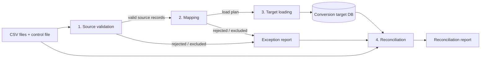
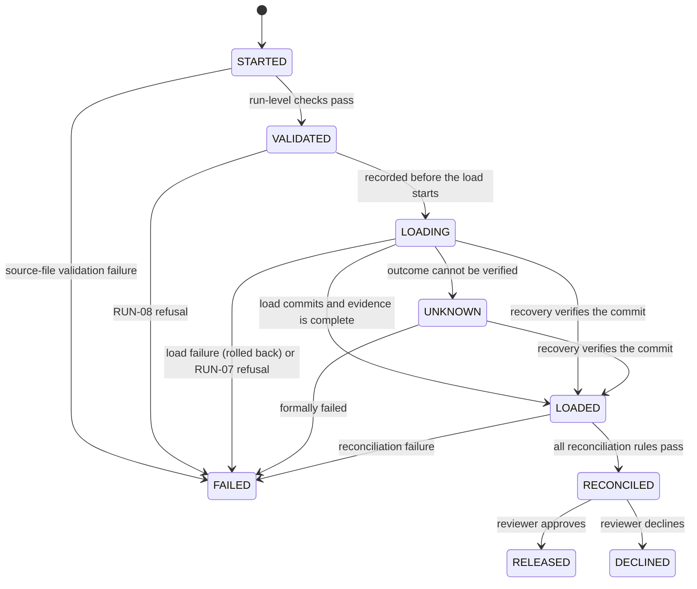
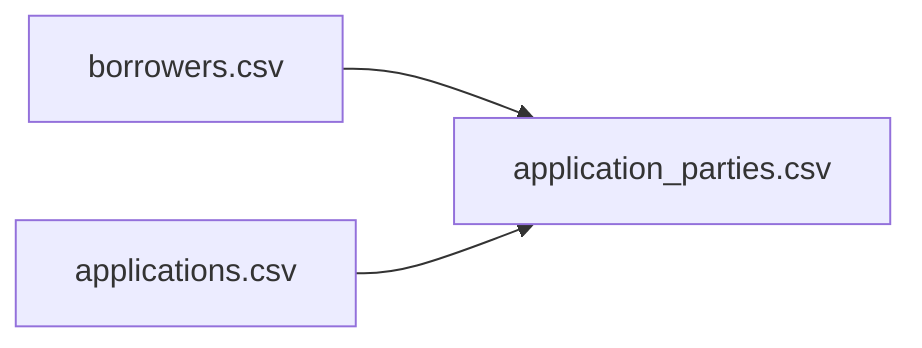

# Legacy LOS CSV Conversion Specification (v1 draft)

This document is the data contract for converting a **fictional legacy loan origination system**
("Legacy LOS") into the lab's LOS schema (`loan_lab.models`). It defines the source files, how
each field is validated and mapped, which records are excluded or rejected, how records depend on
each other, and how the result is reconciled.

> **Synthetic and vendor-neutral.** The Legacy LOS, its file layouts, codes, and every record in
> `sample_data/legacy/` are invented for this lab. They do not describe any real vendor product,
> core-banking system, institution, or person.

**Status:** stages 1–4 are implemented in `loan_lab.conversion.legacy`: source validation and
mapping into a conversion plan (Phase 1), target loading with its run evidence (Phase 2:
`manifest.json`, the verified source archive, and `reports/load_result.json`), including evidence
for source-validation failures and read-only recovery of runs whose evidence is incomplete
(sections 2.2 and 13), the exception, exclusion, and warning reports (section 13.1), and
independent reconciliation (Phase 3 and Milestone 10: RC-01 to RC-12 and
`reports/reconciliation.json`, section 12.1). Every row's disposition, rule codes, dependency,
unit key, root causes, and warnings are determined independently from the archived source
(section 12.3) and compared with the run's evidence and target (RC-11 and RC-12, section 12.4);
new reconciliation reports carry `report_version` 2. Runs reconciled earlier keep their
`report_version` 1 evidence unchanged, with the limits stated in sections 12.1 and 12.6.
Section 12.7 records the converter differences that were corrected before RC-12 was enforced,
and the historical evidence that still shows them. Release approval is not implemented yet.
Nothing in this document changes the existing SQLAlchemy models or the seeded development
database.

## Contents

1. [Scope](#1-scope)
2. [Pipeline stages](#2-pipeline-stages)
3. [Source extract format](#3-source-extract-format)
4. [File layouts](#4-file-layouts)
5. [Source code tables](#5-source-code-tables)
6. [Source-to-target field mapping](#6-source-to-target-field-mapping)
7. [Transformations](#7-transformations)
8. [Record dependencies and reference handling](#8-record-dependencies-and-reference-handling)
9. [Validation rules](#9-validation-rules)
10. [Exclusion criteria](#10-exclusion-criteria)
11. [Target loading](#11-target-loading)
12. [Reconciliation rules](#12-reconciliation-rules)
13. [Exception and run reports](#13-exception-and-run-reports)
14. [Worked examples](#14-worked-examples)
15. [Expected results for the sample extract](#15-expected-results-for-the-sample-extract)
16. [Assumptions](#16-assumptions)
17. [Design decisions and open questions](#17-design-decisions-and-open-questions)

## 1. Scope

In scope for v1:

| Source file | Target model |
| --- | --- |
| `borrowers.csv` | `Borrower` |
| `applications.csv` | `LoanApplication` |
| `application_parties.csv` | `ApplicationParty` |
| `extract_control.csv` | Not loaded. Used only to verify the extract is complete. |

Out of scope for v1: collateral, pledges, liens, payments, documents, credit decisions, delta or
incremental loads, and updates to records that already exist in the target.

Every converted record keeps its legacy identity:

- `source_system` = `LEGACY_LOS` (a constant for this extract).
- `source_system_id` = the legacy key, copied exactly as text.

## 2. Pipeline stages

The conversion runs in four separate stages. Each stage only consumes the previous stage's output.
No stage reaches back to change an earlier decision.



| Stage | Input | Does | Does not | Output |
| --- | --- | --- | --- | --- |
| **1. Source validation** | Raw CSV files | Checks each file and record against the *source* contract: encoding, headers, control counts, formats, required fields, known codes, key uniqueness. Applies the exclusion rules EX-01 to EX-04, then the early dependent exclusion EX-05 (section 10). | Know anything about target models or enums. Look at other files, except the control file and, for EX-05, the applications' exclusion results. | Valid source records (still strings), plus exclusions and rejections |
| **2. Mapping** | Valid source records | Translates codes to target enum values, converts text to `Decimal`/`int`, composes names, and checks target constraints. Resolves references across files and decides whether each conversion unit can be loaded. | Write to the database. | A **load plan** (target-shaped records in dependency order), plus exclusions and rejections |
| **3. Target loading** | Load plan | Inserts the plan in one transaction, in dependency order. | Make any data decisions. If an insert fails, it rolls everything back. | Committed target rows, or nothing |
| **4. Reconciliation** | Source files, exception report, target DB | Re-reads the source and **independently queries the target**, then proves every source row is accounted for and loaded values match. | Trust the load plan as evidence. Fix anything. | Reconciliation report (PASS/FAIL) |

Release approval is not a pipeline stage. It is a separate human decision made after
reconciliation passes (section 2.3).

Each source row that reaches record-level processing ends with exactly one **disposition**:

- **Loaded:** written to the target.
- **Excluded:** deliberately out of scope under section 10. This is not an error.
- **Rejected:** fails a validation rule, or belongs to a rejected conversion unit (section 8.2).
  It appears in the exception report.

### 2.1 Outcome levels

Six kinds of outcome are kept distinct. They differ in scope, in what happens to data, and in what
happens to the run.

| Outcome | Scope | Triggered by | Effect on data | Effect on run | Evidence |
| --- | --- | --- | --- | --- | --- |
| **Source-file validation failure** | Whole extract | A run-level check (RUN-01 to RUN-06) | Nothing is loaded and no target database is created. Rows receive no disposition. | `FAILED` at stage `validation` | `manifest.json` listing every run-level issue with its file and rule, and the archived `source/` files with their checksums |
| **Record rejection** | One source row, or one conversion unit (section 8.2) | A record rule (SV, MP, or RF) | That row, or that unit, is not loaded. Other records continue. | None by itself. The run can still pass. | `exceptions.csv` |
| **Intentional exclusion** | One source row | An exclusion rule (EX) | The row is not loaded. This is not an error. | None | `exclusions.csv` |
| **Load failure** | Whole load | The RUN-07 or RUN-08 precondition (section 9.1), or a database or converter error during schema creation, insert, or commit | RUN-07 and RUN-08: nothing is written to any existing file or database. Otherwise the transaction rolls back, so no converted rows are committed. | `FAILED` at stage `load`, or `UNKNOWN` if the database does not confirm the rollback | `manifest.json` and `reports/load_result.json` with the failing step, the error, the planned counts and amount, transaction states, and the rows found in the database afterwards |
| **Report failure** | Whole run | The exception, exclusion, or warning report cannot be built, disagrees with the plan's row accounting, or cannot be written and verified | Nothing is loaded and no target database is created. Report files already written are kept. | `FAILED` at stage `reports`, evidence `incomplete` | `manifest.json` with the `reports` record (`state: failed`, the error, and any files written) |
| **Reconciliation failure** | Whole run | Any reconciliation rule (RC-01 to RC-12) does not match | Committed rows are **kept unchanged** for troubleshooting but cannot be released. | `FAILED` at stage `reconciliation` | `reports/reconciliation.json` with a discrepancy record (rule, source file, line and key, target table and ID, field, expected and actual values) for every mismatch |
| **Release approval** | Whole run | A named reviewer's sign-off after reconciliation passes | The conversion database is accepted as the run's output. | `RELEASED` | Approval record in the run manifest |

Record rejections and exclusions are expected parts of a successful run. A run whose records are
all rejected can still reconcile, because reconciliation proves *accounting and accuracy*, not
data quality. Whether the rejection level is acceptable is a decision for release approval
(section 2.3).

### 2.2 Run status

Every run has a run ID and a status recorded in its manifest (section 13):



`FAILED`, `RELEASED`, and `DECLINED` are final. A failed or declined run is never resumed or
patched. After the cause is fixed, a **new run** starts with a new run ID and a new, empty
conversion database. `FAILED` always records the failing stage: `validation`, `reports`
(section 13.1), `load`, or `reconciliation`.

**Run status, database transaction, and evidence are recorded separately.** The manifest keeps
three independent facts, so a reporting failure can never make a committed load look as if it
never happened:

| Manifest field | Values | Meaning |
| --- | --- | --- |
| `status` | `STARTED`, `VALIDATED`, `LOADING`, `LOADED`, `RECONCILED`, `FAILED`, `UNKNOWN` (`RELEASED` and `DECLINED` once release approval exists) | Where the run is in its lifecycle |
| `database_transaction` | `not_started`, `in_progress`, `committed`, `rolled_back`, `not_committed`, `unknown` | Whether business rows were committed. `not_committed` and `unknown` are established by read-only inspection. |
| `evidence.state` | `in_progress`, `complete`, `incomplete`, `unverified` | Whether the manifest and report fully describe the database |
| `ready_for_reconciliation` | `true` or `false` | `true` only for `LOADED` with `committed` and `complete` evidence, and no reconciliation attempt recorded |
| `reconciliation.state` | absent, `in_progress`, `unfinalized`, `conflict`, `final` | Where reconciliation's own evidence stands (section 12.2). The status stays `LOADED` until `final`. |

- `LOADING` is written **before** the load starts. If the run stops at any point after that, the
  manifest says `LOADING`, never `VALIDATED`, so a load that may have happened is never hidden.
- If the load commits but writing the final report or manifest fails, the run stays `LOADING`
  with `database_transaction: committed` (when that can still be recorded),
  `evidence.state: incomplete`, and `ready_for_reconciliation: false`. It is **not ready** for
  reconciliation or release until its evidence is repaired by recovery or the run is formally
  failed.
- **Recovery** (`recover_run`) settles a run left in `STARTED`, `VALIDATED`, `LOADING`, or `UNKNOWN`. It
  inspects the run's own database **read-only** (a `mode=ro` connection with `query_only`) and
  rewrites only the run's manifest and load report. It never reloads data, creates or modifies a
  database, or touches another run:

  | Found | Result |
  | --- | --- |
  | Status `UNKNOWN` | Classified again as below, so a commit can be verified later |
  | `STARTED` (validation was interrupted) | `FAILED` at stage `validation`; no database exists |
  | `VALIDATED` (interrupted before the load started) | `FAILED` at stage `load`, `not_started` |
  | Database holds exactly the planned rows and requested amount, with no leftover transaction files | `LOADED`, `committed`, evidence `complete` and marked recovered |
  | No database, or no business rows, and the load was never recorded as committed | `FAILED` at stage `load`, `not_committed` |
  | A `-journal` or `-wal` file is present, the database cannot be read, the counts or amount differ from the plan, or a load recorded as committed has no database or no rows | `UNKNOWN`, `unknown`, evidence `unverified` |

- `UNKNOWN` means the outcome could not be verified; it is reported rather than guessed. An
  `UNKNOWN` run is never ready for reconciliation. It is closed by **formally failing** it
  (`fail_run`), which records `FAILED` with step `formally_failed` and leaves the database and
  `database_transaction` untouched. A settled run (`LOADED`, `RECONCILED`, or `FAILED`) is never
  changed by recovery or by `fail_run`; only reconciliation moves a `LOADED` run on. The one
  exception: `fail_run` can formally fail a `LOADED` run whose reconciliation is `in_progress`,
  `unfinalized`, or `conflict`, at stage `reconciliation`, keeping all its evidence (section 12.2).
- `check_ready` confirms a run may proceed to reconciliation: status `LOADED`, transaction
  `committed`, evidence `complete`, the ready flag set, no reconciliation attempt recorded, the
  source archive verified, a successful load report for the run, and a database whose SHA-256
  still equals the recorded one.

### 2.3 Release approval

Only a `RECONCILED` run can be released. Before approving, the reviewer must see:

- the reconciliation report with every rule RC-01 to RC-12 passing, under `report_version` 2 or
  later. A run reconciled under report version 1 had no independent check of its dispositions,
  rule codes, or root causes (RC-11 and RC-12). It is kept as historical evidence but is **not
  eligible for approval**; its source must be converted again in a new, verified run (section
  12.6);
- the counts of rejected and excluded rows, by rule code;
- the rejected conversion units and their root causes;
- the customers loaded without a converted application (RC-10);
- the inventory of intentionally unmapped fields (section 6.1).

The approval record stores the reviewer's name, the timestamp, the run ID, and the checksum of the
conversion database at approval time. The engine never releases a run on its own.

## 3. Source extract format

Every file in an extract follows the same dialect:

| Property | Rule |
| --- | --- |
| Encoding | UTF-8. A leading UTF-8 byte-order mark is ignored. |
| Delimiter | Comma (`,`) |
| Quoting | RFC 4180 double quotes. A field containing a comma or quote must be quoted; `""` is an escaped quote. |
| Line endings | CRLF or LF |
| Header | Required on the first line. Column names and order must match the layout exactly (case-sensitive). |
| Embedded line breaks | Not permitted inside a field |
| Data types | Every value is text. The converter never lets a CSV reader or spreadsheet infer numbers or dates. |
| Empty value | An empty field (`,,`) means "not provided". A field is **blank** when it is empty or consists entirely of whitespace characters (Unicode whitespace, for example spaces or tabs); a blank field is treated as empty. Evidence always keeps the exact raw value, never the trimmed one. |
| Dates | `YYYYMMDD` |
| Row numbers | Reported as physical line numbers. The header is line 1, so the first data row is line 2. |

The extract is one directory containing exactly these four files. The sample extract lives in
`sample_data/legacy/`.

## 4. File layouts

Identifiers are **text**, not numbers. `00010001` and `10001` are different values, and the
converter never adds or removes leading zeros.

### 4.1 `borrowers.csv`: customer master

One row per legacy customer: an individual or an entity. Guarantors are customers too.

| # | Column | Required | Format | Description |
| --- | --- | --- | --- | --- |
| 1 | `CUST_NO` | Yes | Exactly 8 digits `^[0-9]{8}$` | Legacy customer number. Unique within the file. |
| 2 | `CUST_TYPE` | Yes | Code ([5.1](#51-customer-type-cust_type)) | Individual, business, or trust |
| 3 | `BUSINESS_NAME` | When `CUST_TYPE` is `B` or `T` | Text, 1–200 characters (SV-11) | Registered entity name |
| 4 | `LAST_NAME` | When `CUST_TYPE` = `I` | Text, 1–100 characters (SV-11) | Individual's surname, including any suffix |
| 5 | `FIRST_NAME` | When `CUST_TYPE` = `I` | Text, 1–100 characters (SV-11) | Individual's given name |
| 6 | `MIDDLE_INIT` | No | One letter `^[A-Za-z]$`, checked after trimming surrounding whitespace (` R ` is valid) | Individual's middle initial |
| 7 | `RECORD_STATUS` | Yes | Code ([5.2](#52-record-status-record_status)) | Active or logically deleted |
| 8 | `LAST_MAINT_DATE` | No | `YYYYMMDD` | Last time the legacy record changed. Informational only. |

For `CUST_TYPE` `I`, `BUSINESS_NAME` must be empty. For `B` and `T`, `LAST_NAME`, `FIRST_NAME`, and
`MIDDLE_INIT` must be empty.

### 4.2 `applications.csv`: loan applications

| # | Column | Required | Format | Description |
| --- | --- | --- | --- | --- |
| 1 | `APPL_NO` | Yes | Exactly 10 digits `^[0-9]{10}$` | Legacy application number. Unique within the file. |
| 2 | `PROD_CD` | Yes | Code ([5.3](#53-product-code-prod_cd)) | Legacy product code |
| 3 | `APPL_STAT` | Yes | Code ([5.4](#54-application-status-appl_stat)) | Legacy application status |
| 4 | `REQ_AMT` | Yes | `^[0-9]{1,13}\.[0-9]{2}$` | Requested amount in dollars. Always two decimal places, with no sign, currency symbol, or thousands separator. |
| 5 | `INT_RATE` | Yes | `^[0-9]{6}$` | Annual interest rate in thousandths of a percent ([5.6](#56-interest-rate-representation)) |
| 6 | `TERM_MOS` | Yes | `^[0-9]{1,3}$` | Requested term in months |
| 7 | `APPL_DATE` | No | `YYYYMMDD` | Date the application was taken. **Intentionally unmapped** in v1 (section 6.1). |
| 8 | `BRANCH_NO` | No | 3 digits | Originating branch, with leading zeros. **Intentionally unmapped** in v1 (section 6.1). |

### 4.3 `application_parties.csv`: relationships

One row per customer per application. Its natural key is (`APPL_NO`, `CUST_NO`).

| # | Column | Required | Format | Description |
| --- | --- | --- | --- | --- |
| 1 | `APPL_NO` | Yes | Exactly 10 digits | References `applications.csv` |
| 2 | `CUST_NO` | Yes | Exactly 8 digits | References `borrowers.csv` |
| 3 | `REL_CD` | Yes | Code ([5.5](#55-relationship-code-rel_cd)) | The customer's role on the application |

### 4.4 `extract_control.csv`: extract control totals

The legacy system writes this file when it produces the extract. It lets the converter detect
truncated or partial files before loading anything.

| # | Column | Required | Format | Description |
| --- | --- | --- | --- | --- |
| 1 | `FILE_NAME` | Yes | One of the three data file names | File described by this row |
| 2 | `RECORD_COUNT` | Yes | Digits | Number of data rows in the file, excluding the header |
| 3 | `AMOUNT_TOTAL` | `applications.csv` only | Same format as `REQ_AMT` | Sum of `REQ_AMT` over every row in the file |
| 4 | `EXTRACT_DATE` | Yes | `YYYYMMDD` | Extract date. Must be the same on every row. |

## 5. Source code tables

These codes are **fictional**. A code that is not in its table is an *unknown code*, and the
record is rejected (SV-07). A code that is in the table but has no target mapping is an *unmapped
code*, and the record is rejected (MP-01) unless an exclusion rule applies first.

### 5.1 Customer type (`CUST_TYPE`)

| Code | Legacy meaning | Target `borrower_type` |
| --- | --- | --- |
| `I` | Individual | `individual` |
| `B` | Business entity (LLC, corporation, partnership, PLLC, LP) | `business` |
| `T` | Trust | *No mapping in v1:* always rejected with MP-01 |

Trusts are **never** mapped to `business`. A trust's legal capacity, signing authority, and
liability differ from a business entity's, so mapping one silently would misstate the record. A
trust row is rejected with its full source record kept in the exception report until the target
model supports trusts.

### 5.2 Record status (`RECORD_STATUS`)

| Code | Legacy meaning | Handling |
| --- | --- | --- |
| `A` | Active | Converted |
| `D` | Logically deleted in the legacy system | Excluded (EX-01) |

### 5.3 Product code (`PROD_CD`)

| Code | Legacy description | Target `loan_product` |
| --- | --- | --- |
| `110` | Consumer auto, direct | `consumer_auto` |
| `120` | Consumer unsecured installment | `consumer_personal` |
| `210` | Residential first mortgage | `residential_mortgage` |
| `220` | Home equity term loan | `home_equity` |
| `310` | Commercial term loan | `commercial_term` |
| `320` | Commercial real estate term | `commercial_real_estate` |
| `330` | Commercial revolving line of credit | *Excluded:* no revolving product in target (EX-02) |
| `900` | Internal test / training product | *Excluded:* not a customer loan (EX-02) |

### 5.4 Application status (`APPL_STAT`)

| Code | Legacy meaning | Target `status` |
| --- | --- | --- |
| `P` | Pending entry (incomplete intake) | `draft` |
| `S` | Submitted | `submitted` |
| `U` | In underwriting | `in_review` |
| `A` | Approved | `approved` |
| `D` | Declined | `declined` |
| `W` | Withdrawn by applicant | `withdrawn` |
| `X` | Voided (keyed in error) | *Excluded* (EX-03) |

Codes are case-sensitive. A lowercase `a` is an unknown code.

### 5.5 Relationship code (`REL_CD`)

| Code | Legacy meaning | Target `role` |
| --- | --- | --- |
| `PRI` | Primary borrower | `primary_borrower` |
| `COB` | Co-borrower | `co_borrower` |
| `GTR` | Guarantor | `guarantor` |
| `SGN` | Authorized signer (acts for an entity; not liable) | *Excluded* (EX-04) |

### 5.6 Interest-rate representation

`INT_RATE` is a six-digit, zero-padded integer giving the annual rate in **thousandths of a
percent**. The decimal point is implied, three places from the right.

| `INT_RATE` | Meaning | Target `interest_rate` (`Decimal`, 4 places, percent) |
| --- | --- | --- |
| `006500` | 6.500% | `Decimal("6.5000")` |
| `007125` | 7.125% | `Decimal("7.1250")` |
| `011990` | 11.990% | `Decimal("11.9900")` |
| `000000` | 0.000% | `Decimal("0.0000")` (allowed by the target) |
| `999999` | 999.999% | `Decimal("999.9990")` (the largest value the format can hold, which still fits the target's 7,4 precision) |

Other rate notations sometimes seen in legacy data are **not accepted**, and the record is
rejected with SV-05. The converter never guesses which notation was meant:

| Value seen | Why it is rejected |
| --- | --- |
| `6.875` | Contains an explicit decimal point. It probably means 6.875%, but the contract says implied decimals, and guessing would hide an extract defect. |
| `0.06875` | A decimal fraction rather than a percent |
| `6875` | Only four digits. It could be 6.875% or 0.6875% depending on which digits were lost. |
| `6.875%` | Contains a percent sign |

## 6. Source-to-target field mapping

| Source file.column | Target model.field | Rule | Notes |
| --- | --- | --- | --- |
| *(constant)* | `Borrower.source_system` | `"LEGACY_LOS"` | |
| `borrowers.CUST_NO` | `Borrower.source_system_id` | Copy text unchanged | Leading zeros kept |
| `borrowers.CUST_TYPE` | `Borrower.borrower_type` | Code table 5.1 | |
| `borrowers.BUSINESS_NAME` | `Borrower.legal_name` | T-NAME-B (section 7) | `B` and `T` only |
| `borrowers.FIRST_NAME`, `MIDDLE_INIT`, `LAST_NAME` | `Borrower.legal_name` | T-NAME-I (section 7) | `I` only |
| `borrowers.RECORD_STATUS` | *(none)* | Exclusion only (EX-01) | |
| `borrowers.LAST_MAINT_DATE` | *(none)* | Intentionally unmapped (section 6.1) | |
| *(generated)* | `Borrower.id` | Assigned by the database | Never derived from `CUST_NO` |
| *(constant)* | `LoanApplication.source_system` | `"LEGACY_LOS"` | |
| `applications.APPL_NO` | `LoanApplication.source_system_id` | Copy text unchanged | Leading zeros kept |
| `applications.PROD_CD` | `LoanApplication.loan_product` | Code table 5.3 | |
| `applications.APPL_STAT` | `LoanApplication.status` | Code table 5.4 | The model's `draft` default is never relied on; status is always set explicitly. |
| `applications.REQ_AMT` | `LoanApplication.requested_amount` | T-AMOUNT | `Decimal`, exact |
| `applications.INT_RATE` | `LoanApplication.interest_rate` | T-RATE | `Decimal`, exact |
| `applications.TERM_MOS` | `LoanApplication.term_months` | T-TERM | `int` |
| `applications.APPL_DATE` | *(none)* | Intentionally unmapped (section 6.1) | The target has no application date |
| `applications.BRANCH_NO` | *(none)* | Intentionally unmapped (section 6.1) | The target has no branch |
| *(generated)* | `LoanApplication.id` | Assigned by the database | |
| `application_parties.APPL_NO` | `ApplicationParty.application_id` | Look up the loaded `LoanApplication.id` by `APPL_NO` | Section 8 |
| `application_parties.CUST_NO` | `ApplicationParty.borrower_id` | Look up the loaded `Borrower.id` by `CUST_NO` | Section 8 |
| `application_parties.REL_CD` | `ApplicationParty.role` | Code table 5.5 | |

`ApplicationParty` has no source-identifier column. A converted party is traced through
(`LoanApplication.source_system_id`, `Borrower.source_system_id`), the same pair as its source
natural key.

### 6.1 Intentionally unmapped source fields

These source fields have no target column in v1. That is a **documented decision, not an
omission**, and they are never silently discarded:

| Source field | Content | Why unmapped in v1 | How it is preserved |
| --- | --- | --- | --- |
| `applications.APPL_DATE` | Date the application was taken | `LoanApplication` has no application-date column | Archived source extract; unmapped-field inventory |
| `applications.BRANCH_NO` | Originating branch, with leading zeros | The target has no branch or organization model | Archived source extract; unmapped-field inventory |
| `borrowers.LAST_MAINT_DATE` | Last legacy maintenance date | Legacy audit metadata with no LOS meaning | Archived source extract; unmapped-field inventory |

How "never silently discarded" is enforced:

- **Archived source.** Each run copies the four source files, byte for byte, into its run
  directory and records each file's SHA-256 checksum in the manifest. Every unmapped value stays
  traceable to its record through `APPL_NO` or `CUST_NO`.
- **Inventory in every run.** The run report lists each unmapped field with the number of rows in
  which it is populated, split by disposition (loaded, excluded, rejected). The reviewer sees what
  the target does not hold before approving a release (section 2.3).
- **No validation side effects.** Unmapped fields are not used to accept or reject a record, so a
  malformed `APPL_DATE` never blocks a load. The formats in section 4 are the expected shape. The
  inventory counts values that do not conform, and the raw value is still preserved in the archive.
- **Change control.** Mapping any of these fields later requires a model change and a new version of
  this specification. The values are not backfilled from guesses.

`RECORD_STATUS` and `MIDDLE_INIT` are *used* but have no column of their own: `RECORD_STATUS`
drives exclusion EX-01, and `MIDDLE_INIT` is part of `legal_name`. They are not unmapped.

## 7. Transformations

Transformations are pure functions from a valid source record to target values. They never invent
values: when a required input is missing or invalid, the record is rejected rather than filled in.

| ID | Applies to | Rule |
| --- | --- | --- |
| T-ID | `CUST_NO`, `APPL_NO` | Copy the text exactly. No trimming, padding, case change, or numeric conversion. (`10015` is rejected by SV-03; it is not padded to `00010015`.) |
| T-NAME-B | Business and trust names | Trim leading and trailing whitespace and collapse internal runs of whitespace to one space. Keep the original capitalization and punctuation. |
| T-NAME-I | Individual names | Apply the same whitespace rule to each part, then join: `FIRST [MIDDLE_INIT.] LAST`. The middle initial is upper-cased and followed by a period. `Elena`, `R`, `Marsh` becomes `Elena R. Marsh`. Capitalization is otherwise kept as given (no title-casing, so `McAllister` and `de la Cruz` survive). |
| T-AMOUNT | `REQ_AMT` | `Decimal(text)`. The regex already guarantees exactly two decimal places. Never parsed through `float`. |
| T-RATE | `INT_RATE` | `Decimal(int(text)).scaleb(-3).quantize(Decimal("0.0001"))`. This is exact. |
| T-TERM | `TERM_MOS` | `int(text)` |
| T-CODE | All code fields | Table lookup (section 5). There are no defaults and no fuzzy matching. |

## 8. Record dependencies and reference handling

### 8.1 Dependency order



Borrowers and applications are independent of each other. Party rows depend on both. The load order
is therefore **borrowers, then applications, then parties**.

### 8.2 The application conversion unit

A **conversion unit** is one application row plus all of its party rows, keyed by `APPL_NO`. The
unit, not the individual row, is what loads or fails.

**Required party relationships.** Every party row in the unit with role `PRI`, `COB`, or `GTR` is a
*required relationship*, because each one records who is liable on the loan. `SGN` rows are
excluded (EX-04) and are not required.

A unit is loadable only if **all** of these hold:

1. The application row passed source validation and mapping, and is not excluded.
2. Every required relationship passed its own checks, and its borrower will be loaded.
3. The unit has **exactly one** loadable `PRI` relationship.

If any condition fails, the **whole unit is rejected**: the application row and every one of its
required relationships. The converter never loads an application with some liable parties missing,
because a dropped guarantor or co-borrower would misstate who is liable on the loan.

**What a rejected unit keeps:**

- **Valid related records still load on their own merits.** Customers are not part of the unit. A
  valid, active customer named on a rejected unit is still loaded (section 8.4), and the rejection
  never cascades to that customer or to other applications that customer appears on.
- **Every row of the unit is in the exception report**, including rows that are individually valid.
  - A row with its own failure carries its own rule codes.
  - A **party row** whose only problem is belonging to a rejected unit is recorded as
    *rejected (dependent)* with RF-05, and `DEPENDENT` = `Y`.
  - The **application row is never dependent.** When the unit fails because of its parties, the
    application row carries the unit-level rules RF-06, RF-07, or RF-08 as its own failures, with
    `DEPENDENT` = `N`. Its `ROOT_CAUSE` names the party rows that caused them, or the application
    line itself for RF-08 and for RF-06 when the unit has no `PRI` row (section 12.3.4).
  - Each exception row of the unit carries the unit key (`APPL_NO`) and a `ROOT_CAUSE` naming the
    originating failures by rule, file, and line, so the whole unit can be read together
    (section 13).
- **Full source evidence.** Each exception row includes the raw source line, and the archived
  source files are kept with the run. Nothing about a rejected unit is lost; it is simply not
  loaded.

Excluded relationships (`SGN`) never affect whether a unit can be loaded. An excluded row is
decided before any reference check (section 9.6), so a signer row is excluded even if it points to
a missing or rejected customer.

### 8.3 Missing and invalid references

| Situation | Party row | Application | Borrower |
| --- | --- | --- | --- |
| `APPL_NO` does not exist in `applications.csv` | Rejected: RF-01 | n/a | Unaffected |
| `CUST_NO` does not exist in `borrowers.csv` | Rejected: RF-02 | Rejected: RF-07 | n/a |
| `CUST_NO` has an invalid format (for example, leading zeros lost) | Rejected: SV-03 | Rejected: RF-07 | Unaffected |
| Referenced borrower was rejected | Rejected: RF-03 | Rejected: RF-07 | Stays rejected |
| Referenced borrower was excluded (logically deleted) | Rejected: RF-04 | Rejected: RF-07 | Stays excluded |
| Application was rejected for its own reasons | Rejected: RF-05 (dependent), unless the party row has a failure of its own, which it keeps instead | Rejected | Unaffected |
| Application was excluded | Excluded: EX-05 (dependent) | Excluded | Unaffected |
| No loadable `PRI` row | (each row per its own result) | Rejected: RF-06 | Unaffected |
| `PRI` rows name more than one distinct customer | (each row per its own result) | Rejected: RF-08 | Unaffected |
| The same customer appears twice as `PRI` (duplicate rows) | Both rejected: SV-10 | Rejected: RF-07 and RF-06, not RF-08 | Unaffected |

In every case the converter **never fabricates** the missing piece. It does not create placeholder
borrowers, pad identifiers, choose between duplicate rows, promote a co-borrower to primary, or
default a role. The exception report names exactly what is missing so the source can be corrected
and the extract re-run.

References are matched on the **exact** key text. A malformed key is never matched to a similar
valid key. For example, party row `10015` is rejected by SV-03 and is *not* treated as a reference
to customer `00010015`.

### 8.4 Customers without converted applications

A customer's disposition does not depend on applications. A valid, active customer loads even if
none of the applications it appears on load, because the customer master is converted as a whole.

Such customers are not errors, but they must not blend into the loaded totals unnoticed:

- each one produces warning WN-01;
- reconciliation lists them separately, by `CUST_NO`, with the reason none of their applications
  loaded (RC-10);
- the release reviewer sees that list before approval (section 2.3).

"Without a converted application" means the customer has no *loaded* party relationship. A
customer whose only relationships are excluded (for example, a signer, or a party on a voided
application) or rejected falls into this category.

## 9. Validation rules

Every row in a source file passes through these checks in the same fixed order. A record collects
**all** failures at its stage, so one run reports everything wrong with a row. It does not move on
to later stages once rejected. Rule codes are stable and appear in the exception report.

### 9.1 Run-level checks (abort: nothing is loaded)

| Code | Rule |
| --- | --- |
| RUN-01 | Each of the four files exists and is readable |
| RUN-02 | Each file is valid UTF-8 |
| RUN-03 | Each header matches its layout exactly |
| RUN-04 | Each data file's row count equals `RECORD_COUNT` in the control file |
| RUN-05 | The sum of `REQ_AMT` equals the control `AMOUNT_TOTAL`. If any `REQ_AMT` cannot be parsed, the total is reported as *unverifiable* and the run continues; those rows are rejected by SV-04. |
| RUN-06 | The control file is itself valid. Every row below fails RUN-06, and all are reported together (see the table after this one). |

RUN-06 covers every way `extract_control.csv` can be invalid:

| Control file condition | Example | Reported as |
| --- | --- | --- |
| A row is malformed (wrong field count or invalid CSV) | `borrowers.csv,16,20260930` | RUN-06 at that line |
| `FILE_NAME` is not one of the three data files | `collateral.csv,0,,20260930` | RUN-06 at that line |
| A data file is listed more than once | Two `borrowers.csv` rows | RUN-06 at the second line |
| A data file is not listed | No `application_parties.csv` row | RUN-06 for the control file |
| `RECORD_COUNT` is not a non-negative whole number of at most 9 digits | `sixteen`, `-1`, `16.0` | RUN-06 at that line |
| `AMOUNT_TOTAL` is missing or is not in `REQ_AMT` format on the `applications.csv` row | Empty, or `5,467,000.00` | RUN-06 at that line |
| `AMOUNT_TOTAL` is present on a row for any other file | `borrowers.csv,16,100.00,20260930` | RUN-06 at that line |
| `EXTRACT_DATE` is not `YYYYMMDD` | `2026-09-30` | RUN-06 at that line |
| `EXTRACT_DATE` values differ between rows | `20260930` and `20261001` | RUN-06 for the control file |

RUN-04 and RUN-05 compare the data files against the control file, so they are evaluated only
once the control file passes RUN-06.

**RUN-07 is a loader precondition, not a source check.** Before the loader writes anything, it
confirms the run's conversion database is new and contains no LOS rows (v1 is a full load into an
isolated database; section 11). Planning (Phase 1) never opens a database; the loader (Phase 2)
evaluates RUN-07 for the database after the source checks pass. The run's evidence directory is
reserved first, before source validation, so even a run with an invalid extract spends its run
ID. RUN-07 fails, with nothing written to any existing file, when:

| Condition | Why |
| --- | --- |
| The evidence directory `output/conversion/<run_id>/` already exists, even if empty | A run ID is never reused, including after a failed validation or load. Nothing at all is written. |
| The run directory `data/conversion/<run_id>/` already exists, even if empty | A run ID is never reused. The run's new evidence directory records the refusal. |
| `loan_lab_conversion.db` already exists when the loader creates it (exclusive create) | An existing database is never overwritten, even one created concurrently |
| The newly created database already holds any schema object | It cannot then be proven free of LOS rows |

**RUN-08 is a second loader precondition: the source has not changed since planning.** The plan
records the SHA-256 of all four source files as read for planning. Before any database is
created, the loader archives each file into the run's `source/` directory, hashing the bytes as
they are read and hashing the archived copy again. Every file must give the planned checksum at
both points. A file that changed, was deleted, or cannot be read fails RUN-08: the run becomes
`FAILED` at stage `load`, no database is created, and the archive keeps the bytes that were
actually found. The loader never re-plans or reloads; after the source is corrected, a new run
plans it again under a new run ID.

A run ID that is not a single safe path segment (1–64 letters, digits, `-` or `_`, starting with
a letter or digit) is refused before anything is created, so a run can never write outside its
own directory.

### 9.2 Stage 1: source validation (record is rejected)

| Code | Rule | Files |
| --- | --- | --- |
| SV-01 | Row has the same number of fields as the header and no embedded line breaks | All |
| SV-02 | Required field is empty, including fields required only for certain `CUST_TYPE` values | All |
| SV-03 | Identifier does not match its format (`CUST_NO` 8 digits, `APPL_NO` 10 digits) | All |
| SV-04 | `REQ_AMT` does not match its format | applications |
| SV-05 | `INT_RATE` does not match its format | applications |
| SV-06 | `TERM_MOS` does not match its format | applications |
| SV-07 | Code is not in its source code table | All |
| SV-08 | Name fields are inconsistent with `CUST_TYPE` (a business name on an individual, or person names on a business or trust), or `MIDDLE_INIT` is not a single letter | borrowers |
| SV-09 | Duplicate `CUST_NO` or `APPL_NO` within the file. **Every** row with that key is rejected; the converter does not pick one. | borrowers, applications |
| SV-10 | Duplicate (`APPL_NO`, `CUST_NO`) pair. Every row with that pair is rejected. | application_parties |
| SV-11 | A name field is longer than its documented limit: `FIRST_NAME` or `LAST_NAME` over 100 characters, or `BUSINESS_NAME` over 200 characters. The value is never truncated. | borrowers |

**How SV-11 measures length.** Length is measured on the value **after CSV parsing**, so quotes
and escaped `""` pairs do not count and a quoted comma does. Surrounding whitespace is trimmed
first, consistent with the empty-field rule in section 3. Length is counted in **Unicode code
points** (Python `len`), not bytes. A 100-letter name in an accented script is valid even though
it is longer than 100 bytes in UTF-8. No Unicode normalization is applied, so a decomposed `é`
(`e` + combining accent) counts as two. SV-11 applies only to fields that are populated and
expected for the customer type; a populated field that should be empty is SV-08 instead. The
rejected value is reported in full in `SOURCE_VALUE`.

The duplicate checks (SV-09 and SV-10) run over all rows, including rows that would otherwise be
excluded, because a duplicated key makes every reference to it ambiguous.

### 9.3 Stage 2: mapping (record is rejected)

| Code | Rule |
| --- | --- |
| MP-01 | Code is known to the source but has no target mapping (for example, `CUST_TYPE` = `T`) |
| MP-02 | `requested_amount` must be greater than zero (target constraint) |
| MP-03 | `term_months` must be between 1 and 600 (the target requires > 0; the upper bound is a plausibility limit) |
| MP-04 | Composed `legal_name` is longer than 200 characters (target column length). With SV-11 in place, this can only happen for an individual, whose first name, initial, and last name together can reach 204 characters. |

### 9.4 Stage 2: references and conversion units (record is rejected)

| Code | Rule |
| --- | --- |
| RF-01 | Party `APPL_NO` not found in `applications.csv` |
| RF-02 | Party `CUST_NO` not found in `borrowers.csv` |
| RF-03 | Party references a rejected borrower |
| RF-04 | Party references an excluded borrower |
| RF-05 | Party belongs to a rejected application. This is applied only to party rows that have no error of their own. |
| RF-06 | Application has no loadable primary borrower |
| RF-07 | Application has one or more rejected party rows |
| RF-08 | Application names more than one **distinct** primary customer: two or more non-excluded `PRI` rows with different non-blank `CUST_NO` values, compared as exact text |

**Duplicate primary rows are not RF-08.** Two `PRI` rows for the *same* customer on the same
application are a duplicate relationship. Both rows fail SV-10, and the application is rejected by
RF-07, plus RF-06 because no loadable primary remains. Their root causes are the SV-10 failures on
both lines. RF-08 is reserved for genuinely conflicting primaries, such as two different
customers. Its root cause is the application line, and its message lists every `PRI` line
involved. Rejected `PRI` rows still count towards RF-08 when their customer numbers differ, so an
application can carry RF-07 and RF-08 together, each with its own evidence.

### 9.5 Warnings (record still loads)

| Code | Rule |
| --- | --- |
| WN-01 | A loaded customer has no loaded party relationship (section 8.4). Also listed separately in reconciliation (RC-10). |

### 9.6 Evaluation order

1. Run-level checks (9.1). Any failure stops the run.
2. SV-01 on every row.
3. Duplicate-key checks SV-09 and SV-10 on every row that passed SV-01.
4. Exclusion rules, applied only where the field deciding the exclusion is itself valid. An
   excluded row is not validated any further.
   1. EX-01 to EX-04 on each file's own rows.
   2. Then the **early dependent exclusion** EX-05: a party row whose `APPL_NO` matches
      application rows that were all excluded in step 4.1 is excluded. This happens **before field
      validation**, so the party row's own fields (for example, a malformed `CUST_NO`) are never
      checked or reported. EX-05 needs only the applications' exclusion results, not their
      validation results, which is why it can run this early.
5. The remaining source checks (SV-02 to SV-08, and SV-11) on rows that are still candidates.
6. Mapping checks MP-01 to MP-04.
7. Borrower dispositions become final.
8. Party reference checks RF-01 to RF-04.
9. Conversion-unit checks RF-06 to RF-08, then RF-05 for the remaining party rows of rejected
   applications.
10. Warnings.

Exclusion always takes precedence over dependent rejection. A party row excluded at step 4 (EX-04
or EX-05) is never also rejected, and a rejected row is never also excluded. That keeps exactly
one disposition per row (RC-01). Rows already rejected at steps 2 or 3 (SV-01, SV-09, SV-10) stay
rejected even if their application is excluded.

Section 12.3.2 states this order in full, including exactly which rows each step evaluates, and
section 12.3.4 states the root cause recorded for each rule. Reconciliation determines every
row's disposition from those sections independently of the converter (RC-11, RC-12).

## 10. Exclusion criteria

Exclusions are deliberate scope decisions, not data-quality failures. Excluded rows are counted and
listed in the run report, but they are not errors.

| Code | File | Criterion | Reason |
| --- | --- | --- | --- |
| EX-01 | borrowers | `RECORD_STATUS` = `D` | Logically deleted in the legacy system |
| EX-02 | applications | `PROD_CD` in (`330`, `900`) | The target has no revolving-credit product; `900` is test data |
| EX-03 | applications | `APPL_STAT` = `X` | Voided entries were keyed in error and never were applications |
| EX-04 | application_parties | `REL_CD` = `SGN` | Signers are not liable parties; the target roles cover liability only |
| EX-05 | application_parties | The row's application is excluded | Follows its parent. This is an *early dependent exclusion*, applied before the party row's own fields are validated (section 9.6, step 4.2). |

A party row that references an **excluded borrower** while its application is in scope is a
conflict, not an exclusion, and is rejected (RF-04).

## 11. Target loading

- **Isolated conversion database:** each run creates its own new SQLite database from the current
  models, at `data/conversion/<run_id>/loan_lab_conversion.db`. A run never writes to the seeded
  development database `data/loan_lab_dev.db`, or to another run's database. Only valid records
  in the load plan are written; rejected and excluded rows exist only in the reports.
- **Schema first, then one load transaction:** the empty schema is created from the current models
  in its own transaction, and then the whole load plan is inserted in a single transaction. If any
  insert or the commit fails, everything rolls back. The run becomes `FAILED` at stage `load`, the
  database is left with its empty schema (or with no tables, if creating the schema itself failed),
  and the failing step, the database error, and the load-plan summary are written to
  `manifest.json` and `reports/load_result.json` (section 13). No converted row is ever committed
  by a failed load. Validation should make such failures impossible, so one
  indicates a converter defect.
- **No data decisions:** the loader inserts exactly the plan's load-eligible rows. It never
  re-evaluates a mapping, exclusion, or rejection. If the plan is inconsistent (for example, an
  eligible party whose application or borrower is not being loaded, or a source key that appears
  twice), the load fails and rolls back; nothing is skipped or repaired.
- **Order:** borrowers, then applications, then parties. Database-generated IDs are kept in an
  in-memory crosswalk (`CUST_NO` → `Borrower.id`, `APPL_NO` → `LoanApplication.id`) that is used to
  resolve party foreign keys. The committed load returns these crosswalks, plus
  (`APPL_NO`, `CUST_NO`) → `ApplicationParty.id`, with the loaded counts and requested amount.
  Reconciliation may compare them with the target, but still queries the target independently
  (section 12).
- **Inserts only:** the load never updates or deletes rows. A run refuses to load into a database
  that is not new and empty (RUN-07, section 9.1). A failed run's directory is kept as evidence, so
  its run ID is spent. A rerun always starts fresh under a new run ID. There is no reset or
  overwrite option.
- **Exact values:** amounts and rates are passed as `Decimal` and stored by `ExactDecimal`. The
  loader never touches a float.
- **Bounded batches:** inserts are issued in batches of a configurable size inside the single
  transaction, so memory stays flat for larger extracts.
- **Evidence after commit:** once the load transaction commits, the database is read back
  (read-only) and the evidence is completed. If that fails, the committed rows are left exactly
  as they are; the run stays `LOADING`, is recorded as committed with incomplete evidence where
  possible, and is not ready for reconciliation until `recover_run` verifies it or `fail_run`
  closes it (section 2.2). Evidence is never repaired by reloading, re-running under the same ID,
  or writing to the database.

## 12. Reconciliation rules

Reconciliation runs after the load commits, as an independent step. It re-reads the archived
source files and queries the conversion database directly, filtering on
`source_system = 'LEGACY_LOS'`. It does not reuse the load plan or the mapping stage's in-memory
results, so it can detect defects in both. A run **passes** only if every rule below matches
exactly.

**Counts and dollar totals alone are not sufficient.** Matching counts and totals can hide
offsetting errors:

- two applications with swapped amounts;
- a wrong product, status, rate, or term with the right amount;
- a misspelled or truncated name;
- a guarantor attached to the wrong application;
- a co-borrower recorded as primary.

For that reason, the field-level comparison (RC-07) and the relationship checks (RC-08 and RC-09)
are **mandatory** and cover every loaded record, not a sample. A run that passes RC-01 to RC-06 but
fails RC-07, RC-08, or RC-09 has failed reconciliation.

| Code | Rule |
| --- | --- |
| RC-01 | **Disposition accounting.** For each file: rows read = loaded + excluded + rejected, and every row has exactly one disposition. |
| RC-02 | **Control file agreement.** Rows read per file equal `RECORD_COUNT`. Total `REQ_AMT` equals `AMOUNT_TOTAL`, or is reported unverifiable under RUN-05. |
| RC-03 | **Target counts.** Target `Borrower` and `LoanApplication` row counts equal the loaded counts. Target `ApplicationParty` rows on converted applications equal the loaded party count. |
| RC-04 | **Key completeness.** The set of loaded source keys equals the set of target `source_system_id` values, with no missing, extra, or duplicated keys. |
| RC-05 | **Amount control totals.** The loaded `REQ_AMT` sum equals the target `requested_amount` sum, exactly in `Decimal`. In addition, loaded + excluded + rejected amounts equal the source total, counting only parseable amounts; the number of unparseable amounts is reported. |
| RC-06 | **Distributions.** Loaded counts by product, status, borrower type, and role equal the target counts grouped the same way. |
| RC-07 | **Field-level comparison.** For **every** loaded record (not a sample), each mapped target field equals the value recomputed from the source by the section 7 transformations. |
| RC-08 | **Relationships.** For each loaded application, the set of (`CUST_NO`, role) pairs from non-excluded source rows equals the set read from the target, joining `ApplicationParty` to `Borrower.source_system_id`. |
| RC-09 | **Primary borrower.** Every loaded application has exactly one `primary_borrower` in the target. |
| RC-10 | **Customers without converted applications.** These customers are reported as a separate line, not folded into the loaded-customer total. The set of loaded customers with no `ApplicationParty` row in the target equals the set of WN-01 customers determined independently from the archived source (section 12.3.5), and the WN-01 list recorded by the mapping stage (`warnings.csv`) equals that same set. Each is listed with its `CUST_NO` and the dispositions of the source relationships that name it. |
| RC-11 | **Independent dispositions and target membership.** For every data line of the three source files, the disposition determined independently from the archived source (section 12.3) equals the disposition recorded in the run's evidence (`exceptions.csv`, `exclusions.csv`, or neither), and the target holds a record for the line if and only if its independent disposition is loaded. The recorded row counts by disposition equal the independent counts. |
| RC-12 | **Independent report rows, dependency, unit keys, root causes, and warnings.** For every excluded or rejected line whose recorded disposition equals its independent disposition (RC-11), the recorded report rows equal the independently determined rows one for one: `RULE_CODE`, `FIELD`, `SOURCE_VALUE`, `STAGE`, `DEPENDENT`, `UNIT_KEY`, `ROOT_CAUSE`, and `SOURCE_LINE` (sections 12.3 and 12.4; `SOURCE_KEY` is checked by RC-01). The WN-01 rows in `warnings.csv` equal the independently determined warnings, with the same causes. |

RC-10 is an accounting check. Having such customers does not fail the run, but any disagreement
between the target and the WN-01 list does.

**Expected and actual.** Every expected value (which lines load, their dispositions, rule codes,
report rows, flags, unit keys, causes, and warnings) is derived only from the archived source and
the rules of this specification (section 12.3). The converter's decisions and the record reports
are never the source of an expected value. They are **actual** evidence, compared against the
expected values in two separate comparisons:

- **expected membership against the target database**: which records must, and must not, exist
  (RC-03 to RC-10, RC-11 `missing_from_target` and `unexpected_in_target`);
- **expected decisions against the recorded evidence**: the record reports and the manifest's
  validation and expected-target counts (RC-01, RC-10 `warning_list_mismatch`, RC-11, RC-12).

The recorded evidence and the target are never compared with each other as a substitute for
either comparison.

| Rules | Expected | Actual |
| --- | --- | --- |
| RC-01 | The exclusion criteria judged from each line's raw text, each line's exact key, and the independent loaded counts | The recorded disposition of each line (rejected if it appears in `exceptions.csv`, excluded if it appears in `exclusions.csv`, otherwise loaded; section 12.4), the reports' `SOURCE_KEY`, and the manifest's expected target counts |
| RC-02 | The archived source's counts and amounts | The control file |
| RC-03 to RC-09 | The independent dispositions and the values recomputed from the source | The target database |
| RC-10 | The independent dispositions and WN-01 set | The target database, and the WN-01 list in `warnings.csv` |
| RC-11 | The independent dispositions and counts | The record reports, the manifest's validation counts, and the target database |
| RC-12 | The independent report rows, flags, unit keys, causes, and warnings | The record reports |

RC-01 to RC-10 keep their meaning and their check names. What changes is the expected side:
before RC-11 and RC-12, RC-01 and RC-03 to RC-10 took the dispositions and the WN-01 list from the
converter's own rules, re-run during reconciliation; they now take them from section 12.3.

Because RC-03 to RC-10 use the independent dispositions, a row the converter wrongly rejected or
wrongly loaded also shows up there as a count, key, amount, distribution, or relationship
difference. RC-11 names the cause. A missing or extra WN-01 customer is reported by both RC-10
(`warning_list_mismatch`) and RC-12. Every rule is always evaluated and every discrepancy is
reported; no rule is skipped because another failed.

**When reconciliation fails:**

- The run becomes `FAILED` at stage `reconciliation` and **cannot be released**. A failed run can
  never move to `RECONCILED` or `RELEASED`.
- **Evidence is preserved, not discarded:**
  - the run's conversion database is kept unchanged, and is never modified, repaired, or reused;
  - the archived source files, exception, exclusion, and warning reports, and the reconciliation
    report with expected and actual values for every rule are all kept.
- Troubleshooting works from that evidence. The fix is made in the converter or the source extract,
  and a **new run** loads into a new database. The failed run's evidence stays available for
  comparison until it is deliberately removed.

### 12.1 Implementation

`reconcile_run(run_id)` (module `reconcile.py`; command line
`python -m loan_lab.conversion.legacy.reconcile_cli <run_id>`) reconciles one `LOADED` run.

**Preconditions.** Reconciliation is **refused**, with nothing written and the status unchanged,
when:

- `check_ready` reports any problem (section 2.2): the run is not `LOADED` with a committed
  transaction, complete evidence, a verified source archive, and a successful load report;
- an archived source file is missing or its SHA-256 differs from the planned and archived
  checksums in the manifest;
- the database's SHA-256 differs from the one recorded when it was loaded, before or after it is
  read, or a `-journal` or `-wal` file sits beside it;
- the run lacks the row-level record reports that RC-11 and RC-12 compare: its manifest version
  is below 3, its `reports` record is missing or not `complete`, or `exceptions.csv`,
  `exclusions.csv`, or `warnings.csv` is missing, is a link, cannot be parsed, or does not match
  its recorded SHA-256 when read. Section 12.6 describes how such runs are treated.

**Independence.** What each part of the comparison is built from:

| Input | Source | Shared with the converter |
| --- | --- | --- |
| Source rows and control totals | The archived files, read again by the reconciler's own reader (section 3 dialect) | File names and header layouts only |
| Expected target values | Recomputed from the raw source text with the reconciler's own code tables (section 5) and transformations (section 7). `T-RATE` is rebuilt from the digits (`006500` → `6.5000`). Amounts are `Decimal`; no `float` is ever used. | Nothing. The conversion plan's mapped values are never read. |
| Target values | A raw SQLite connection opened `mode=ro` with `PRAGMA query_only`. Amounts and rates are read as their stored scaled integers and converted with `Decimal`; a value that is not an integer is a discrepancy. | Nothing; the ORM is not used. |
| Dispositions, rule codes, dependency, unit keys, root causes, and warnings (expected) | Determined from the archived files by the reconciler's own implementation of sections 8 to 10 and 12.3, with its own tables, patterns, and limits | File names and header layouts only. The converter's decisions are never used as the expected answer. |
| Dispositions and report contents (actual) | The record reports `exceptions.csv`, `exclusions.csv`, and `warnings.csv`, read as CSV text and hashed from the same bytes that are parsed; the manifest's validation counts and expected target | Nothing; these are the evidence under test, never the expected answer |

**Prohibited dependencies.** The independent determination (section 12.3) must not:

- call the converter's planner (`plan_conversion`, `build_plan`) or read a conversion plan, its
  row results, issues, causes, or units, whether built at run time or again during
  reconciliation;
- import the converter's planner, plan, source reader, transformations, or report builders;
- read the converter's code tables, patterns, required-field lists, exclusion lists, or limits
  (for example, the product, status, role, and customer type tables, the excluded products, the
  term range, and the name lengths). The reconciler keeps its own copy, written from sections 4,
  5, 9, and 10. Rule codes are written as the literal text of this specification;
- use the manifest's validation summary, expected target, or `reports` record, the load
  report's crosswalks, or the record reports as an input to the expected answer. They are only
  compared against it.

**Permitted shared, neutral utilities.** These cannot carry a disposition decision:

- the data file names, the control file name, and the header layouts (a wrong layout fails
  RUN-03 at conversion, so it cannot change a decision silently);
- the reconciler's own CSV reader for the section 3 dialect, which is separate from the
  converter's reader;
- the Python standard library (`csv`, `decimal`, `re`, `hashlib`, `json`, `sqlite3`);
- the run evidence helpers that locate files, check checksums, and write the reconciliation
  report and manifest record (section 12.2). They read and write evidence; they make no
  disposition decision.

The independent determination is a pure function of the archived source: it reads no database,
report, or manifest and writes nothing. Its independence is enforced by tests: one inspects its
imports, and one changes every converter decision table to a different value and requires an
identical result.

**Remaining independence limits.**

- The converter and the reconciler are both written from this specification. An error in the
  specification itself is reproduced by both. The section 15 expected results, transcribed by
  hand in `tests/test_conversion_spec_acceptance.py`, and human review of the specification
  remain the guard against that.
- RC-12 does not compare `MESSAGE` or `REMEDIATION`. Neither has an expected value that can be
  derived from the source without copying the converter's wording: `MESSAGE` is free text, and
  the fixed remediation texts are not part of this specification. A wrong message on an
  otherwise correct row is not detected. Every other column is compared (section 12.4).
- A party line that fails SV-01 cannot be attributed to an application (section 12.3.3, open
  question Q9). Reconciliation proves it was rejected and reported, but cannot prove whether it
  was a liable party of a loaded application.
- Runs reconciled under report version 1 (before RC-11 and RC-12) had only the RC-01 exclusion
  cross-check on their dispositions. A valid row wrongly rejected, or a wrong rule code or root
  cause, would not have been detected for them (section 12.6).

**Checks per rule.** Each discrepancy carries a stable rule code and a stable `check` name:

| Rule | Checks (`check`) |
| --- | --- |
| RC-01 | Every line read has one recorded disposition (`rows_not_accounted`: the manifest's rows read differ from the lines read; `disposition_total`: its loaded + excluded + rejected differ from the lines read; `no_disposition`: it records no dispositions for a file; `key_mismatch`: a report row's `SOURCE_KEY` is not the line's exact source key); recorded exclusions agree with the criteria judged from the raw text (`exclusion_without_criterion`, `loaded_despite_exclusion`, `rejected_despite_exclusion`); the manifest's expected target counts equal the independent loaded counts (`load_plan_count`) |
| RC-02 | `record_count`, `control_amount` (or a note when unverifiable), `extract_date`, and malformed, duplicate, or missing control rows |
| RC-03 | `row_count` for `borrower`, `loan_application`, and `application_party` rows on converted applications |
| RC-04 | `missing_key`, `unexpected_key` (with the source row's own disposition, if it exists), `duplicate_key`, `duplicate_source_key`, and `foreign_row` (a row not from `LEGACY_LOS`) |
| RC-05 | `loaded_amount_total`, `disposition_amount_total`, `load_plan_amount`, and `stored_amount_invalid` |
| RC-06 | `distribution` for each product, status, borrower type, and role value |
| RC-07 | `field_mismatch` for `source_system`, `borrower_type`, `legal_name`, `loan_product`, `status`, `requested_amount`, `interest_rate`, and `term_months` on every loaded record; `source_not_convertible` when a loaded row fails independent validation |
| RC-08 | `missing_relationship`, `unexpected_relationship`, `role_mismatch`, `duplicate_relationship`, `rejected_relationship_on_loaded_application`, `relationship_borrower_unknown`, `relationship_on_unloaded_application`, `relationship_without_application`, `source_role_unmapped` |
| RC-09 | `primary_borrower_count` for every converted application |
| RC-10 | `standalone_customer_related`, `unexpected_standalone_customer`, and `warning_list_mismatch` (the WN-01 list disagrees with the loaded customers that have no loaded relationship) |
| RC-11 | `wrongly_rejected`, `wrongly_excluded`, `wrongly_loaded`, `rejected_instead_of_excluded`, `excluded_instead_of_rejected`, `recorded_twice`, `report_row_without_source_line`, `missing_from_target`, `unexpected_in_target`, `disposition_count` (section 12.4) |
| RC-12 | `missing_rule`, `missing_row`, `unexpected_rule`, `unexpected_row`, `source_value_mismatch`, `dependent_mismatch`, `unit_key_mismatch`, `root_cause_mismatch`, `root_cause_unreadable`, `stage_mismatch`, `source_line_mismatch`, `missing_warning`, `unexpected_warning`, `warning_cause_mismatch` (section 12.4) |

**Outcome.** Once finalized (section 12.2):

- every rule passes, with every comparison made: status `RECONCILED`,
  `reconciliation.release_review: awaiting_approval`;
- any discrepancy, or any rule left `INCOMPLETE` (RC-12, section 12.4): status `FAILED`, failure
  stage `reconciliation` (step `reconcile`, the failing rule, and the discrepancy count),
  `reconciliation.release_review: blocked`.
- **The failing rule recorded in `failure.rule`** is RC-11 whenever RC-11 has a discrepancy,
  because a wrong disposition is the cause of the differences it produces in RC-03 to RC-10.
  Otherwise it is the first failing rule in order RC-01 to RC-12. `reconciliation.rules_failed`
  still lists every failing rule in that order, and the report keeps every rule's result and
  every discrepancy.

In both cases the database, the source archive, and the load report are unchanged, `release`
stays empty, and the run is never released or declined automatically.

### 12.2 Reconciliation evidence and recovery

A report on disk never stands for a reconciled run by itself. Only a manifest with status
`RECONCILED` and `reconciliation.state: final` does, and it records the report's SHA-256.
Finalization has three steps:

1. The manifest records the attempt: `reconciliation.state: in_progress`, a random `attempt` ID,
   and `ready_for_reconciliation: false`. The status stays `LOADED`.
2. `reports/reconciliation.json` is written atomically and carries the same `attempt`.
3. The manifest is finalized: `state: final`, `attempt`, `report_sha256`, the result, and the new
   status.

| What fails | Recorded | Effect |
| --- | --- | --- |
| Writing the attempt marker | Nothing | Status `LOADED`, still ready; reconcile again |
| Writing the report | The marker is undone; the manifest is restored byte for byte | Status `LOADED`, still ready; no report; reconcile again |
| Finalizing the manifest | `state: unfinalized`, with `report_sha256`, `result`, and the error (best effort) | Status `LOADED`, **not ready, not reconciled**; the provisional report is kept; `ReconciliationNotFinalizedError` (command line exit 10) |
| Recording `unfinalized` too, or an interruption after the report | `state: in_progress` remains | As above |

**Retry.** `reconcile_run` on a run whose state is `in_progress` or `unfinalized` is the
recovery path. Before finalizing anything it:

1. re-checks the load evidence (status `LOADED`, committed transaction, complete evidence,
   verified archive, successful load report), the archived source checksums, and the database
   checksum, and refuses with nothing written if any differ;
2. re-runs the full comparison against the read-only database;
3. if the report exists, requires that its SHA-256 equals the recorded `report_sha256` (when
   recorded), that its `attempt` is the recorded attempt, and that it is identical to what the
   fresh comparison would write, apart from `generated_at`. Only then is the manifest finalized,
   **without rewriting the report**, and `finalized_by_retry_at` is recorded;
4. if no report exists and the state is `in_progress`, the report was never written, so a new
   attempt starts.

**Conflicts.** Contradictory evidence is never overwritten. Reconciliation records
`state: conflict` with the problems and the existing report's SHA-256 (best effort), keeps the
status `LOADED` and not ready, and raises `ReconciliationConflictError` (command line exit 9) when:

- a report exists but the manifest records no attempt;
- the provisional report is unreadable, belongs to another attempt, does not match its recorded
  checksum, or differs from a fresh comparison of the same evidence. This includes a provisional
  report written under a different `report_version`, for example a version 1 report left by an
  interrupted attempt before RC-11 and RC-12 existed: it cannot be finalized under the current
  rules, and it is never rewritten;
- the manifest records an `unfinalized` report that no longer exists.

A conflict is sticky: reconciling again raises the same error. The operator investigates and
closes the run with `fail_run`, which records `FAILED` at stage `reconciliation` and keeps the
report and manifest record as they are. A new run then converts the extract again.

**Verification.** `verify_reconciliation(run_id)` re-checks a `RECONCILED` run read-only. It
checks that the status and `state: final` are recorded with a passed result and no release, that
the report matches the recorded SHA-256, attempt, and run, and records PASS, that the report,
manifest, and load agree on the database SHA-256, that the database still matches it, and that
the archived source still matches both the manifest and the report. Verification is not release
approval.

**Report versions.** `reports/reconciliation.json` records its `report_version`. From version 2,
the manifest's finalized reconciliation record repeats it, and the two must agree. Records
finalized under version 1 have no copy in the manifest; the report's own version governs them.

| `report_version` | Rules the report must record as PASS for a passed result | Meaning |
| --- | --- | --- |
| 1 | RC-01 to RC-10 | Reconciled before RC-11 and RC-12 existed. Dispositions were re-derived by the converter's own rules (section 12.6). |
| 2 | RC-01 to RC-12 | Dispositions, rule codes, dependency, unit keys, root causes, and warnings were determined independently (sections 12.3 and 12.4). |

Verification, and anything that presents a reconciliation, checks a report against the rules of
its own version. A version 1 report is neither failed for lacking RC-11 and RC-12 nor described
as having passed them. A version 2 report that lacks RC-11 or RC-12, or records any rule as
`INCOMPLETE` (section 12.4), does not verify. An unknown version does not verify.

A version 2 rule result is `PASS`, `FAIL`, or `INCOMPLETE` (no discrepancy, but comparisons left
unmade). Version 1 reports use only `PASS` and `FAIL`.

### 12.3 Independent disposition determination

RC-11 and RC-12 compare the run's evidence with an answer the reconciler works out for itself
from the archived source files. This section is the normative definition of that answer. It
restates sections 8 to 10 precisely enough to be implemented twice, by the converter and by the
reconciler, without either reading the other.

#### 12.3.1 Source lines and dispositions

The unit of accounting is the **source line**: one data line (physical line 2 onwards) of
`borrowers.csv`, `applications.csv`, or `application_parties.csv`, identified by its file name
and physical line number (section 3). The header lines and `extract_control.csv` receive no
disposition. For each source line the determination produces:

| Attribute | Definition |
| --- | --- |
| Key | `CUST_NO`, `APPL_NO`, or `APPL_NO/CUST_NO`, as exact source text (T-ID). Empty for a line that fails SV-01. |
| Disposition | Exactly one of **loaded**, **excluded**, or **rejected**. A line with any rejection rule (SV, MP, or RF) is rejected; otherwise a line with any exclusion rule (EX) is excluded; otherwise it is loaded. The precedence in 12.3.2 ensures the two kinds never both apply. |
| Rule codes | The set of rejection rules, or the set of exclusion rules, that apply to the line. Empty when loaded. |
| Dependent | `Y` only for a party line rejected by RF-05 or excluded by EX-05 (12.3.3). `N` for every other line, including every borrower and application line. |
| Unit key | 12.3.3. Empty for borrower lines and for lines in no unit. |
| Root causes | For each rule code, the set of **immediate causes** recorded for it (12.3.4). A cause is a rule code at a source file and line, written `RULE file:line`. |
| Report rows | For each rule code, the expected `exceptions.csv` or `exclusions.csv` rows with their `FIELD` and `SOURCE_VALUE` (12.4) |
| Warning | For a loaded borrower line only: whether WN-01 applies, with its causes (12.3.5). |

What each disposition must leave behind in the run's evidence:

| Disposition | `exceptions.csv` | `exclusions.csv` | `warnings.csv` | Conversion database |
| --- | --- | --- | --- | --- |
| Loaded | No row | No row | One WN-01 row if the line is a borrower that WN-01 applies to; otherwise none | Exactly one record for the line: the borrower with its `CUST_NO`, the application with its `APPL_NO`, or the party joining its `APPL_NO` and `CUST_NO` |
| Excluded | No row | One or more rows, one for each exclusion rule | No row | No record with the line's key |
| Rejected | One or more rows, one for each failure | No row | No row | No record with the line's key |

#### 12.3.2 Rule precedence

Steps run in this order over the whole extract. A line rejected or excluded at a step is not
evaluated by any later step, except where a later step explicitly reads its result. Within a
step, **every** rule that applies is recorded. "Blank" means empty or entirely whitespace (section 3).
Keys and codes are compared as exact text.

| Step | Rules | Evaluated on | Result |
| --- | --- | --- | --- |
| 1. Structure | SV-01 | Every data line | Rejected. The line has no readable values, no key, and no unit key, and it is never matched as a reference (12.3.3, open question Q9). |
| 2. Duplicate keys | SV-09 (`CUST_NO`, `APPL_NO`); SV-10 (`APPL_NO`, `CUST_NO` pair) | Lines that passed step 1 and whose key fields are all non-blank, **including lines that would otherwise be excluded** | Every line in a group of two or more with the same key is rejected. None is chosen. |
| 3a. Exclusions | EX-01 (`RECORD_STATUS` = `D`); EX-02 (`PROD_CD` is `330` or `900`); EX-03 (`APPL_STAT` = `X`); EX-04 (`REL_CD` = `SGN`) | Lines still open after step 2 | Excluded. EX-02 and EX-03 are both recorded when both apply. Each criterion is a single valid code, so the exclusion applies only where the deciding field is itself valid (section 9.6). |
| 3b. Early dependent exclusion | EX-05 | Party lines still open after step 3a (so never together with EX-04) whose `APPL_NO` equals that of at least one indexed application line, where **every** such application line was excluded at step 3a | Excluded, dependent. The party line's own fields are not validated. |
| 4. Field validation | SV-02 to SV-08, SV-11 | Lines still open | Rejected. Format (SV-03 to SV-06) and code (SV-07) checks apply only to non-blank values; a blank required value is SV-02 only. See "Unknown or blank `CUST_TYPE`" below. |
| 5. Mapping | MP-01 to MP-04 | Lines still open | Rejected. Borrower dispositions are final after this step. |
| 6. References | RF-01; then one of RF-02, RF-03, RF-04 | Party lines still open | Rejected. RF-01 if the `APPL_NO` is not in the application index. Independently: RF-02 if the `CUST_NO` is not in the borrower index; otherwise RF-03 if any indexed borrower line with that `CUST_NO` is rejected; otherwise RF-04 if all of them are excluded. RF-01 can be recorded together with one of the others. |
| 7. Conversion-unit checks | RF-07, RF-08, RF-06 | Each `APPL_NO` in the application index that has **exactly one** application line, when that line is still open (12.3.3) | The application line is rejected with every rule that applies. |
| 8. Dependent rejection | RF-05 | Party lines still open whose unit's application line, or any of its application lines, is rejected (at any step) | Rejected, dependent |
| 9. Warnings | WN-01 | Borrower lines still open (loaded) | Warning only; the disposition stays loaded (12.3.5) |

**Unknown or blank `CUST_TYPE`.** The type itself is always reported through its own direct
failure: SV-02 when blank, SV-07 when it is not a source code, and MP-01 at step 5 when it is a
source code with no target mapping (`T`). Only the checks that cannot be decided without a known
type are then not evaluated:

- the type-conditional required names (SV-02 for `LAST_NAME` and `FIRST_NAME`, or for
  `BUSINESS_NAME`);
- the SV-08 checks that a field must be empty for the type (`BUSINESS_NAME` for an individual;
  `LAST_NAME`, `FIRST_NAME`, and `MIDDLE_INIT` for a business or trust);
- SV-11, which applies only to name fields expected for the type (section 9.2).

Every other check still runs on the line, whatever the type: SV-02 for `CUST_NO` and
`RECORD_STATUS`, SV-03 for `CUST_NO`, SV-07 for `RECORD_STATUS`, and the SV-08 format check that a
populated `MIDDLE_INIT` is one letter after trimming surrounding whitespace (its format in
section 4.1 does not depend on the type; `SOURCE_VALUE` keeps the untrimmed value).
For a business or trust, a populated `MIDDLE_INIT` is reported once, as SV-08 on `MIDDLE_INIT`.
Converters before Milestone 10 Phase 1B skipped the `MIDDLE_INIT` format check when the type was
blank or unknown (section 12.7, C2); the current converter applies it.

The **application index** holds the application lines that passed step 1 and have a non-blank
`APPL_NO`, by exact text, whatever their disposition. The **borrower index** is the same for
borrower lines and `CUST_NO`. A malformed key (for example `10015`) is indexed as written, and is
therefore never matched to a similar valid key (section 8.3).

Consequences of this order that the comparison relies on:

- An application line rejected at steps 1 to 5 is not checked at step 7, so it carries only its
  own rules. Its party lines that are still open receive RF-05.
- A party line with a failure of its own keeps that failure and never also receives RF-05.
- An application whose `APPL_NO` appears on two or more lines is rejected by SV-09 on each. Step
  7 does not run for it, and its open party lines receive RF-05.
- A party line excluded at step 3 is never rejected later, and never makes its application fail
  (section 8.2).

#### 12.3.3 Conversion-unit membership and dependency

- **Unit key.** Every application line in the application index has its `APPL_NO` as its unit
  key. A party line that passed step 1 has its `APPL_NO` as its unit key when that `APPL_NO` is
  in the application index, whatever either line's disposition. Every other line has an empty
  unit key: borrower lines, lines that failed SV-01, application lines with a blank `APPL_NO`,
  and party lines whose application is not in the extract (RF-01).
- **Members.** The party lines of a unit are the lines with that unit key. **Required** members
  are those not excluded.
- **Party lines that fail SV-01 (interim rule, open question Q9).** Section 3 assigns a value to
  a column only on a line that is valid CSV with exactly the header's number of fields. A line
  that fails SV-01 meets neither condition, so no field on it, including its `APPL_NO`, `CUST_NO`,
  or `REL_CD`, can be attributed to a column under the current parsing contract. Two kinds are
  distinguished, for reporting only:
  - **unparseable**: not valid CSV (an unbalanced quote, or a fragment of a record broken by an
    embedded line break). No field boundary is known.
  - **wrong field count**: valid CSV with more or fewer fields than the header. Field boundaries
    are known, but which column each field belongs to is not.

  Neither kind has a reliably recoverable `APPL_NO`: recovering one would require assuming
  where the missing or extra field is, which the contract does not state. Until Q9 is decided,
  such a line belongs to no unit, receives no unit key, and is never counted as a required
  member. It therefore cannot cause RF-06, RF-07, or RF-08, and its application can still load
  (section 12.1, remaining limits). No association is inferred, and none is recorded.
- **Step 7, evaluated on the unit's single open application line:**
  - RF-07 if any required member is rejected;
  - RF-08 if the required members with `REL_CD` = `PRI`, including rejected ones, name more than
    one distinct non-blank `CUST_NO`;
  - RF-06 if no required member with `REL_CD` = `PRI` is still open. Every required `PRI` member
    is then rejected, or there is none.
- **Dependency.** Only two rules make a line dependent: RF-05 (rejected only because its
  application is rejected) and EX-05 (excluded only because its application is excluded). Both
  apply only to party lines. A dependent line has exactly that one rule code. Application lines
  rejected by RF-06, RF-07, or RF-08 are **not** dependent (section 8.2); those are the unit's
  own failures, recorded on its head line. Borrower lines are never dependent, because customers
  are not part of a unit.

#### 12.3.4 Root-cause attribution

Every rejection and exclusion is recorded with the set of causes that explains it. Two kinds of
cause are distinguished:

- An **immediate cause** is the failure that directly produced the rule: the rule itself at this
  line for a direct failure, or the rules recorded at the related line or lines this rule refers
  to. `ROOT_CAUSE` records **immediate causes only**. The column keeps its name for compatibility.
- An **originating source defect** is where a chain of immediate causes ends: a direct failure
  at some line. It is found by following immediate causes from line to line until every path
  reaches a direct failure. It is **not** recorded in the reports and is not compared by RC-12.
  It can always be derived from the reports and the archived source, because every immediate
  cause names a line that has its own report rows.

Attribution is deterministic: it depends only on the archived source, never on processing order.
It reaches back exactly as far as this table says.

| Rule recorded on the line | Immediate causes (`ROOT_CAUSE`) | Kind |
| --- | --- | --- |
| SV-01 to SV-11, MP-01 to MP-04, EX-01 to EX-04, RF-01, RF-02, RF-08 | The rule at the line itself. For SV-09 and SV-10, only this line; the other copies are named in `MESSAGE`. RF-08 names only the application line; the conflicting `PRI` lines are named in `MESSAGE`. | Direct |
| RF-03 | For every indexed borrower line with the referenced `CUST_NO`: each of that line's rejection rules at that line | Reference |
| RF-04 | For every indexed borrower line with the referenced `CUST_NO`: each of that line's exclusion rules at that line | Reference |
| EX-05 | For every application line with the party's `APPL_NO`: each of that line's exclusion rules at that line | Dependent |
| RF-07 | For every rejected required member of the unit: each of that party line's rejection rules at that line | Unit |
| RF-06 | The failures responsible for there being no valid primary relationship. If the unit has required `PRI` members (all of them rejected, or RF-06 would not apply): each of their rejection rules at their lines. If it has none: the rule at the application line itself (direct). Rejected non-`PRI` members and RF-08 are never causes of RF-06, even when recorded on the same line; they are reported under RF-07 and RF-08. | Unit, or direct |
| RF-05 | **Propagation exception.** Not the rules on the application line, but the application's own immediate causes: the union, over every application line with the unit's `APPL_NO`, of the immediate causes of each rule recorded on that line. RF-05 is the only rule that looks through a related line to that line's causes, and it does so exactly once. | Dependent, through the application |
| WN-01 | For every party line that passed SV-01 and names the customer's `CUST_NO`: each of that line's rejection or exclusion rules at that line. Empty if no party line names the customer. | Warning |

Causes are compared as **sets**. Their order and any repetition in `ROOT_CAUSE` are not
significant. Where this specification lists them, they are shown in file order (borrowers,
applications, parties), then line, then rule.

Examples from the sample extract (section 15). "Originating" is shown for explanation only; it is
never recorded.

| Line | Rule | Immediate causes (`ROOT_CAUSE`) | Originating defects |
| --- | --- | --- | --- |
| `applications.csv:8` | MP-02 | `MP-02 applications.csv:8` | The same (direct) |
| `borrowers.csv:12` | SV-02 | `SV-02 borrowers.csv:12` | The same (direct) |
| `application_parties.csv:15` | RF-03 | `SV-02 borrowers.csv:12` | `SV-02 borrowers.csv:12` |
| `applications.csv:10` | RF-07 | `RF-03 application_parties.csv:15; RF-02 application_parties.csv:16` | `SV-02 borrowers.csv:12; RF-02 application_parties.csv:16` |
| `applications.csv:10` | RF-06 | `RF-03 application_parties.csv:15` (the only `PRI` line; the rejected guarantor on line 16 is not a cause of a missing primary) | `SV-02 borrowers.csv:12` |
| `applications.csv:13` | RF-07, RF-06 | `SV-03 application_parties.csv:19` for both | The same |
| `applications.csv:14` | RF-06 | `RF-06 applications.csv:14` (no `PRI` line at all) | The same (direct) |
| `application_parties.csv:13` | RF-05 (dependent) | `MP-02 applications.csv:8` (the application's immediate cause) | The same |
| `application_parties.csv:20` | RF-05 (dependent) | `RF-06 applications.csv:14` | The same |
| `application_parties.csv:17` | EX-05 (dependent) | `EX-02 applications.csv:11` | The same |
| `borrowers.csv:9` (`00010008`) | WN-01 | `RF-05 application_parties.csv:14; EX-05 application_parties.csv:17` | `SV-05 applications.csv:9; EX-02 applications.csv:11` |

**Historical version 1 evidence.** Converters before Milestone 10 Phase 1B wrote RF-06 on
`applications.csv:10` with `ROOT_CAUSE`
`RF-03 application_parties.csv:15; RF-02 application_parties.csv:16`: they recorded RF-06 as
having no cause of its own and reported all of the application's causes, including the rejected
guarantor (section 12.7, C1). That row is preserved unchanged as immutable evidence of runs
reconciled under `report_version` 1, for example `DEMO-REPORTS-001`, `reports/exceptions.csv`
line 9 (section 12.6). The current converter writes `RF-03 application_parties.csv:15` alone, as
this section requires. Were a converter to write the historical form again, RC-12 would report
it as a `root_cause_mismatch`.

And for situations the sample does not contain:

| Situation | Rule | Immediate causes (`ROOT_CAUSE`) |
| --- | --- | --- |
| Two `PRI` lines for the same customer (lines a and b) on application line n | RF-07 and RF-06 on line n | `SV-10 application_parties.csv:a; SV-10 application_parties.csv:b` for both |
| Two different primary customers, both valid, on application line n | RF-08 only (a loadable primary exists, so no RF-06) | `RF-08 applications.csv:n` |
| Two different primary customers on application line n, both rejected by RF-02 (lines a and b), and a valid guarantor (line c) | RF-07 / RF-08 / RF-06 on line n; RF-05 on line c | RF-07: `RF-02 application_parties.csv:a; RF-02 application_parties.csv:b`. RF-08: `RF-08 applications.csv:n`. RF-06: `RF-02 application_parties.csv:a; RF-02 application_parties.csv:b`, **without** RF-08 (converters before Phase 1B added `RF-08 applications.csv:n`; section 12.7). RF-05: the union of all three. |
| A `PRI` line rejected by SV-03 (line a) and a guarantor rejected by RF-02 (line b) on application line n | RF-07 / RF-06 on line n | RF-07: `SV-03 application_parties.csv:a; RF-02 application_parties.csv:b`. RF-06: `SV-03 application_parties.csv:a` only (converters before Phase 1B added line b; section 12.7). |
| A valid guarantor on application line n, whose only other member is a `PRI` line x rejected by RF-02 | RF-05 on the guarantor's line | `RF-02 application_parties.csv:x`: the application's immediate cause, not `RF-07 applications.csv:n` and not the guarantor's own line |
| A party line naming an application that appears on lines m and n | RF-05 on the party line | `SV-09 applications.csv:m; SV-09 applications.csv:n` |
| A party line naming a logically deleted customer on borrower line k | RF-04 | `EX-01 borrowers.csv:k` |

#### 12.3.5 Warnings and lines with no target record

- **WN-01** applies to a loaded borrower line when no party line that names its `CUST_NO` (as
  exact text, among lines that passed SV-01) is loaded. It never changes the disposition: the
  customer is loaded and has exactly one target record. Its causes are given by 12.3.4. A
  customer named on no party line at all has WN-01 with an empty `ROOT_CAUSE`. A warning is
  never dependent and has an empty unit key.
- **Lines that legitimately produce no target record** are exactly the excluded and rejected
  lines. That includes individually valid lines: dependent party lines (RF-05, EX-05), and
  every line of a rejected unit. Their absence from the target is required, and their presence
  in the target is a discrepancy (RC-11 `unexpected_in_target`).
- **Loaded records never depend on a line that was not loaded.** A loaded party line always has
  a loaded application and a loaded borrower, because otherwise step 3b would have excluded it
  or step 6 or 8 would have rejected it.
- No line ever produces a placeholder, and no target record may lack a loaded source line
  (RC-04 `unexpected_key`).

### 12.4 Comparing recorded evidence: RC-11 and RC-12

**Reading the evidence.** The reconciler reads the three record reports as CSV text (section
13.1), checking the SHA-256 of the same bytes it parses against the manifest's `reports`
record. Each row is assigned to the source line named by its `FILE_NAME` and `LINE_NO`. The
**recorded disposition** of a source line is:

- rejected, if any `exceptions.csv` row names it;
- excluded, if any `exclusions.csv` row names it;
- loaded, if neither does. Loaded lines have no row by design (section 13.1).

Every cell is compared as the text the CSV reader returns, after RFC 4180 unquoting and
unescaping, as Unicode code points with no trimming, case change, or normalization. An empty
value and a blank value of whitespace only are different. A doubled quote, a comma, or a leading zero
inside a value is part of the value. Escaping in the report file is not itself compared; only
the decoded values are.

**Expected report rows.** For each excluded or rejected line, section 12.3 gives its rule codes.
Each rule code produces the rows below in the matching report, each with a `FIELD` and a
`SOURCE_VALUE` derived only from the archived line. "As read" means the field's decoded value
from the archived source, exactly as above. At most one row is expected for each combination of
rule code and `FIELD` on a line.

| Rule | Rows for the line | `FIELD` | `SOURCE_VALUE` |
| --- | --- | --- | --- |
| SV-01 | One | Empty | Empty (the line is in `SOURCE_LINE`) |
| SV-02 | One per required field that is blank (section 4, and the type-conditional names of 12.3.2) | That field | As read: empty or whitespace only |
| SV-03 | One per identifier that does not match its format: `CUST_NO` in borrowers; `APPL_NO` in applications; each of `APPL_NO` and `CUST_NO` in parties | That field | As read |
| SV-04, SV-05, SV-06 | One | `REQ_AMT`, `INT_RATE`, `TERM_MOS` | As read |
| SV-07 | One per code field not in its source table: `CUST_TYPE`, `RECORD_STATUS`; `PROD_CD`, `APPL_STAT`; `REL_CD` | That field | As read |
| SV-08 | One per name field that must be empty for the type but is populated, and one for a populated `MIDDLE_INIT` that is not one letter; a field is reported once even if both apply | That field | As read |
| SV-09 | One | `CUST_NO` or `APPL_NO` | As read |
| SV-10 | One | Empty | Empty (the pair is in `SOURCE_KEY`) |
| SV-11 | One per name field over its limit | That field | As read, in full, untrimmed |
| MP-01 | One per code with no target mapping: `CUST_TYPE`; `PROD_CD`, `APPL_STAT`; `REL_CD` | That field | As read |
| MP-02, MP-03 | One | `REQ_AMT`, `TERM_MOS` | As read |
| MP-04 | One | Empty | Empty (the composed name is not a source field) |
| EX-01, EX-02, EX-03, EX-04, EX-05 | One | `RECORD_STATUS`, `PROD_CD`, `APPL_STAT`, `REL_CD`, `APPL_NO` | As read |
| RF-01 | One | `APPL_NO` | As read |
| RF-02, RF-03, RF-04 | One | `CUST_NO` | As read |
| RF-05, RF-06, RF-07, RF-08 | One | Empty | Empty |
| WN-01 (in `warnings.csv`) | One | Empty | Empty |

Every row expected for a rule on a line carries that rule's immediate causes (12.3.4), the line's
dependency and unit key (12.3.3), the stage of its rule code, and the archived line as
`SOURCE_LINE`.

**Matching rows.** The comparison is row by row. On each line, recorded rows are matched to
expected rows by exact (`RULE_CODE`, `FIELD`, `SOURCE_VALUE`). The remaining rows are then
paired by (`RULE_CODE`, `FIELD`) where exactly one expected and one recorded row remain for that
pair; such a pair is a `source_value_mismatch`. Every row still unmatched is a discrepancy of its
own. Rule-code totals and counts per rule follow from this row-level result; they are never
compared instead of it.

`ROOT_CAUSE` is parsed strictly. It is empty, or a list of entries separated by `; `. Each entry
is `RULE FILE:LINE`, where `RULE` is a rule code defined in section 9 or 10, `FILE` is one of the
three data file names, and `LINE` is a data line of that file in the archived source. Any other
form is `root_cause_unreadable`.

**RC-11** evaluates every source line and passes only if none of these discrepancies occurs.

| Check | Condition |
| --- | --- |
| `wrongly_rejected` | Independently loaded, recorded rejected |
| `wrongly_excluded` | Independently loaded, recorded excluded |
| `wrongly_loaded` | Independently rejected or excluded, recorded loaded (no report row) |
| `rejected_instead_of_excluded` | Independently excluded, recorded rejected |
| `excluded_instead_of_rejected` | Independently rejected, recorded excluded |
| `recorded_twice` | The line has rows in both `exceptions.csv` and `exclusions.csv` |
| `report_row_without_source_line` | A report row names an unknown file, a header line, or a line beyond the end of the file |
| `missing_from_target` | Independently loaded, but the target has no record for the line (12.3.1) |
| `unexpected_in_target` | Independently excluded or rejected, but the target holds a record with the line's key |
| `disposition_count` | For a file, the manifest's validation counts (loaded, excluded, rejected, and dependent) differ from the independent counts |

A line that is `recorded_twice` is not also given a disposition check. RC-11 fails, rather than
passing with nothing checked, if an extract with data lines produced no line comparisons.

**RC-12** evaluates every line whose recorded disposition equals its independent disposition and
is excluded or rejected, and compares the warnings of every source line. The exception and
exclusion rows of lines where RC-11 found a disposition discrepancy are not compared: a different
disposition implies different rules, and RC-11 already reports the line, so RC-12 does not restate
it. Those comparisons are not verified, and RC-12 records them as not made:

- its rule result carries `complete: false` and `not_evaluated` with the number of `lines`, of
  independently `expected_rows` on them, and of `recorded_rows` on them in the two reports (every
  version 2 rule result carries `complete`; RC-12's always carries `not_evaluated`, with zeros
  when complete);
- its note says how many lines were not compared and why;
- its result is `FAIL` if it found any discrepancy, otherwise `INCOMPLETE`, never `PASS`; the
  manifest's reconciliation record lists it in `rules_incomplete` (and in `rules_failed` only if
  it found a discrepancy), and the eligibility summary says `row_details: incomplete` and
  `independently_verified: false`.

Because RC-11 fails whenever lines are not compared, such a run is always `FAILED` with RC-11 as
`failure.rule`. RC-12 passes only if it made every comparison and none of these discrepancies
occurs.

| Check | Condition |
| --- | --- |
| `missing_rule` | An expected row is unmatched, and the line has no recorded row with its rule code |
| `missing_row` | An expected row is unmatched, and the line has other recorded rows with its rule code (for example, one of two missing fields is not reported) |
| `unexpected_rule` | A recorded row is unmatched, and its rule code is not expected on the line, including a code in the wrong report (for example an EX code in `exceptions.csv`) or an unknown code |
| `unexpected_row` | A recorded row is unmatched, its rule code is expected on the line, but its `FIELD` is not, or it repeats a row already matched |
| `source_value_mismatch` | An expected and a recorded row agree on rule code and `FIELD`, but not on `SOURCE_VALUE` (for example, a trimmed or padded value) |
| `dependent_mismatch` | A row's `DEPENDENT` differs from the line's independent dependency (12.3.3). `warnings.csv` rows must be `N`. |
| `unit_key_mismatch` | A row's `UNIT_KEY` differs from the line's independent unit key (12.3.3) |
| `root_cause_mismatch` | A matched row's causes differ from the immediate causes of its rule on the line (12.3.4). Each row is compared on its own. |
| `root_cause_unreadable` | A `ROOT_CAUSE` value cannot be parsed as above |
| `stage_mismatch` | A row's `STAGE` is not the stage of its rule code: `source_validation` for SV, `mapping` for MP, `reference` for RF, `exclusion` for EX, `warning` for WN |
| `source_line_mismatch` | A row's `SOURCE_LINE` is not the exact text of the archived line, without its line ending |
| `missing_warning` | WN-01 applies independently to a borrower line, but `warnings.csv` has no WN-01 row for it |
| `unexpected_warning` | `warnings.csv` has a row for a line WN-01 does not apply to, or a code other than WN-01 |
| `warning_cause_mismatch` | A WN-01 row's causes differ from the independent causes (12.3.4) |

Rows in `warnings.csv` are matched and checked in the same way, column for column. The record reports' `SOURCE_KEY` is checked by RC-01
(`key_mismatch`). `MESSAGE` and `REMEDIATION` are not compared (section 12.1, remaining limits).

### 12.5 Discrepancies and how they are presented

Every RC-11 and RC-12 discrepancy uses the discrepancy record of section 12.1, so it can be
traced to the exact source record and the exact evidence:

| Field | RC-11 and RC-12 content |
| --- | --- |
| `rule`, `check` | As in section 12.4 |
| `file`, `line` | The source line's file and physical line. For `report_row_without_source_line`, the values the report row gives (`line` is `null` if `LINE_NO` is not a number). `line` is `null` only for a whole-file count check. |
| `source_key` | The line's exact key from the archived source (empty for SV-01 lines) |
| `unit_key` | New in report version 2: the line's independent unit key (`APPL_NO`, 12.3.3), or `null` when the line belongs to no unit |
| `evidence` | New in report version 2: the record report and its physical line that holds the disputed value, such as `reports/exceptions.csv:7`; the report path alone when the evidence is a missing row; `manifest.json` for `disposition_count`; `null` for target-only checks. The RC-01 and RC-10 checks that compare recorded evidence carry it the same way (`key_mismatch`, `warning_list_mismatch`, and `manifest.json` for the manifest count checks); their other checks have `null`. |
| `target_table`, `target_id` | The target record, for `missing_from_target` (table only) and `unexpected_in_target` |
| `field` | For RC-11, `disposition` or `target_record`. For RC-12, the report column that differs (`RULE_CODE`, `FIELD`, `SOURCE_VALUE`, `DEPENDENT`, `UNIT_KEY`, `ROOT_CAUSE`, `STAGE`, or `SOURCE_LINE`); for a missing or unexpected row, `RULE_CODE`. |
| `expected`, `actual` | The independent value and the recorded or target value, in canonical text: dispositions as `loaded`, `excluded`, or `rejected`; a whole row as `RULE FIELD=value` (for example `SV-02 LAST_NAME=` for a blank name), or `none` when there is no row; causes as `RULE file:line` joined by `; ` in the order of 12.3.4; flags as `Y` or `N`; source text exactly as read, never trimmed. Values are stored as JSON strings, so no character is lost or escaped differently from the source. |
| `message` | A sentence naming the line, the rule, and what differs |

Discrepancies are sorted by rule, then file order, then line, then check, so the same evidence
always produces the same report (section 12.2, retry).

**Archived evidence is never changed.** Reconciliation reads the archived source, the record
reports, the manifest, and the database. It writes only `reports/reconciliation.json` and the
manifest's reconciliation record and failure. A discrepancy is never corrected in the record
reports, the validation summary, or the database. Anything that presents a reconciliation reads
these files and writes nothing. It shows each discrepancy's source file, line, and exact key
next to the expected and actual values, keeping the source text exactly as read. It shows the
report version (section 12.2), and every discrepancy, not only the first for each line. It shows
only the rules of the report's own version, discloses any rule left incomplete (section 12.4),
and, when no report exists, shows no rule results at all: a run never reconciled is described as
not yet reconciled, with the reason its status gives.

### 12.6 Runs without row-level reports, and earlier reconciliations

RC-11 and RC-12 need the record reports, which exist only from manifest version 3 (section
13.1). Assurance is never extended beyond what a run's evidence supports:

| Run | Treatment |
| --- | --- |
| `LOADED`, manifest version below 3 (converted before the record reports existed), with no reconciliation attempt | Reconciliation is **refused** (section 12.1 preconditions, command line exit 8). Nothing is written: the status, manifest, source archive, database, and reports are unchanged. The message says the run predates row-level reports and that the archived source must be converted again in a new run. No partial or membership-only reconciliation is performed. The run stays `LOADED`, not reconciled and not releasable. The same refusal applies if such a run also has an interrupted attempt: preconditions are checked before any provisional report is compared, so nothing is recorded; the operator closes it with `fail_run`. |
| `LOADED`, manifest version 3, with record reports that are incomplete, missing, or changed | Refused in the same way; `check_ready` already reports these problems (section 13.1). |
| `LOADED`, with a provisional report version 1 left by an interrupted attempt | A retry is a conflict (section 12.2); the operator closes the run with `fail_run` and converts again. |
| `RECONCILED` or `FAILED` under report version 1 | Final. Never reconciled again, rewritten, or upgraded. Verified against RC-01 to RC-10 (section 12.2), and presented as reconciled before independent disposition verification, without any RC-11 or RC-12 result. **Not eligible for release approval** (below). |

A run reconciled under report version 2 has passed RC-11 and RC-12 against its own record
reports. Version 1 results are never added to, or converted into, version 2 results.

**Version 1 runs are historical evidence only.** A run reconciled under report version 1 (for
example `DEMO-001`, `DEMO-REPORTS-001`, and `SYN-REJ`) keeps its status, manifest, reports, and
database unchanged, and stays viewable. Its reconciliation was not independent of the converter's
eligibility decisions, so it does not meet the assurance standard of this version. It can never
be approved for release, and its status is not changed to say so; release review shows that it
needs a fresh conversion. To release the same source, the operator converts the archived source
again in a new run, which must be loaded and reconciled under report version 2 with every rule
RC-01 to RC-12 passing (section 2.3). Release approval itself is not implemented yet; this rule
applies when it is.

**Stranded runs (proposed, not implemented).** A `LOADED` run that reconciliation refuses for a
reason no retry can fix stays `LOADED` indefinitely, because a refused precondition writes
nothing (section 12.1) and must remain side-effect free. A separate operator command is proposed
to close such a run. It is listed here for review and is not part of this version:

- **Invocation.** A separate operation (for example `fail_stranded_run`) run only by an operator,
  naming one run ID and a mandatory reason. It is never called by reconciliation, conversion,
  the user interface's display, or any automatic process, and it never releases or declines a run.
- **Eligible runs.** Only a run whose status is `LOADED`, with no reconciliation record and no
  provisional report, and which reconciliation currently refuses for a permanent reason: the
  manifest version is below 3; the record reports are missing, incomplete, or changed; an
  archived source file no longer matches its recorded checksum; or the database is missing or
  no longer matches its recorded checksum. A run with a provisional version 1 report keeps using
  `fail_run` (above).
- **Safety checks.** The operator supplies the manifest's SHA-256 as read when the decision was
  made; the command refuses if it changed. It re-evaluates the reconciliation preconditions at
  the moment it runs, read-only, and refuses if the run is reconcilable, if any problem is not in
  the permanent list, or if the status is anything other than `LOADED`. Running it again on a run
  it already closed changes nothing.
- **What it writes.** Only the manifest, atomically: status `FAILED`; a failure with stage
  `reconciliation`, step `stranded`, the operator's reason, and the problems observed; the
  previous status `LOADED`; and the time and operator. Every other manifest field is kept. It
  writes no reconciliation report, so the run does not appear reconciled.
- **What it never changes.** The archived source, the record reports, the load result, the run
  log, and the database. A closed run remains readable as evidence, and its source can be
  converted again in a new run.

Open points for this proposal are listed in section 17 (Q12).

### 12.7 Known differences from the current converter

The rules in sections 12.3 and 12.4 are the specification. Where a converter
(`src/loan_lab/conversion/legacy/`) differs, the converter is wrong, not the specification, and
RC-12 reports the difference on any run it affects. Archived evidence of earlier runs is never
changed (section 12.6).

Two differences existed when RC-11 and RC-12 were specified. Both were corrected in the converter
in Milestone 10 Phase 1B, before RC-12 was enforced. They are kept here because runs converted
before the correction still show them, as immutable `report_version` 1 evidence.

| # | Difference | Specification, and the current converter | Converters before Phase 1B | Historical version 1 evidence |
| --- | --- | --- | --- | --- |
| C1 | RF-06 causes when a required `PRI` member is rejected | Only the rejected `PRI` members' own rejection rules; the application line itself when there is no `PRI` member (12.3.4). **Corrected.** | RF-06 had no cause of its own, so its row repeated every cause on the application line: all RF-07 causes, including rejected non-`PRI` members, and RF-08's application line when RF-08 also applied | The sample's RF-06 row on `applications.csv:10` names line 16 as well as line 15, for example in `DEMO-REPORTS-001`, `reports/exceptions.csv` line 9. It is kept unchanged. A new run of the sample passes RC-12. |
| C2 | `MIDDLE_INIT` format when `CUST_TYPE` is blank or unknown | The single-letter check (SV-08) still applies; only the type-dependent checks are skipped (12.3.2, step 4). **Corrected.** | All checks after the code checks were skipped, including the `MIDDLE_INIT` format check | A borrower with a blank or unknown type and a malformed middle initial lacks an SV-08 row. The sample extract has no such line, so no recorded run is known to be affected. |
| C3 | Party lines that fail SV-01 | Pending Q9 (section 17). Until decided, the interim rule of 12.3.3 (Option A) applies, and the converter follows it. | Rejected with SV-01, no unit, no effect on any application (unchanged) | None. Options B and C would change the converter and the expected results. |

Version 1 evidence is never re-checked under RC-11 or RC-12: those runs are final and are never
reconciled again (section 12.6). The differences above therefore never turn a historical run into
a failure; they explain why its record reports differ from what the current converter writes.

`FIELD` and `SOURCE_VALUE` (12.4) match what the current converter writes for every rule. This
was confirmed by comparing the converter with the independent determination on the sample and
17 synthetic extracts, and is enforced by RC-12 on every new run.

## 13. Exception and run reports

Every run writes its evidence to its own directory, `output/conversion/<run_id>/`, which Git
ignores. The run's database lives in `data/conversion/<run_id>/` (section 11). Nothing in either
directory is overwritten by a later run.

| File | Contents |
| --- | --- |
| `manifest.json` | Run ID; start, last-update, and end times (UTC); status, database transaction state, evidence state, and readiness for reconciliation (section 2.2); failure (stage, step, rule, reason), if any; specification version; source directory; for each source file the planned, read, and archived SHA-256, its size, and whether they agree; validation summary (control totals, row counts by disposition, requested amounts by disposition), or the run-level issues if validation failed; expected target counts and amount; the `reports` record with each report's checksum and counts (section 13.1); the conversion database's path, tables, and SHA-256; load outcome; the reconciliation record (result, report, report version from version 2, time, database SHA-256, failed rules, discrepancy count, and whether release review is awaiting approval or blocked); the release approval record (empty until implemented) |
| `source/` | Byte-for-byte copies of the source files that could be read, verified against the plan (RUN-08) when one exists |
| `reports/load_result.json` | Written once a load was attempted. The load outcome: success, failure, or unverified; expected counts and amount, the counts and requested amount **read back from the database** afterwards (amounts as decimal strings), rows inserted, the state of the schema and load transactions, whether any business rows were committed, the database checksum, and the failing step and error |
| `reports/exceptions.csv` | Record rejections, including dependent rejections. Written once validation passes, before any load. |
| `reports/exclusions.csv` | Intentional exclusions, own-rule and dependent. Written with `exceptions.csv`. |
| `reports/warnings.csv` | Nonblocking warnings (WN-01). Written with `exceptions.csv`. |
| `unmapped_fields.csv` | The inventory of intentionally unmapped fields (section 6.1) |
| `reports/reconciliation.json` | Its `report_version` (section 12.2); results for RC-01 to RC-10, and from version 2 RC-11 and RC-12 (result, items checked, discrepancies, notes, and from version 2 whether every comparison was made, with RC-12's `not_evaluated` counts; section 12.4); from version 2, an `eligibility` section with the independent and recorded row counts by file and disposition (including dependent rows, and recorded lines found in both reports), the number of lines compared, the number with a disposition discrepancy, whether RC-12's row details are complete and the lines and rows it did not compare, and the independent WN-01 customers (the manifest's finalized reconciliation record repeats `report_version` and a summary of this section); row totals by disposition; requested amounts (source, control, loaded, excluded, rejected, target) as decimal strings; expected and actual distributions; expected and actual (`CUST_NO`, role) sets for every loaded application; the customers without converted applications with their relationships' dispositions; every discrepancy; a final PASS or FAIL; and the `attempt` ID that the manifest's finalized record must match (section 12.2). It is never overwritten once written. |
| `run.log` | Stage-by-stage log, including the database error for a load failure |

A source-file validation failure produces `manifest.json` and `source/` only (plus `run.log` once
implemented). The manifest records status `FAILED` at stage `validation`, every run-level issue
(rule, file, line, message) under `validation.issues`, and `database_transaction: not_started`.
Each source file that exists and is readable is archived with its raw bytes, SHA-256, and size;
a missing, non-regular, or unreadable file is recorded with an `error` instead. Its
`planned_sha256` is empty and `source.verified` is `null`, because no plan exists. Nothing is
dispositioned or loaded, and **no target database or `data/conversion/<run_id>/` directory is
created**.

**How evidence is written:**

- The evidence directory is **reserved** with an exclusive create before anything else is written,
  including before source validation. If it already exists, the run is refused (RUN-07) and
  nothing is written anywhere. Every run ID, including a failed one, is spent.
- `manifest.json` is first written with status `STARTED` (or `VALIDATED`, when a pre-built plan
  is loaded), updated after the source archive and validation, set to `LOADING` before the load
  starts, and finally set to `LOADED` (only after the load commits and the report is written),
  `FAILED`, or `UNKNOWN` (section 2.2). Reconciliation records its attempt, then sets
  `RECONCILED` or `FAILED` (sections 12.1 and 12.2).
  Reports and the manifest are written to a temporary file in the same directory, flushed to disk,
  and then atomically renamed over the previous version, so a reader never sees a partial file and
  an interrupted write leaves the previous version intact. They are only ever replaced inside the
  run's own directory.
- Source files are only read, never moved or modified. The source archive and the target
  database live in separate roots (`output/` and `data/`), both ignored by Git.
- On a load failure the database is inspected read-only afterwards, so the report states what it
  actually contains, not what the loader assumed. If the inspection does not confirm the rollback,
  the run is `UNKNOWN`, not `FAILED`. An unexpected interruption is settled the same way: `FAILED`
  with outcome `interrupted` if no business rows exist, `LOADING` with incomplete evidence if the
  load verifiably committed, and `UNKNOWN` otherwise.
- If the process dies before any of this can be recorded, the manifest is left as `STARTED`,
  `VALIDATED`, or `LOADING`, and `recover_run` settles it (section 2.2).
- In `reports/load_result.json`, `success` is `true`, `false`, or `null` (unverified), and
  `business_rows_committed` is `true`, `false`, or `null` (unknown). A recovered report records
  what recovery found under `recovered`.

Not yet implemented: `unmapped_fields.csv` and `run.log`. Recovery and formal failure are
library functions only; there is no command-line entry point for them yet.

### 13.1 Exception, exclusion, and warning reports

The three record reports are generated from the validated conversion plan, never from the
database, and written to `reports/` once validation passes and **before** the load starts. When
a pre-built plan is loaded (`run_load`), they are written as soon as the plan is recorded, before
the source is archived and verified. Runs whose manifest predates them (manifest version
below 3, such as `DEMO-001` and the earlier scenario runs) have no reports and are not changed.
Such a run cannot be reconciled under RC-11 and RC-12; section 12.6 describes how it is
treated.

- **Accounting.** Before anything is written, each report is checked against the plan: the set
  of (file, line) pairs in `exceptions.csv` equals the rejected and dependent-rejected rows, the
  set in `exclusions.csv` equals the excluded and dependent-excluded rows, each row's rules and
  `DEPENDENT` flag match its disposition, no source line appears in both, `exceptions.csv` has
  exactly one row per rejection issue, and `warnings.csv` holds exactly the plan's warnings, whose
  WN-01 keys equal the customers without converted applications (section 8.4). Any mismatch fails
  the run and writes no report.
- **Exact values.** `SOURCE_KEY`, `UNIT_KEY`, `SOURCE_VALUE`, and `SOURCE_LINE` are the source
  text as read: never trimmed, padded, or repaired. `LINE_NO` is the physical line in the file.
  Files are UTF-8 without a BOM, with CRLF line endings and standard CSV quoting.
- **Writing.** Each file is written atomically (section 13, "How evidence is written") and read
  back to confirm its SHA-256. The manifest's `reports` record holds `state` (`not_started`,
  `in_progress`, `complete`, or `failed`), the column list, the error if any, and for each report
  its path, SHA-256, size, row count, rows per source file, dependent rows per source file, and
  rows per rule. The record is `complete` only after all three files are written and verified.
- **Failure.** If a report cannot be built or written, the run is `FAILED` at stage `reports`,
  step `write_reports`, with evidence `incomplete`. No database is created, files already written
  are kept, and the command line exits with code 11.
- **Readiness.** For a version 3 manifest, `check_ready` and reconciliation refuse a run whose
  `reports` record is not `complete`, whose files are missing, are links, or no longer match their
  recorded SHA-256, or whose recorded counts disagree with the validation summary. `check_ready`
  does not re-derive the report contents from the source. Reconciliation does: RC-11 and RC-12
  compare every report row with the dispositions, rule codes, flags, unit keys, and root causes
  determined independently from the archived source (sections 12.3 and 12.4).

**`exceptions.csv`** has one row per failure. A record with several failures has several rows.

| Column | Example |
| --- | --- |
| `FILE_NAME` | `application_parties.csv` |
| `LINE_NO` | `16` |
| `SOURCE_KEY` | `0000500109/00010099` |
| `UNIT_KEY` | `0000500109`: the conversion unit's `APPL_NO`, as exact text (T-ID), on the application row and its relationship rows. A malformed `APPL_NO` is kept as it is, never padded. Empty for customer rows and for rows that belong to no unit: a row that cannot be read (SV-01), a blank `APPL_NO`, or a relationship to an application not in the extract (RF-01). |
| `STAGE` | `source_validation`, `mapping`, `reference` |
| `RULE_CODE` | `RF-02` |
| `DEPENDENT` | `N`. `Y` only on an RF-05 row: a party row rejected only because its application was rejected. Application rows rejected by RF-06, RF-07, or RF-08 are `N`, and so is every borrower row (section 12.3.3). |
| `ROOT_CAUSE` | `RF-02 application_parties.csv:16`: the row's immediate causes, each as `RULE file:line`, separated by `; `. A direct failure names its own line; a reference, unit, or dependent rule names the related lines defined in section 12.3.4. The originating source defect is found by following these causes and is not recorded. |
| `FIELD` | `CUST_NO` |
| `SOURCE_VALUE` | `00010099` |
| `MESSAGE` | `Customer 00010099 is not in borrowers.csv.` |
| `REMEDIATION` | `Add the customer to the extract, or correct CUST_NO; no placeholder is created.`: fixed guidance for the rule. Corrections are made in the legacy system or extract, never by the converter. |
| `SOURCE_LINE` | `0000500109,00010099,GTR`: the raw source line |

**`exclusions.csv`** and **`warnings.csv`** have the same columns, with `STAGE` = `exclusion` or
`warning`. In `exclusions.csv`, `DEPENDENT` = `Y` marks a row excluded only because its unit was
excluded (EX-05), with `ROOT_CAUSE` pointing to the application's own exclusion. `warnings.csv`
rows are never dependent and have an empty `UNIT_KEY`; for WN-01, `ROOT_CAUSE` lists the rule and
source line that removed each relationship naming the customer (for example `RF-05
application_parties.csv:14; EX-05 application_parties.csv:17`), and is empty for a customer named
on no relationship. `MESSAGE` lists those applications with their dispositions.

For the sample extract (section 15) the reports hold 18 exceptions (borrowers 4, applications 7,
parties 7, of which 3 are dependent RF-05 rows), 6 exclusions (EX-01 to EX-04 once each and two
dependent EX-05 rows), and 3 WN-01 warnings (`00010008`, `00010009`, `00010015`).

## 14. Worked examples

### 14.1 Complete application: `0000500101` (loaded)

A commercial real estate application from a business borrower with a personal guarantor.

**Source rows**

```text
applications.csv, line 2
APPL_NO,PROD_CD,APPL_STAT,REQ_AMT,INT_RATE,TERM_MOS,APPL_DATE,BRANCH_NO
0000500101,320,U,1250000.00,006500,240,20260803,014

application_parties.csv, lines 2-3
APPL_NO,CUST_NO,REL_CD
0000500101,00010001,PRI
0000500101,00010002,GTR

borrowers.csv, lines 2-3
CUST_NO,CUST_TYPE,BUSINESS_NAME,LAST_NAME,FIRST_NAME,MIDDLE_INIT,RECORD_STATUS,LAST_MAINT_DATE
00010001,B,Cedar Hollow Logistics LLC,,,,A,20260814
00010002,I,,Marsh,Elena,R,A,20260702
```

**Stage 1, source validation:** every field matches its format, the codes are known, and the keys
are unique. No exclusion applies: `320` is in scope, `U` is not voided, both customers are `A`, and
neither role is `SGN`.

**Stage 2, mapping:**

| Source | Transformation | Target value |
| --- | --- | --- |
| `APPL_NO` `0000500101` | T-ID | `source_system_id = "0000500101"` |
| `PROD_CD` `320` | Table 5.3 | `loan_product = LoanProduct.COMMERCIAL_REAL_ESTATE` |
| `APPL_STAT` `U` | Table 5.4 | `status = ApplicationStatus.IN_REVIEW` |
| `REQ_AMT` `1250000.00` | T-AMOUNT | `requested_amount = Decimal("1250000.00")` |
| `INT_RATE` `006500` | T-RATE | `interest_rate = Decimal("6.5000")` |
| `TERM_MOS` `240` | T-TERM | `term_months = 240` |
| `APPL_DATE` `20260803`, `BRANCH_NO` `014` | Intentionally unmapped (section 6.1) | None. The values stay in the archived source and are counted in the unmapped-field inventory. |
| `00010001` / `B` / `Cedar Hollow Logistics LLC` | T-ID, 5.1, T-NAME-B | `Borrower(source_system_id="00010001", borrower_type=BUSINESS, legal_name="Cedar Hollow Logistics LLC")` |
| `00010002` / `I` / `Elena`, `R`, `Marsh` | T-ID, 5.1, T-NAME-I | `Borrower(source_system_id="00010002", borrower_type=INDIVIDUAL, legal_name="Elena R. Marsh")` |
| `PRI` | Table 5.5 | `role = PartyRole.PRIMARY_BORROWER` |
| `GTR` | Table 5.5 | `role = PartyRole.GUARANTOR` |

The conversion-unit check passes: both required relationships are valid, both customers load, and
there is exactly one `PRI`.

**Stage 3, target rows** (IDs are illustrative; the database assigns them):

```text
borrower          id=1  source_system=LEGACY_LOS  source_system_id=00010001  legal_name="Cedar Hollow Logistics LLC"  borrower_type=business
borrower          id=2  source_system=LEGACY_LOS  source_system_id=00010002  legal_name="Elena R. Marsh"              borrower_type=individual
loan_application  id=1  source_system=LEGACY_LOS  source_system_id=0000500101  loan_product=commercial_real_estate
                        requested_amount=1250000.00  interest_rate=6.5000  term_months=240  status=in_review
application_party       application_id=1  borrower_id=1  role=primary_borrower
application_party       application_id=1  borrower_id=2  role=guarantor
```

**Stage 4, reconciliation:** the application contributes 1 to the loaded application count (RC-03),
$1,250,000.00 to the loaded amount total (RC-05), and its key `0000500101` to the key set (RC-04).
Its field-level comparison (RC-07) and relationship set
{(`00010001`, primary_borrower), (`00010002`, guarantor)} (RC-08) match the target.

Both customers also appear on `0000500102`. They are loaded once and referenced twice.

### 14.2 Rejected application: `0000500109`

```text
applications.csv          0000500109,310,S,95000.00,007500,60,20260829,007
application_parties.csv   0000500109,00010011,PRI
                          0000500109,00010099,GTR
borrowers.csv             00010011,I,,,Jordan,,A,20260320
```

| Record | Result | Rule | Why |
| --- | --- | --- | --- |
| Borrower `00010011` | Rejected | SV-02 | Individual with no `LAST_NAME`. The converter does not load "Jordan" as a full legal name. |
| Party `0000500109/00010011` | Rejected | RF-03 | References a rejected borrower |
| Party `0000500109/00010099` | Rejected | RF-02 | Customer `00010099` is not in the extract. No placeholder is created. |
| Application `0000500109` | Rejected | RF-06, RF-07 | No loadable primary borrower, and it has rejected party rows |

The application row itself is well-formed, but it is not loaded because loading it would leave a
commercial loan with no borrower and no guarantor. The rejection is recorded for the whole
conversion unit `0000500109`:

- The unit's three rows (the application and its two relationships) produce four exception rows,
  because the application has two rule codes. Each carries its raw source line and `UNIT_KEY`
  `0000500109`.
- The application's RF-07 row points to both rejected party lines (`RF-03
  application_parties.csv:15; RF-02 application_parties.csv:16`). Its RF-06 row points only to
  the rejected primary (`RF-03 application_parties.csv:15`): the missing guarantor on line 16 is
  why RF-07 applies, not why there is no primary. The application row is not dependent
  (`DEPENDENT` = `N`). Runs converted before Milestone 10 Phase 1B recorded both lines on the
  RF-06 row as well; that historical evidence is kept unchanged (section 12.7, C1).
- Customer `00010011` is not part of the unit (section 8.2). Its own SV-02 rejection is a separate
  exception row with no unit key, and line 15's `ROOT_CAUSE` points to it
  (`SV-02 borrowers.csv:12`). The application's `ROOT_CAUSE` records immediate causes only, so it
  stops at the party lines; `SV-02 borrowers.csv:12` is the originating defect, found by
  following line 15 (section 12.3.4).

Nothing is created to fill the gaps: no placeholder for `00010099`, and no partial name for
`00010011`.

## 15. Expected results for the sample extract

`sample_data/legacy/` contains 13 applications, 16 customer rows, and 20 relationship rows. Six
applications convert cleanly; the rest cover the exception and exclusion paths. When the converter
is built, these expected results become its acceptance test.

The extract passes every run-level check (RUN-01 to RUN-06), so it reaches record-level
processing. Row-level outcomes use these terms:

| Outcome | Meaning |
| --- | --- |
| **Loaded** | Written to the conversion database |
| **Loaded, WN-01** | Loaded customer with no loaded relationship; listed separately under RC-10 |
| **Excluded** | Out of scope under an EX rule. Not an error. |
| **Excluded (dependent)** | Party row excluded only because its application is excluded (EX-05) |
| **Rejected** | Fails its own rule |
| **Rejected (dependent)** | Valid on its own, but belongs to a rejected conversion unit (RF-05). Its source line is kept in `exceptions.csv`. |

### 15.1 Borrowers (`borrowers.csv`)

| Line | `CUST_NO` | Disposition | Rule | Note |
| --- | --- | --- | --- | --- |
| 2 | 00010001 | Loaded | | Cedar Hollow Logistics LLC (business) |
| 3 | 00010002 | Loaded | | Elena R. Marsh, guarantor on two applications |
| 4 | 00010003 | Loaded | | Daniel Okafor |
| 5 | 00010004 | Loaded | | Priya S. Okafor, co-borrower |
| 6 | 00010005 | Loaded | | Bluestem Dental Group PLLC (business) |
| 7 | 00010006 | Loaded | | Tomas J. Lindqvist, guarantor |
| 8 | 00010007 | Loaded | | Marisol Reyes |
| 9 | 00010008 | Loaded, WN-01 | | Northgate Self Storage LP. Its relationship on 0000500108 is rejected (dependent) and on 0000500110 is excluded (dependent). |
| 10 | 00010009 | Loaded, WN-01 | | Colin W. Abernathy. His relationships on 0000500107 and 0000500113 are both rejected (dependent). |
| 11 | 00010010 | Loaded | | Name padded with spaces in the source; normalized to `Grace Haverford` |
| 12 | 00010011 | Rejected | SV-02 | Individual with no last name. This causes RF-03 on relationship line 15. |
| 13 | 00010012 | Excluded | EX-01 | Logically deleted. Not referenced by any relationship. |
| 14 | 00010013 | Rejected | SV-09 | Duplicate `CUST_NO` with two different names. Neither row is chosen. |
| 15 | 00010014 | Rejected | MP-01 | Trust. Never mapped to `business`. |
| 16 | 00010013 | Rejected | SV-09 | Duplicate `CUST_NO` (second row) |
| 17 | 00010015 | Loaded, WN-01 | | Ana M. Delgado. Her only relationship is on voided application 0000500111, which is excluded (dependent). The rejected row `10015` (relationship line 19) is **not** a reference to her, because keys match exactly. |

### 15.2 Applications (`applications.csv`)

Each application row is the head of a conversion unit. The unit's outcome is the application's
outcome.

| Line | `APPL_NO` | Disposition | Rule | Root cause and note |
| --- | --- | --- | --- | --- |
| 2 | 0000500101 | Loaded | | Worked example 14.1 |
| 3 | 0000500102 | Loaded | | Same business borrower and guarantor as 0000500101 |
| 4 | 0000500103 | Loaded | | Mortgage with a co-borrower |
| 5 | 0000500104 | Loaded | | Business borrower with a guarantor. The signer row is excluded and does not affect the unit. |
| 6 | 0000500105 | Loaded | | Declined consumer auto |
| 7 | 0000500106 | Loaded | | Draft (pending entry) home equity application |
| 8 | 0000500107 | Rejected | MP-02 | Own failure: `REQ_AMT` is `0.00` |
| 9 | 0000500108 | Rejected | SV-05 | Own failure: `INT_RATE` is `6.875`, which has an explicit decimal point |
| 10 | 0000500109 | Rejected | RF-06, RF-07 | Invalid references on relationship lines 15 (RF-03) and 16 (RF-02). Worked example 14.2. |
| 11 | 0000500110 | Excluded | EX-02 | Product `330`, a revolving line of credit |
| 12 | 0000500111 | Excluded | EX-03 | Status `X`, voided |
| 13 | 0000500112 | Rejected | RF-06, RF-07 | Relationship line 19 has a malformed customer number, `10015` (SV-03) |
| 14 | 0000500113 | Rejected | RF-06 | Its only relationship is a co-borrower. There is no primary, and none is promoted. |

### 15.3 Relationships (`application_parties.csv`)

| Line | `APPL_NO` / `CUST_NO` / `REL_CD` | Disposition | Rule | Root cause and note |
| --- | --- | --- | --- | --- |
| 2–3 | 0000500101 / 00010001 PRI, 00010002 GTR | Loaded | | |
| 4–5 | 0000500102 / 00010001 PRI, 00010002 GTR | Loaded | | |
| 6–7 | 0000500103 / 00010003 PRI, 00010004 COB | Loaded | | |
| 8–9 | 0000500104 / 00010005 PRI, 00010006 GTR | Loaded | | |
| 10 | 0000500104 / 00010007 SGN | Excluded | EX-04 | Signer, not a required relationship. The unit still loads. |
| 11 | 0000500105 / 00010007 PRI | Loaded | | |
| 12 | 0000500106 / 00010010 PRI | Loaded | | |
| 13 | 0000500107 / 00010009 PRI | Rejected (dependent) | RF-05 | Valid on its own. Unit rejected by MP-02 on application line 8. |
| 14 | 0000500108 / 00010008 PRI | Rejected (dependent) | RF-05 | Valid on its own. Unit rejected by SV-05 on application line 9. |
| 15 | 0000500109 / 00010011 PRI | Rejected | RF-03 | Customer rejected by SV-02 on customer line 12 |
| 16 | 0000500109 / 00010099 GTR | Rejected | RF-02 | Customer not in the extract. No placeholder is created. |
| 17 | 0000500110 / 00010008 PRI | Excluded (dependent) | EX-05 | Application excluded by EX-02 |
| 18 | 0000500111 / 00010015 PRI | Excluded (dependent) | EX-05 | Application excluded by EX-03 |
| 19 | 0000500112 / `10015` PRI | Rejected | SV-03 | Leading zeros lost. Not padded, and not matched to `00010015`. |
| 20 | 0000500113 / 00010009 COB | Rejected (dependent) | RF-05 | Valid on its own. Unit rejected by RF-06 (no primary). |
| 21 | 0000500199 / 00010003 PRI | Rejected | RF-01 | Application not in the extract. Customer 00010003 is unaffected and still loads through 0000500103. |

### 15.4 Expected reconciliation totals

| Measure | Read | Loaded | Excluded | Rejected |
| --- | --- | --- | --- | --- |
| Borrower rows | 16 | 11 | 1 | 4 |
| Application rows | 13 | 6 | 2 | 5 |
| Party rows | 20 | 10 | 3 | 7 |
| `REQ_AMT` total | $5,467,000.00 | $2,281,000.00 | $291,000.00 | $2,895,000.00 |

Expected values for the remaining rules:

| Rule | Expected value |
| --- | --- |
| RC-02 | Every count matches the control file; the amount total matches $5,467,000.00 |
| RC-06, loaded by product | commercial_real_estate 1, commercial_term 2, residential_mortgage 1, consumer_auto 1, home_equity 1 |
| RC-06, loaded by status | in_review 2, approved 1, submitted 1, declined 1, draft 1 |
| RC-06, loaded by borrower type | individual 8, business 3 |
| RC-06, loaded by role | primary_borrower 6, co_borrower 1, guarantor 3 |
| RC-07 | Every mapped field matches for all 11 loaded customers and all 6 loaded applications. For example, `00010010` becomes `Grace Haverford`, and `0000500101` has rate `6.5000`. |
| RC-08 | The (`CUST_NO`, role) set matches for each of the 6 loaded applications. 0000500104's set is {(00010005, primary_borrower), (00010006, guarantor)}; the excluded signer is not included. |
| RC-09 | Each of the 6 loaded applications has exactly one primary borrower |
| RC-10 | 3 customers without converted applications: 00010008, 00010009, 00010015. Reported separately; they are included in the 11 loaded customers, not added to them. |
| Exception rows | 18: 4 customer, 7 application (two each for 0000500109 and 0000500112), 7 relationship. Three of the relationship rows are dependent (lines 13, 14, 20). |
| Exclusion rows | 6: 1 customer (EX-01), 2 application (EX-02, EX-03), 3 relationship (EX-04, plus EX-05 twice, dependent) |
| Warnings | 3 (WN-01 for 00010008, 00010009, 00010015) |
| RC-11 | All 49 source lines (16 + 13 + 20) agree: the independent dispositions equal the recorded ones and the totals above, the 27 loaded lines each have their target record, and none of the 22 excluded or rejected lines does |
| RC-12 | All 18 exception rows, 6 exclusion rows, and 3 warning rows match. Root causes as in sections 12.3.4, 15.2, and 15.3, for example `MP-02 applications.csv:8` on relationship line 13, and `RF-05 application_parties.csv:13; RF-05 application_parties.csv:20` for customer 00010009, and `RF-03 application_parties.csv:15` alone on the RF-06 row of application line 10. Only relationship lines 13, 14, 17, 18, and 20 are dependent. A new run of the sample with the current converter passes RC-12; the version 1 evidence of earlier runs still shows the pre-correction RF-06 row (section 12.7). |
| Run status | `RECONCILED`: awaiting release approval. Rejections do not fail the run. |

### 15.5 Verification of these numbers

These figures were checked against the CSV files, not just derived from this document:

- Row counts (16, 13, 20) and the `REQ_AMT` total ($5,467,000.00) match `extract_control.csv`.
- Loaded amounts: 1,250,000.00 + 180,000.00 + 412,500.00 + 350,000.00 + 28,500.00 + 60,000.00 =
  $2,281,000.00.
- Excluded amounts: 250,000.00 + 41,000.00 = $291,000.00.
- Rejected amounts: 0.00 + 2,400,000.00 + 95,000.00 + 15,000.00 + 385,000.00 = $2,895,000.00.
- 2,281,000.00 + 291,000.00 + 2,895,000.00 = $5,467,000.00.
- Every identifier keeps its leading zeros when the files are read as text.

The numbers are unchanged from the first draft of this specification. The only correction is the
note for customer `00010015`. It previously said her applications were "excluded or rejected", but
under exact key matching (section 8.3) the rejected row `10015` is not hers. Her disposition
(loaded, WN-01) does not change.

## 16. Assumptions

1. The extract is a consistent point-in-time snapshot. All four files come from the same run, which
   the control file's `EXTRACT_DATE` confirms.
2. Legacy keys are stable and unique within the legacy system. A duplicate in the file is an extract
   defect, not two real customers.
3. `REQ_AMT` is in US dollars. There is no currency field.
4. `INT_RATE` is an annual nominal rate. The source carries no fixed or variable indicator and no
   index or margin, and the target does not model them.
5. Name fields are already in the legal form the bank wants to keep. The converter normalizes only
   whitespace.
6. A customer can appear on many applications in different roles. A customer appears at most once
   per application, which matches the target's unique (`application_id`, `borrower_id`) constraint.
7. A legacy status is copied as a point-in-time fact. Converted applications are not re-validated
   against future workflow transition rules.
8. The sample extract is small and synthetic. Volume behavior (batch size, memory) will be tested
   separately with generated extracts.

## 17. Design decisions and open questions

### 17.1 Decided

| # | Decision | Where |
| --- | --- | --- |
| D1 | An application with a failed required relationship (`PRI`, `COB`, or `GTR`) is rejected as a whole conversion unit. Valid customers still load on their own merits. Every row of the unit is kept as exception evidence, with its raw source line and root cause. | 8.2, 13 |
| D2 | Valid customers without a converted application load, raise WN-01, and are reported separately in reconciliation (RC-10). | 8.4, 12 |
| D3 | Trusts are rejected (MP-01) and never mapped to `business`. | 5.1 |
| D4 | Valid records load in one transaction into an isolated, per-run conversion database. Reconciliation runs independently after commit. A reconciliation failure marks the run `FAILED`, blocks release, and preserves all evidence, including the database. | 2.2, 11, 12 |
| D5 | `APPL_DATE`, `BRANCH_NO`, and `LAST_MAINT_DATE` are intentionally unmapped in v1. They are archived and inventoried, never silently discarded. | 6.1 |
| D6 | Source-file validation failure, record rejection, intentional exclusion, load failure, reconciliation failure, and release approval are distinct outcomes. | 2.1 |
| D7 | Counts and dollar totals are not sufficient. Field-level and relationship reconciliation on every loaded record are mandatory. | 12 |
| D8 | Authorized signers are excluded (EX-04), because the target roles describe liability. | 10 |
| D9 | A full load only; delta loads come later. | 11 |
| D10 | A reference to a logically deleted customer rejects the unit (RF-04). | 8.3 |
| D11 | Excluded rows skip further validation, except duplicate-key checks. | 9.6 |
| D12 | References match on exact key text; malformed keys are never matched to similar keys. | 8.3 |
| D13 | Reconciliation determines every row's disposition, rule codes, dependency, unit key, root causes, and warnings independently from the archived source, and compares them with the record reports and the target (RC-11, RC-12). The converter's decisions are never the expected answer. | 12.1, 12.3, 12.4 |
| D14 | A run without row-level record reports cannot be reconciled under RC-11 and RC-12. It is refused with nothing written; runs already reconciled under report version 1 are kept as they are, never upgraded. | 12.6 |
| D15 | When RC-11 fails, it is the run's recorded failure rule; otherwise the first failing rule is. Every rule's result is kept. | 12.1 |
| D16 | Only party rows are ever dependent (RF-05, EX-05). An application rejected because of its parties carries RF-06, RF-07, or RF-08 as its own failures. | 8.2, 12.3.3 |
| D17 | `ROOT_CAUSE` records deterministic immediate causes. RF-05 is the one propagation exception: it names the application's immediate causes. Originating source defects are found by following immediate causes and are not recorded (resolves Q7). | 12.3.4 |
| D18 | RF-06 names only the failures responsible for there being no valid primary: the rejected `PRI` members' own rules, or the application line when there is no `PRI` member. RF-08 and rejected non-`PRI` members are reported separately and are never RF-06 causes (resolves Q8; converter difference C1). | 12.3.4, 12.7 |
| D19 | A blank, unknown, or unmapped `CUST_TYPE` is reported by its own rule (SV-02, SV-07, or MP-01). Only checks that need a known type are skipped; every other check still applies (resolves Q10; converter difference C2). | 12.3.2, 12.7 |
| D20 | RC-12 compares every report row, including `FIELD` and `SOURCE_VALUE` as decoded from the archived source, exactly. Counts follow from the row comparison. `MESSAGE` and `REMEDIATION` are not compared (resolves Q11). | 12.4 |
| D21 | A refused reconciliation writes nothing. A stranded `LOADED` run may only be closed by a separate operator command, proposed in section 12.6 and not yet implemented (Q12). | 12.1, 12.6 |
| D22 | Runs reconciled under report version 1 are historical evidence only and can never be approved for release; their source must be converted again in a run reconciled under report version 2 (resolves Q13). | 2.3, 12.6 |

### 17.2 Open questions

| # | Question | Current position |
| --- | --- | --- |
| Q1 | What does "release" deliver? A released conversion database is accepted as the run's output, but nothing yet consumes it. The web interface reads `data/loan_lab_dev.db`, and no promotion step is defined. | Release is an approval record only, until a consumer is designed. |
| Q2 | Is there a rejection threshold that blocks release automatically, such as more than N% of applications rejected? | None. The reviewer decides, using the counts in the run report. |
| Q3 | Who may approve a release, and can the person who ran the conversion approve their own run? | Not defined. The approval record stores the reviewer's name only. |
| Q4 | How long is evidence from failed and declined runs retained? | Until deliberately removed. No retention policy yet. |
| Q5 | Should `application_date` (and possibly branch) be added to `LoanApplication` before converted data is used for reporting? | Not in v1 (D5). |
| Q6 | Is 600 months the right upper bound for terms (MP-03)? | Yes as a plausibility check. Adjust if longer terms appear. |
| Q7 | Depth of root-cause attribution. | Decided: D17. |
| Q8 | RF-06 causes when RF-08 also applies. | Decided: D18. Requires converter change C1. |
| Q9 | A party line that fails SV-01 has no reliably recoverable `APPL_NO` (section 3: an unparseable line has no fields, and a line with the wrong number of fields has no reliable column positions). It belongs to no unit and cannot cause RF-07, so a possibly liable relationship that cannot be read does not stop any application from loading. D1 does not decide this, because the line's role and application are unknown. Options: **A.** Keep the interim rule (12.3.3); no converter change; an unreadable guarantor or primary can go unnoticed except as an SV-01 row. **B.** Hold the application, under a new rule code, when a line parses as CSV and its first field exactly equals the `APPL_NO` of an application line; the report would say the line *may* belong to the application, without asserting it. Needs a new rule, converter and reconciler changes, and new sample results; it relies on column position in a line already known to be malformed. **C.** Fail the run at source validation when any party line fails SV-01. Strongest protection; one bad line blocks the whole extract; needs a new run-level rule. **D.** Keep A, and require release review to list every unattributable party line for explicit acknowledgment. Needs the release design; no converter change. | Deferred. Option A is accepted as the interim rule for Milestone 10, recorded as converter difference C3 (no change). B or C would change existing behavior; B and D can be combined. |
| Q10 | Checks when `CUST_TYPE` is blank or unknown. | Decided: D19. Requires converter change C2. |
| Q11 | Comparison of `FIELD` and `SOURCE_VALUE`. | Decided: D20. Converter conformance to be confirmed by tests. |
| Q12 | The stranded-run command (section 12.6, proposed): who may run it, whether it needs a second person, how the operator is identified without SEC-001 authentication, whether a database whose checksum no longer matches should be closed or investigated first, and whether the command and the user interface share one implementation. | Proposed only. Until decided and implemented, a stranded run stays `LOADED`, is not reconciled, and is not releasable. |
| Q13 | Release of runs reconciled under report version 1. | Decided: D22. |
| Q14 | RC-12 cannot detect a converter error that also exists in the specification's own reading of it, for example a rule both sides interpret the same wrong way. Independence reduces this risk only as far as the independent rules are written from the specification, not from the converter. | Accepted limit. Reviewed by comparing section 12.3 with sections 4 to 10, not with the code. |
| Q15 | Section 12.3 restates the eligibility rules of sections 4 to 10 in a form the reconciler can follow. If the two ever disagree, which governs? | Sections 4 to 10 govern; a disagreement is a specification defect to fix in both places. |
