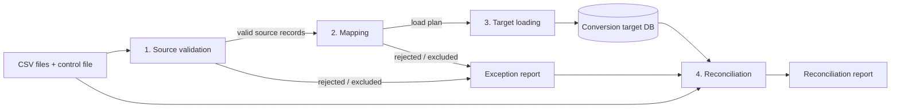
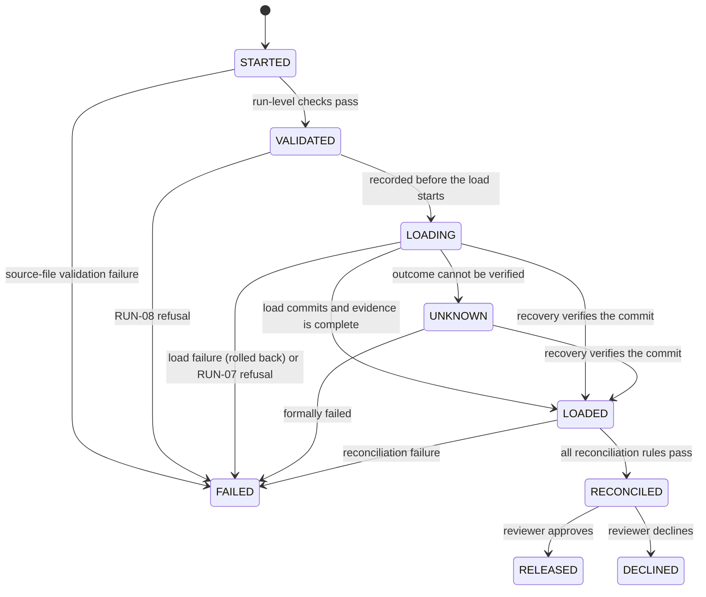
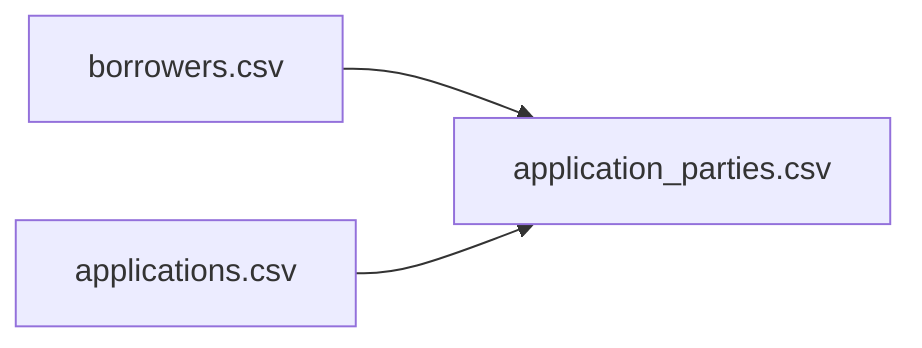

# Legacy LOS CSV Conversion Specification (v1 draft)

This document is the data contract for converting a **fictional legacy loan origination system**
("Legacy LOS") into the lab's LOS schema (`loan_lab.models`). It defines the source files, how
each field is validated and mapped, which records are excluded or rejected, how records depend on
each other, and how the result is reconciled.

> **Synthetic and vendor-neutral.** The Legacy LOS, its file layouts, codes, and every record in
> `sample_data/legacy/` are invented for this lab. They do not describe any real vendor product,
> core-banking system, institution, or person.

**Status:** stages 1–3 are implemented in `loan_lab.conversion.legacy`: source validation and
mapping into a conversion plan (Phase 1), and target loading with its run evidence (Phase 2:
`manifest.json`, the verified source archive, and `reports/load_result.json`), including evidence
for source-validation failures and read-only recovery of runs whose evidence is incomplete
(sections 2.2 and 13). Reconciliation, the exception and exclusion reports, and release approval
are not implemented yet. Nothing in this document changes the
existing SQLAlchemy models or the seeded development database.

## Contents

1. [Scope](#1-scope)
2. [Pipeline stages](#2-pipeline-stages)
3. [Source extract format](#3-source-extract-format)
4. [File layouts](#4-file-layouts)
5. [Source code tables](#5-source-code-tables)
6. [Source-to-target field mapping](#6-source-to-target-field-mapping)
7. [Transformations](#7-transformations)
8. [Record dependencies and reference handling](#8-record-dependencies-and-reference-handling)
9. [Validation rules](#9-validation-rules)
10. [Exclusion criteria](#10-exclusion-criteria)
11. [Target loading](#11-target-loading)
12. [Reconciliation rules](#12-reconciliation-rules)
13. [Exception and run reports](#13-exception-and-run-reports)
14. [Worked examples](#14-worked-examples)
15. [Expected results for the sample extract](#15-expected-results-for-the-sample-extract)
16. [Assumptions](#16-assumptions)
17. [Design decisions and open questions](#17-design-decisions-and-open-questions)

## 1. Scope

In scope for v1:

| Source file | Target model |
| --- | --- |
| `borrowers.csv` | `Borrower` |
| `applications.csv` | `LoanApplication` |
| `application_parties.csv` | `ApplicationParty` |
| `extract_control.csv` | Not loaded. Used only to verify the extract is complete. |

Out of scope for v1: collateral, pledges, liens, payments, documents, credit decisions, delta or
incremental loads, and updates to records that already exist in the target.

Every converted record keeps its legacy identity:

- `source_system` = `LEGACY_LOS` (a constant for this extract).
- `source_system_id` = the legacy key, copied exactly as text.

## 2. Pipeline stages

The conversion runs in four separate stages. Each stage only consumes the previous stage's output.
No stage reaches back to change an earlier decision.



| Stage | Input | Does | Does not | Output |
| --- | --- | --- | --- | --- |
| **1. Source validation** | Raw CSV files | Checks each file and record against the *source* contract: encoding, headers, control counts, formats, required fields, known codes, key uniqueness. Applies the exclusion rules EX-01 to EX-04, then the early dependent exclusion EX-05 (section 10). | Know anything about target models or enums. Look at other files, except the control file and, for EX-05, the applications' exclusion results. | Valid source records (still strings), plus exclusions and rejections |
| **2. Mapping** | Valid source records | Translates codes to target enum values, converts text to `Decimal`/`int`, composes names, and checks target constraints. Resolves references across files and decides whether each conversion unit can be loaded. | Write to the database. | A **load plan** (target-shaped records in dependency order), plus exclusions and rejections |
| **3. Target loading** | Load plan | Inserts the plan in one transaction, in dependency order. | Make any data decisions. If an insert fails, it rolls everything back. | Committed target rows, or nothing |
| **4. Reconciliation** | Source files, exception report, target DB | Re-reads the source and **independently queries the target**, then proves every source row is accounted for and loaded values match. | Trust the load plan as evidence. Fix anything. | Reconciliation report (PASS/FAIL) |

Release approval is not a pipeline stage. It is a separate human decision made after
reconciliation passes (section 2.3).

Each source row that reaches record-level processing ends with exactly one **disposition**:

- **Loaded:** written to the target.
- **Excluded:** deliberately out of scope under section 10. This is not an error.
- **Rejected:** fails a validation rule, or belongs to a rejected conversion unit (section 8.2).
  It appears in the exception report.

### 2.1 Outcome levels

Six kinds of outcome are kept distinct. They differ in scope, in what happens to data, and in what
happens to the run.

| Outcome | Scope | Triggered by | Effect on data | Effect on run | Evidence |
| --- | --- | --- | --- | --- | --- |
| **Source-file validation failure** | Whole extract | A run-level check (RUN-01 to RUN-06) | Nothing is loaded and no target database is created. Rows receive no disposition. | `FAILED` at stage `validation` | `manifest.json` listing every run-level issue with its file and rule, and the archived `source/` files with their checksums |
| **Record rejection** | One source row, or one conversion unit (section 8.2) | A record rule (SV, MP, or RF) | That row, or that unit, is not loaded. Other records continue. | None by itself. The run can still pass. | `exceptions.csv` |
| **Intentional exclusion** | One source row | An exclusion rule (EX) | The row is not loaded. This is not an error. | None | `exclusions.csv` |
| **Load failure** | Whole load | The RUN-07 or RUN-08 precondition (section 9.1), or a database or converter error during schema creation, insert, or commit | RUN-07 and RUN-08: nothing is written to any existing file or database. Otherwise the transaction rolls back, so no converted rows are committed. | `FAILED` at stage `load`, or `UNKNOWN` if the database does not confirm the rollback | `manifest.json` and `reports/load_result.json` with the failing step, the error, the planned counts and amount, transaction states, and the rows found in the database afterwards |
| **Reconciliation failure** | Whole run | Any reconciliation rule (RC-01 to RC-10) does not match | Committed rows are **kept unchanged** for troubleshooting but cannot be released. | `FAILED` at stage `reconciliation` | `reconciliation.md` with expected and actual values |
| **Release approval** | Whole run | A named reviewer's sign-off after reconciliation passes | The conversion database is accepted as the run's output. | `RELEASED` | Approval record in the run manifest |

Record rejections and exclusions are expected parts of a successful run. A run whose records are
all rejected can still reconcile, because reconciliation proves *accounting and accuracy*, not
data quality. Whether the rejection level is acceptable is a decision for release approval
(section 2.3).

### 2.2 Run status

Every run has a run ID and a status recorded in its manifest (section 13):



`FAILED`, `RELEASED`, and `DECLINED` are final. A failed or declined run is never resumed or
patched. After the cause is fixed, a **new run** starts with a new run ID and a new, empty
conversion database. `FAILED` always records the failing stage: `validation`, `load`, or
`reconciliation`.

**Run status, database transaction, and evidence are recorded separately.** The manifest keeps
three independent facts, so a reporting failure can never make a committed load look as if it
never happened:

| Manifest field | Values | Meaning |
| --- | --- | --- |
| `status` | `STARTED`, `VALIDATED`, `LOADING`, `LOADED`, `FAILED`, `UNKNOWN` | Where the run is in its lifecycle |
| `database_transaction` | `not_started`, `in_progress`, `committed`, `rolled_back`, `not_committed`, `unknown` | Whether business rows were committed. `not_committed` and `unknown` are established by read-only inspection. |
| `evidence.state` | `in_progress`, `complete`, `incomplete`, `unverified` | Whether the manifest and report fully describe the database |
| `ready_for_reconciliation` | `true` or `false` | `true` only for `LOADED` with `committed` and `complete` evidence |

- `LOADING` is written **before** the load starts. If the run stops at any point after that, the
  manifest says `LOADING`, never `VALIDATED`, so a load that may have happened is never hidden.
- If the load commits but writing the final report or manifest fails, the run stays `LOADING`
  with `database_transaction: committed` (when that can still be recorded),
  `evidence.state: incomplete`, and `ready_for_reconciliation: false`. It is **not ready** for
  reconciliation or release until its evidence is repaired by recovery or the run is formally
  failed.
- **Recovery** (`recover_run`) settles a run left in `STARTED`, `VALIDATED`, `LOADING`, or `UNKNOWN`. It
  inspects the run's own database **read-only** (a `mode=ro` connection with `query_only`) and
  rewrites only the run's manifest and load report. It never reloads data, creates or modifies a
  database, or touches another run:

  | Found | Result |
  | --- | --- |
  | Status `UNKNOWN` | Classified again as below, so a commit can be verified later |
  | `STARTED` (validation was interrupted) | `FAILED` at stage `validation`; no database exists |
  | `VALIDATED` (interrupted before the load started) | `FAILED` at stage `load`, `not_started` |
  | Database holds exactly the planned rows and requested amount, with no leftover transaction files | `LOADED`, `committed`, evidence `complete` and marked recovered |
  | No database, or no business rows, and the load was never recorded as committed | `FAILED` at stage `load`, `not_committed` |
  | A `-journal` or `-wal` file is present, the database cannot be read, the counts or amount differ from the plan, or a load recorded as committed has no database or no rows | `UNKNOWN`, `unknown`, evidence `unverified` |

- `UNKNOWN` means the outcome could not be verified; it is reported rather than guessed. An
  `UNKNOWN` run is never ready for reconciliation. It is closed by **formally failing** it
  (`fail_run`), which records `FAILED` with step `formally_failed` and leaves the database and
  `database_transaction` untouched. A final run (`LOADED` or `FAILED`) is never changed by recovery
  or by `fail_run`.
- `check_ready` confirms a run may proceed to reconciliation: status `LOADED`, transaction
  `committed`, evidence `complete`, the ready flag set, the source archive verified, a successful
  load report for the run, and a database whose SHA-256 still equals the recorded one.

### 2.3 Release approval

Only a `RECONCILED` run can be released. Before approving, the reviewer must see:

- the reconciliation report with every rule passing;
- the counts of rejected and excluded rows, by rule code;
- the rejected conversion units and their root causes;
- the customers loaded without a converted application (RC-10);
- the inventory of intentionally unmapped fields (section 6.1).

The approval record stores the reviewer's name, the timestamp, the run ID, and the checksum of the
conversion database at approval time. The engine never releases a run on its own.

## 3. Source extract format

Every file in an extract follows the same dialect:

| Property | Rule |
| --- | --- |
| Encoding | UTF-8. A leading UTF-8 byte-order mark is ignored. |
| Delimiter | Comma (`,`) |
| Quoting | RFC 4180 double quotes. A field containing a comma or quote must be quoted; `""` is an escaped quote. |
| Line endings | CRLF or LF |
| Header | Required on the first line. Column names and order must match the layout exactly (case-sensitive). |
| Embedded line breaks | Not permitted inside a field |
| Data types | Every value is text. The converter never lets a CSV reader or spreadsheet infer numbers or dates. |
| Empty value | An empty field (`,,`) means "not provided". A field containing only spaces is treated as empty. |
| Dates | `YYYYMMDD` |
| Row numbers | Reported as physical line numbers. The header is line 1, so the first data row is line 2. |

The extract is one directory containing exactly these four files. The sample extract lives in
`sample_data/legacy/`.

## 4. File layouts

Identifiers are **text**, not numbers. `00010001` and `10001` are different values, and the
converter never adds or removes leading zeros.

### 4.1 `borrowers.csv`: customer master

One row per legacy customer: an individual or an entity. Guarantors are customers too.

| # | Column | Required | Format | Description |
| --- | --- | --- | --- | --- |
| 1 | `CUST_NO` | Yes | Exactly 8 digits `^[0-9]{8}$` | Legacy customer number. Unique within the file. |
| 2 | `CUST_TYPE` | Yes | Code ([5.1](#51-customer-type-cust_type)) | Individual, business, or trust |
| 3 | `BUSINESS_NAME` | When `CUST_TYPE` is `B` or `T` | Text, 1–200 characters (SV-11) | Registered entity name |
| 4 | `LAST_NAME` | When `CUST_TYPE` = `I` | Text, 1–100 characters (SV-11) | Individual's surname, including any suffix |
| 5 | `FIRST_NAME` | When `CUST_TYPE` = `I` | Text, 1–100 characters (SV-11) | Individual's given name |
| 6 | `MIDDLE_INIT` | No | One letter `^[A-Za-z]$` | Individual's middle initial |
| 7 | `RECORD_STATUS` | Yes | Code ([5.2](#52-record-status-record_status)) | Active or logically deleted |
| 8 | `LAST_MAINT_DATE` | No | `YYYYMMDD` | Last time the legacy record changed. Informational only. |

For `CUST_TYPE` `I`, `BUSINESS_NAME` must be empty. For `B` and `T`, `LAST_NAME`, `FIRST_NAME`, and
`MIDDLE_INIT` must be empty.

### 4.2 `applications.csv`: loan applications

| # | Column | Required | Format | Description |
| --- | --- | --- | --- | --- |
| 1 | `APPL_NO` | Yes | Exactly 10 digits `^[0-9]{10}$` | Legacy application number. Unique within the file. |
| 2 | `PROD_CD` | Yes | Code ([5.3](#53-product-code-prod_cd)) | Legacy product code |
| 3 | `APPL_STAT` | Yes | Code ([5.4](#54-application-status-appl_stat)) | Legacy application status |
| 4 | `REQ_AMT` | Yes | `^[0-9]{1,13}\.[0-9]{2}$` | Requested amount in dollars. Always two decimal places, with no sign, currency symbol, or thousands separator. |
| 5 | `INT_RATE` | Yes | `^[0-9]{6}$` | Annual interest rate in thousandths of a percent ([5.6](#56-interest-rate-representation)) |
| 6 | `TERM_MOS` | Yes | `^[0-9]{1,3}$` | Requested term in months |
| 7 | `APPL_DATE` | No | `YYYYMMDD` | Date the application was taken. **Intentionally unmapped** in v1 (section 6.1). |
| 8 | `BRANCH_NO` | No | 3 digits | Originating branch, with leading zeros. **Intentionally unmapped** in v1 (section 6.1). |

### 4.3 `application_parties.csv`: relationships

One row per customer per application. Its natural key is (`APPL_NO`, `CUST_NO`).

| # | Column | Required | Format | Description |
| --- | --- | --- | --- | --- |
| 1 | `APPL_NO` | Yes | Exactly 10 digits | References `applications.csv` |
| 2 | `CUST_NO` | Yes | Exactly 8 digits | References `borrowers.csv` |
| 3 | `REL_CD` | Yes | Code ([5.5](#55-relationship-code-rel_cd)) | The customer's role on the application |

### 4.4 `extract_control.csv`: extract control totals

The legacy system writes this file when it produces the extract. It lets the converter detect
truncated or partial files before loading anything.

| # | Column | Required | Format | Description |
| --- | --- | --- | --- | --- |
| 1 | `FILE_NAME` | Yes | One of the three data file names | File described by this row |
| 2 | `RECORD_COUNT` | Yes | Digits | Number of data rows in the file, excluding the header |
| 3 | `AMOUNT_TOTAL` | `applications.csv` only | Same format as `REQ_AMT` | Sum of `REQ_AMT` over every row in the file |
| 4 | `EXTRACT_DATE` | Yes | `YYYYMMDD` | Extract date. Must be the same on every row. |

## 5. Source code tables

These codes are **fictional**. A code that is not in its table is an *unknown code*, and the
record is rejected (SV-07). A code that is in the table but has no target mapping is an *unmapped
code*, and the record is rejected (MP-01) unless an exclusion rule applies first.

### 5.1 Customer type (`CUST_TYPE`)

| Code | Legacy meaning | Target `borrower_type` |
| --- | --- | --- |
| `I` | Individual | `individual` |
| `B` | Business entity (LLC, corporation, partnership, PLLC, LP) | `business` |
| `T` | Trust | *No mapping in v1:* always rejected with MP-01 |

Trusts are **never** mapped to `business`. A trust's legal capacity, signing authority, and
liability differ from a business entity's, so mapping one silently would misstate the record. A
trust row is rejected with its full source record kept in the exception report until the target
model supports trusts.

### 5.2 Record status (`RECORD_STATUS`)

| Code | Legacy meaning | Handling |
| --- | --- | --- |
| `A` | Active | Converted |
| `D` | Logically deleted in the legacy system | Excluded (EX-01) |

### 5.3 Product code (`PROD_CD`)

| Code | Legacy description | Target `loan_product` |
| --- | --- | --- |
| `110` | Consumer auto, direct | `consumer_auto` |
| `120` | Consumer unsecured installment | `consumer_personal` |
| `210` | Residential first mortgage | `residential_mortgage` |
| `220` | Home equity term loan | `home_equity` |
| `310` | Commercial term loan | `commercial_term` |
| `320` | Commercial real estate term | `commercial_real_estate` |
| `330` | Commercial revolving line of credit | *Excluded:* no revolving product in target (EX-02) |
| `900` | Internal test / training product | *Excluded:* not a customer loan (EX-02) |

### 5.4 Application status (`APPL_STAT`)

| Code | Legacy meaning | Target `status` |
| --- | --- | --- |
| `P` | Pending entry (incomplete intake) | `draft` |
| `S` | Submitted | `submitted` |
| `U` | In underwriting | `in_review` |
| `A` | Approved | `approved` |
| `D` | Declined | `declined` |
| `W` | Withdrawn by applicant | `withdrawn` |
| `X` | Voided (keyed in error) | *Excluded* (EX-03) |

Codes are case-sensitive. A lowercase `a` is an unknown code.

### 5.5 Relationship code (`REL_CD`)

| Code | Legacy meaning | Target `role` |
| --- | --- | --- |
| `PRI` | Primary borrower | `primary_borrower` |
| `COB` | Co-borrower | `co_borrower` |
| `GTR` | Guarantor | `guarantor` |
| `SGN` | Authorized signer (acts for an entity; not liable) | *Excluded* (EX-04) |

### 5.6 Interest-rate representation

`INT_RATE` is a six-digit, zero-padded integer giving the annual rate in **thousandths of a
percent**. The decimal point is implied, three places from the right.

| `INT_RATE` | Meaning | Target `interest_rate` (`Decimal`, 4 places, percent) |
| --- | --- | --- |
| `006500` | 6.500% | `Decimal("6.5000")` |
| `007125` | 7.125% | `Decimal("7.1250")` |
| `011990` | 11.990% | `Decimal("11.9900")` |
| `000000` | 0.000% | `Decimal("0.0000")` (allowed by the target) |
| `999999` | 999.999% | `Decimal("999.9990")` (the largest value the format can hold, which still fits the target's 7,4 precision) |

Other rate notations sometimes seen in legacy data are **not accepted**, and the record is
rejected with SV-05. The converter never guesses which notation was meant:

| Value seen | Why it is rejected |
| --- | --- |
| `6.875` | Contains an explicit decimal point. It probably means 6.875%, but the contract says implied decimals, and guessing would hide an extract defect. |
| `0.06875` | A decimal fraction rather than a percent |
| `6875` | Only four digits. It could be 6.875% or 0.6875% depending on which digits were lost. |
| `6.875%` | Contains a percent sign |

## 6. Source-to-target field mapping

| Source file.column | Target model.field | Rule | Notes |
| --- | --- | --- | --- |
| *(constant)* | `Borrower.source_system` | `"LEGACY_LOS"` | |
| `borrowers.CUST_NO` | `Borrower.source_system_id` | Copy text unchanged | Leading zeros kept |
| `borrowers.CUST_TYPE` | `Borrower.borrower_type` | Code table 5.1 | |
| `borrowers.BUSINESS_NAME` | `Borrower.legal_name` | T-NAME-B (section 7) | `B` and `T` only |
| `borrowers.FIRST_NAME`, `MIDDLE_INIT`, `LAST_NAME` | `Borrower.legal_name` | T-NAME-I (section 7) | `I` only |
| `borrowers.RECORD_STATUS` | *(none)* | Exclusion only (EX-01) | |
| `borrowers.LAST_MAINT_DATE` | *(none)* | Intentionally unmapped (section 6.1) | |
| *(generated)* | `Borrower.id` | Assigned by the database | Never derived from `CUST_NO` |
| *(constant)* | `LoanApplication.source_system` | `"LEGACY_LOS"` | |
| `applications.APPL_NO` | `LoanApplication.source_system_id` | Copy text unchanged | Leading zeros kept |
| `applications.PROD_CD` | `LoanApplication.loan_product` | Code table 5.3 | |
| `applications.APPL_STAT` | `LoanApplication.status` | Code table 5.4 | The model's `draft` default is never relied on; status is always set explicitly. |
| `applications.REQ_AMT` | `LoanApplication.requested_amount` | T-AMOUNT | `Decimal`, exact |
| `applications.INT_RATE` | `LoanApplication.interest_rate` | T-RATE | `Decimal`, exact |
| `applications.TERM_MOS` | `LoanApplication.term_months` | T-TERM | `int` |
| `applications.APPL_DATE` | *(none)* | Intentionally unmapped (section 6.1) | The target has no application date |
| `applications.BRANCH_NO` | *(none)* | Intentionally unmapped (section 6.1) | The target has no branch |
| *(generated)* | `LoanApplication.id` | Assigned by the database | |
| `application_parties.APPL_NO` | `ApplicationParty.application_id` | Look up the loaded `LoanApplication.id` by `APPL_NO` | Section 8 |
| `application_parties.CUST_NO` | `ApplicationParty.borrower_id` | Look up the loaded `Borrower.id` by `CUST_NO` | Section 8 |
| `application_parties.REL_CD` | `ApplicationParty.role` | Code table 5.5 | |

`ApplicationParty` has no source-identifier column. A converted party is traced through
(`LoanApplication.source_system_id`, `Borrower.source_system_id`), the same pair as its source
natural key.

### 6.1 Intentionally unmapped source fields

These source fields have no target column in v1. That is a **documented decision, not an
omission**, and they are never silently discarded:

| Source field | Content | Why unmapped in v1 | How it is preserved |
| --- | --- | --- | --- |
| `applications.APPL_DATE` | Date the application was taken | `LoanApplication` has no application-date column | Archived source extract; unmapped-field inventory |
| `applications.BRANCH_NO` | Originating branch, with leading zeros | The target has no branch or organization model | Archived source extract; unmapped-field inventory |
| `borrowers.LAST_MAINT_DATE` | Last legacy maintenance date | Legacy audit metadata with no LOS meaning | Archived source extract; unmapped-field inventory |

How "never silently discarded" is enforced:

- **Archived source.** Each run copies the four source files, byte for byte, into its run
  directory and records each file's SHA-256 checksum in the manifest. Every unmapped value stays
  traceable to its record through `APPL_NO` or `CUST_NO`.
- **Inventory in every run.** The run report lists each unmapped field with the number of rows in
  which it is populated, split by disposition (loaded, excluded, rejected). The reviewer sees what
  the target does not hold before approving a release (section 2.3).
- **No validation side effects.** Unmapped fields are not used to accept or reject a record, so a
  malformed `APPL_DATE` never blocks a load. The formats in section 4 are the expected shape. The
  inventory counts values that do not conform, and the raw value is still preserved in the archive.
- **Change control.** Mapping any of these fields later requires a model change and a new version of
  this specification. The values are not backfilled from guesses.

`RECORD_STATUS` and `MIDDLE_INIT` are *used* but have no column of their own: `RECORD_STATUS`
drives exclusion EX-01, and `MIDDLE_INIT` is part of `legal_name`. They are not unmapped.

## 7. Transformations

Transformations are pure functions from a valid source record to target values. They never invent
values: when a required input is missing or invalid, the record is rejected rather than filled in.

| ID | Applies to | Rule |
| --- | --- | --- |
| T-ID | `CUST_NO`, `APPL_NO` | Copy the text exactly. No trimming, padding, case change, or numeric conversion. (`10015` is rejected by SV-03; it is not padded to `00010015`.) |
| T-NAME-B | Business and trust names | Trim leading and trailing whitespace and collapse internal runs of whitespace to one space. Keep the original capitalization and punctuation. |
| T-NAME-I | Individual names | Apply the same whitespace rule to each part, then join: `FIRST [MIDDLE_INIT.] LAST`. The middle initial is upper-cased and followed by a period. `Elena`, `R`, `Marsh` becomes `Elena R. Marsh`. Capitalization is otherwise kept as given (no title-casing, so `McAllister` and `de la Cruz` survive). |
| T-AMOUNT | `REQ_AMT` | `Decimal(text)`. The regex already guarantees exactly two decimal places. Never parsed through `float`. |
| T-RATE | `INT_RATE` | `Decimal(int(text)).scaleb(-3).quantize(Decimal("0.0001"))`. This is exact. |
| T-TERM | `TERM_MOS` | `int(text)` |
| T-CODE | All code fields | Table lookup (section 5). There are no defaults and no fuzzy matching. |

## 8. Record dependencies and reference handling

### 8.1 Dependency order



Borrowers and applications are independent of each other. Party rows depend on both. The load order
is therefore **borrowers, then applications, then parties**.

### 8.2 The application conversion unit

A **conversion unit** is one application row plus all of its party rows, keyed by `APPL_NO`. The
unit, not the individual row, is what loads or fails.

**Required party relationships.** Every party row in the unit with role `PRI`, `COB`, or `GTR` is a
*required relationship*, because each one records who is liable on the loan. `SGN` rows are
excluded (EX-04) and are not required.

A unit is loadable only if **all** of these hold:

1. The application row passed source validation and mapping, and is not excluded.
2. Every required relationship passed its own checks, and its borrower will be loaded.
3. The unit has **exactly one** loadable `PRI` relationship.

If any condition fails, the **whole unit is rejected**: the application row and every one of its
required relationships. The converter never loads an application with some liable parties missing,
because a dropped guarantor or co-borrower would misstate who is liable on the loan.

**What a rejected unit keeps:**

- **Valid related records still load on their own merits.** Customers are not part of the unit. A
  valid, active customer named on a rejected unit is still loaded (section 8.4), and the rejection
  never cascades to that customer or to other applications that customer appears on.
- **Every row of the unit is in the exception report**, including rows that are individually valid.
  - A row with its own failure carries its own rule codes.
  - A row whose only problem is belonging to a rejected unit is recorded as *rejected (dependent)*
    with RF-05 for a party row, or RF-07 or RF-06 for the application row.
  - Each exception row carries the unit key (`APPL_NO`) and the rule codes of the unit's root cause,
    so the whole unit can be read together (section 13).
- **Full source evidence.** Each exception row includes the raw source line, and the archived
  source files are kept with the run. Nothing about a rejected unit is lost; it is simply not
  loaded.

Excluded relationships (`SGN`) never affect whether a unit can be loaded. An excluded row is
decided before any reference check (section 9.6), so a signer row is excluded even if it points to
a missing or rejected customer.

### 8.3 Missing and invalid references

| Situation | Party row | Application | Borrower |
| --- | --- | --- | --- |
| `APPL_NO` does not exist in `applications.csv` | Rejected: RF-01 | n/a | Unaffected |
| `CUST_NO` does not exist in `borrowers.csv` | Rejected: RF-02 | Rejected: RF-07 | n/a |
| `CUST_NO` has an invalid format (for example, leading zeros lost) | Rejected: SV-03 | Rejected: RF-07 | Unaffected |
| Referenced borrower was rejected | Rejected: RF-03 | Rejected: RF-07 | Stays rejected |
| Referenced borrower was excluded (logically deleted) | Rejected: RF-04 | Rejected: RF-07 | Stays excluded |
| Application was rejected for its own reasons | Rejected: RF-05 (dependent) | Rejected | Unaffected |
| Application was excluded | Excluded: EX-05 (dependent) | Excluded | Unaffected |
| No loadable `PRI` row | (each row per its own result) | Rejected: RF-06 | Unaffected |
| `PRI` rows name more than one distinct customer | (each row per its own result) | Rejected: RF-08 | Unaffected |
| The same customer appears twice as `PRI` (duplicate rows) | Both rejected: SV-10 | Rejected: RF-07 and RF-06, not RF-08 | Unaffected |

In every case the converter **never fabricates** the missing piece. It does not create placeholder
borrowers, pad identifiers, choose between duplicate rows, promote a co-borrower to primary, or
default a role. The exception report names exactly what is missing so the source can be corrected
and the extract re-run.

References are matched on the **exact** key text. A malformed key is never matched to a similar
valid key. For example, party row `10015` is rejected by SV-03 and is *not* treated as a reference
to customer `00010015`.

### 8.4 Customers without converted applications

A customer's disposition does not depend on applications. A valid, active customer loads even if
none of the applications it appears on load, because the customer master is converted as a whole.

Such customers are not errors, but they must not blend into the loaded totals unnoticed:

- each one produces warning WN-01;
- reconciliation lists them separately, by `CUST_NO`, with the reason none of their applications
  loaded (RC-10);
- the release reviewer sees that list before approval (section 2.3).

"Without a converted application" means the customer has no *loaded* party relationship. A
customer whose only relationships are excluded (for example, a signer, or a party on a voided
application) or rejected falls into this category.

## 9. Validation rules

Every row in a source file passes through these checks in the same fixed order. A record collects
**all** failures at its stage, so one run reports everything wrong with a row. It does not move on
to later stages once rejected. Rule codes are stable and appear in the exception report.

### 9.1 Run-level checks (abort: nothing is loaded)

| Code | Rule |
| --- | --- |
| RUN-01 | Each of the four files exists and is readable |
| RUN-02 | Each file is valid UTF-8 |
| RUN-03 | Each header matches its layout exactly |
| RUN-04 | Each data file's row count equals `RECORD_COUNT` in the control file |
| RUN-05 | The sum of `REQ_AMT` equals the control `AMOUNT_TOTAL`. If any `REQ_AMT` cannot be parsed, the total is reported as *unverifiable* and the run continues; those rows are rejected by SV-04. |
| RUN-06 | The control file is itself valid. Every row below fails RUN-06, and all are reported together (see the table after this one). |

RUN-06 covers every way `extract_control.csv` can be invalid:

| Control file condition | Example | Reported as |
| --- | --- | --- |
| A row is malformed (wrong field count or invalid CSV) | `borrowers.csv,16,20260930` | RUN-06 at that line |
| `FILE_NAME` is not one of the three data files | `collateral.csv,0,,20260930` | RUN-06 at that line |
| A data file is listed more than once | Two `borrowers.csv` rows | RUN-06 at the second line |
| A data file is not listed | No `application_parties.csv` row | RUN-06 for the control file |
| `RECORD_COUNT` is not a non-negative whole number of at most 9 digits | `sixteen`, `-1`, `16.0` | RUN-06 at that line |
| `AMOUNT_TOTAL` is missing or is not in `REQ_AMT` format on the `applications.csv` row | Empty, or `5,467,000.00` | RUN-06 at that line |
| `AMOUNT_TOTAL` is present on a row for any other file | `borrowers.csv,16,100.00,20260930` | RUN-06 at that line |
| `EXTRACT_DATE` is not `YYYYMMDD` | `2026-09-30` | RUN-06 at that line |
| `EXTRACT_DATE` values differ between rows | `20260930` and `20261001` | RUN-06 for the control file |

RUN-04 and RUN-05 compare the data files against the control file, so they are evaluated only
once the control file passes RUN-06.

**RUN-07 is a loader precondition, not a source check.** Before the loader writes anything, it
confirms the run's conversion database is new and contains no LOS rows (v1 is a full load into an
isolated database; section 11). Planning (Phase 1) never opens a database; the loader (Phase 2)
evaluates RUN-07 for the database after the source checks pass. The run's evidence directory is
reserved first, before source validation, so even a run with an invalid extract spends its run
ID. RUN-07 fails, with nothing written to any existing file, when:

| Condition | Why |
| --- | --- |
| The evidence directory `output/conversion/<run_id>/` already exists, even if empty | A run ID is never reused, including after a failed validation or load. Nothing at all is written. |
| The run directory `data/conversion/<run_id>/` already exists, even if empty | A run ID is never reused. The run's new evidence directory records the refusal. |
| `loan_lab_conversion.db` already exists when the loader creates it (exclusive create) | An existing database is never overwritten, even one created concurrently |
| The newly created database already holds any schema object | It cannot then be proven free of LOS rows |

**RUN-08 is a second loader precondition: the source has not changed since planning.** The plan
records the SHA-256 of all four source files as read for planning. Before any database is
created, the loader archives each file into the run's `source/` directory, hashing the bytes as
they are read and hashing the archived copy again. Every file must give the planned checksum at
both points. A file that changed, was deleted, or cannot be read fails RUN-08: the run becomes
`FAILED` at stage `load`, no database is created, and the archive keeps the bytes that were
actually found. The loader never re-plans or reloads; after the source is corrected, a new run
plans it again under a new run ID.

A run ID that is not a single safe path segment (1–64 letters, digits, `-` or `_`, starting with
a letter or digit) is refused before anything is created, so a run can never write outside its
own directory.

### 9.2 Stage 1: source validation (record is rejected)

| Code | Rule | Files |
| --- | --- | --- |
| SV-01 | Row has the same number of fields as the header and no embedded line breaks | All |
| SV-02 | Required field is empty, including fields required only for certain `CUST_TYPE` values | All |
| SV-03 | Identifier does not match its format (`CUST_NO` 8 digits, `APPL_NO` 10 digits) | All |
| SV-04 | `REQ_AMT` does not match its format | applications |
| SV-05 | `INT_RATE` does not match its format | applications |
| SV-06 | `TERM_MOS` does not match its format | applications |
| SV-07 | Code is not in its source code table | All |
| SV-08 | Name fields are inconsistent with `CUST_TYPE` (a business name on an individual, or person names on a business or trust), or `MIDDLE_INIT` is not a single letter | borrowers |
| SV-09 | Duplicate `CUST_NO` or `APPL_NO` within the file. **Every** row with that key is rejected; the converter does not pick one. | borrowers, applications |
| SV-10 | Duplicate (`APPL_NO`, `CUST_NO`) pair. Every row with that pair is rejected. | application_parties |
| SV-11 | A name field is longer than its documented limit: `FIRST_NAME` or `LAST_NAME` over 100 characters, or `BUSINESS_NAME` over 200 characters. The value is never truncated. | borrowers |

**How SV-11 measures length.** Length is measured on the value **after CSV parsing**, so quotes
and escaped `""` pairs do not count and a quoted comma does. Surrounding whitespace is trimmed
first, consistent with the empty-field rule in section 3. Length is counted in **Unicode code
points** (Python `len`), not bytes. A 100-letter name in an accented script is valid even though
it is longer than 100 bytes in UTF-8. No Unicode normalization is applied, so a decomposed `é`
(`e` + combining accent) counts as two. SV-11 applies only to fields that are populated and
expected for the customer type; a populated field that should be empty is SV-08 instead. The
rejected value is reported in full in `SOURCE_VALUE`.

The duplicate checks (SV-09 and SV-10) run over all rows, including rows that would otherwise be
excluded, because a duplicated key makes every reference to it ambiguous.

### 9.3 Stage 2: mapping (record is rejected)

| Code | Rule |
| --- | --- |
| MP-01 | Code is known to the source but has no target mapping (for example, `CUST_TYPE` = `T`) |
| MP-02 | `requested_amount` must be greater than zero (target constraint) |
| MP-03 | `term_months` must be between 1 and 600 (the target requires > 0; the upper bound is a plausibility limit) |
| MP-04 | Composed `legal_name` is longer than 200 characters (target column length). With SV-11 in place, this can only happen for an individual, whose first name, initial, and last name together can reach 204 characters. |

### 9.4 Stage 2: references and conversion units (record is rejected)

| Code | Rule |
| --- | --- |
| RF-01 | Party `APPL_NO` not found in `applications.csv` |
| RF-02 | Party `CUST_NO` not found in `borrowers.csv` |
| RF-03 | Party references a rejected borrower |
| RF-04 | Party references an excluded borrower |
| RF-05 | Party belongs to a rejected application. This is applied only to party rows that have no error of their own. |
| RF-06 | Application has no loadable primary borrower |
| RF-07 | Application has one or more rejected party rows |
| RF-08 | Application names more than one **distinct** primary customer: two or more non-excluded `PRI` rows with different non-blank `CUST_NO` values, compared as exact text |

**Duplicate primary rows are not RF-08.** Two `PRI` rows for the *same* customer on the same
application are a duplicate relationship. Both rows fail SV-10, and the application is rejected by
RF-07, plus RF-06 because no loadable primary remains. Their root causes are the SV-10 failures on
both lines. RF-08 is reserved for genuinely conflicting primaries, such as two different
customers. Its root cause is the application line, and its message lists every `PRI` line
involved. Rejected `PRI` rows still count towards RF-08 when their customer numbers differ, so an
application can carry RF-07 and RF-08 together, each with its own evidence.

### 9.5 Warnings (record still loads)

| Code | Rule |
| --- | --- |
| WN-01 | A loaded customer has no loaded party relationship (section 8.4). Also listed separately in reconciliation (RC-10). |

### 9.6 Evaluation order

1. Run-level checks (9.1). Any failure stops the run.
2. SV-01 on every row.
3. Duplicate-key checks SV-09 and SV-10 on every row that passed SV-01.
4. Exclusion rules, applied only where the field deciding the exclusion is itself valid. An
   excluded row is not validated any further.
   1. EX-01 to EX-04 on each file's own rows.
   2. Then the **early dependent exclusion** EX-05: a party row whose `APPL_NO` matches
      application rows that were all excluded in step 4.1 is excluded. This happens **before field
      validation**, so the party row's own fields (for example, a malformed `CUST_NO`) are never
      checked or reported. EX-05 needs only the applications' exclusion results, not their
      validation results, which is why it can run this early.
5. The remaining source checks (SV-02 to SV-08, and SV-11) on rows that are still candidates.
6. Mapping checks MP-01 to MP-04.
7. Borrower dispositions become final.
8. Party reference checks RF-01 to RF-04.
9. Conversion-unit checks RF-06 to RF-08, then RF-05 for the remaining party rows of rejected
   applications.
10. Warnings.

Exclusion always takes precedence over dependent rejection. A party row excluded at step 4 (EX-04
or EX-05) is never also rejected, and a rejected row is never also excluded. That keeps exactly
one disposition per row (RC-01). Rows already rejected at steps 2 or 3 (SV-01, SV-09, SV-10) stay
rejected even if their application is excluded.

## 10. Exclusion criteria

Exclusions are deliberate scope decisions, not data-quality failures. Excluded rows are counted and
listed in the run report, but they are not errors.

| Code | File | Criterion | Reason |
| --- | --- | --- | --- |
| EX-01 | borrowers | `RECORD_STATUS` = `D` | Logically deleted in the legacy system |
| EX-02 | applications | `PROD_CD` in (`330`, `900`) | The target has no revolving-credit product; `900` is test data |
| EX-03 | applications | `APPL_STAT` = `X` | Voided entries were keyed in error and never were applications |
| EX-04 | application_parties | `REL_CD` = `SGN` | Signers are not liable parties; the target roles cover liability only |
| EX-05 | application_parties | The row's application is excluded | Follows its parent. This is an *early dependent exclusion*, applied before the party row's own fields are validated (section 9.6, step 4.2). |

A party row that references an **excluded borrower** while its application is in scope is a
conflict, not an exclusion, and is rejected (RF-04).

## 11. Target loading

- **Isolated conversion database:** each run creates its own new SQLite database from the current
  models, at `data/conversion/<run_id>/loan_lab_conversion.db`. A run never writes to the seeded
  development database `data/loan_lab_dev.db`, or to another run's database. Only valid records
  in the load plan are written; rejected and excluded rows exist only in the reports.
- **Schema first, then one load transaction:** the empty schema is created from the current models
  in its own transaction, and then the whole load plan is inserted in a single transaction. If any
  insert or the commit fails, everything rolls back. The run becomes `FAILED` at stage `load`, the
  database is left with its empty schema (or with no tables, if creating the schema itself failed),
  and the failing step, the database error, and the load-plan summary are written to
  `manifest.json` and `reports/load_result.json` (section 13). No converted row is ever committed
  by a failed load. Validation should make such failures impossible, so one
  indicates a converter defect.
- **No data decisions:** the loader inserts exactly the plan's load-eligible rows. It never
  re-evaluates a mapping, exclusion, or rejection. If the plan is inconsistent (for example, an
  eligible party whose application or borrower is not being loaded, or a source key that appears
  twice), the load fails and rolls back; nothing is skipped or repaired.
- **Order:** borrowers, then applications, then parties. Database-generated IDs are kept in an
  in-memory crosswalk (`CUST_NO` → `Borrower.id`, `APPL_NO` → `LoanApplication.id`) that is used to
  resolve party foreign keys. The committed load returns these crosswalks, plus
  (`APPL_NO`, `CUST_NO`) → `ApplicationParty.id`, with the loaded counts and requested amount.
  Reconciliation may compare them with the target, but still queries the target independently
  (section 12).
- **Inserts only:** the load never updates or deletes rows. A run refuses to load into a database
  that is not new and empty (RUN-07, section 9.1). A failed run's directory is kept as evidence, so
  its run ID is spent. A rerun always starts fresh under a new run ID. There is no reset or
  overwrite option.
- **Exact values:** amounts and rates are passed as `Decimal` and stored by `ExactDecimal`. The
  loader never touches a float.
- **Bounded batches:** inserts are issued in batches of a configurable size inside the single
  transaction, so memory stays flat for larger extracts.
- **Evidence after commit:** once the load transaction commits, the database is read back
  (read-only) and the evidence is completed. If that fails, the committed rows are left exactly
  as they are; the run stays `LOADING`, is recorded as committed with incomplete evidence where
  possible, and is not ready for reconciliation until `recover_run` verifies it or `fail_run`
  closes it (section 2.2). Evidence is never repaired by reloading, re-running under the same ID,
  or writing to the database.

## 12. Reconciliation rules

Reconciliation runs after the load commits, as an independent step. It re-reads the archived
source files and queries the conversion database directly, filtering on
`source_system = 'LEGACY_LOS'`. It does not reuse the load plan or the mapping stage's in-memory
results, so it can detect defects in both. A run **passes** only if every rule below matches
exactly.

**Counts and dollar totals alone are not sufficient.** Matching counts and totals can hide
offsetting errors:

- two applications with swapped amounts;
- a wrong product, status, rate, or term with the right amount;
- a misspelled or truncated name;
- a guarantor attached to the wrong application;
- a co-borrower recorded as primary.

For that reason, the field-level comparison (RC-07) and the relationship checks (RC-08 and RC-09)
are **mandatory** and cover every loaded record, not a sample. A run that passes RC-01 to RC-06 but
fails RC-07, RC-08, or RC-09 has failed reconciliation.

| Code | Rule |
| --- | --- |
| RC-01 | **Disposition accounting.** For each file: rows read = loaded + excluded + rejected, and every row has exactly one disposition. |
| RC-02 | **Control file agreement.** Rows read per file equal `RECORD_COUNT`. Total `REQ_AMT` equals `AMOUNT_TOTAL`, or is reported unverifiable under RUN-05. |
| RC-03 | **Target counts.** Target `Borrower` and `LoanApplication` row counts equal the loaded counts. Target `ApplicationParty` rows on converted applications equal the loaded party count. |
| RC-04 | **Key completeness.** The set of loaded source keys equals the set of target `source_system_id` values, with no missing, extra, or duplicated keys. |
| RC-05 | **Amount control totals.** The loaded `REQ_AMT` sum equals the target `requested_amount` sum, exactly in `Decimal`. In addition, loaded + excluded + rejected amounts equal the source total, counting only parseable amounts; the number of unparseable amounts is reported. |
| RC-06 | **Distributions.** Loaded counts by product, status, borrower type, and role equal the target counts grouped the same way. |
| RC-07 | **Field-level comparison.** For **every** loaded record (not a sample), each mapped target field equals the value recomputed from the source by the section 7 transformations. |
| RC-08 | **Relationships.** For each loaded application, the set of (`CUST_NO`, role) pairs from non-excluded source rows equals the set read from the target, joining `ApplicationParty` to `Borrower.source_system_id`. |
| RC-09 | **Primary borrower.** Every loaded application has exactly one `primary_borrower` in the target. |
| RC-10 | **Customers without converted applications.** These customers are reported as a separate line, not folded into the loaded-customer total. The set of loaded customers with no `ApplicationParty` row in the target equals the set of WN-01 customers from the mapping stage. Each is listed with its `CUST_NO` and the dispositions of the source relationships that name it. |

RC-10 is an accounting check. Having such customers does not fail the run, but any disagreement
between the target and the WN-01 list does.

**When reconciliation fails:**

- The run becomes `FAILED` at stage `reconciliation` and **cannot be released**. A failed run can
  never move to `RECONCILED` or `RELEASED`.
- **Evidence is preserved, not discarded:**
  - the run's conversion database is kept unchanged, and is never modified, repaired, or reused;
  - the archived source files, exception, exclusion, and warning reports, and the reconciliation
    report with expected and actual values for every rule are all kept.
- Troubleshooting works from that evidence. The fix is made in the converter or the source extract,
  and a **new run** loads into a new database. The failed run's evidence stays available for
  comparison until it is deliberately removed.

## 13. Exception and run reports

Every run writes its evidence to its own directory, `output/conversion/<run_id>/`, which Git
ignores. The run's database lives in `data/conversion/<run_id>/` (section 11). Nothing in either
directory is overwritten by a later run.

| File | Contents |
| --- | --- |
| `manifest.json` | Run ID; start, last-update, and end times (UTC); status, database transaction state, evidence state, and readiness for reconciliation (section 2.2); failure (stage, step, rule, reason), if any; specification version; source directory; for each source file the planned, read, and archived SHA-256, its size, and whether they agree; validation summary (control totals, row counts by disposition, requested amounts by disposition), or the run-level issues if validation failed; expected target counts and amount; the conversion database's path, tables, and SHA-256; load outcome; reconciliation and release approval records (empty until implemented) |
| `source/` | Byte-for-byte copies of the source files that could be read, verified against the plan (RUN-08) when one exists |
| `reports/load_result.json` | Written once a load was attempted. The load outcome: success, failure, or unverified; expected counts and amount, the counts and requested amount **read back from the database** afterwards (amounts as decimal strings), rows inserted, the state of the schema and load transactions, whether any business rows were committed, the database checksum, and the failing step and error |
| `exceptions.csv` | Record rejections |
| `exclusions.csv` | Intentional exclusions |
| `warnings.csv` | Warnings (WN-01) |
| `unmapped_fields.csv` | The inventory of intentionally unmapped fields (section 6.1) |
| `reconciliation.md` | Results for RC-01 to RC-10, with expected and actual values, the customers without converted applications, and a final PASS or FAIL |
| `run.log` | Stage-by-stage log, including the database error for a load failure |

A source-file validation failure produces `manifest.json` and `source/` only (plus `run.log` once
implemented). The manifest records status `FAILED` at stage `validation`, every run-level issue
(rule, file, line, message) under `validation.issues`, and `database_transaction: not_started`.
Each source file that exists and is readable is archived with its raw bytes, SHA-256, and size;
a missing, non-regular, or unreadable file is recorded with an `error` instead. Its
`planned_sha256` is empty and `source.verified` is `null`, because no plan exists. Nothing is
dispositioned or loaded, and **no target database or `data/conversion/<run_id>/` directory is
created**.

**How evidence is written:**

- The evidence directory is **reserved** with an exclusive create before anything else is written,
  including before source validation. If it already exists, the run is refused (RUN-07) and
  nothing is written anywhere. Every run ID, including a failed one, is spent.
- `manifest.json` is first written with status `STARTED` (or `VALIDATED`, when a pre-built plan
  is loaded), updated after the source archive and validation, set to `LOADING` before the load
  starts, and finally set to `LOADED` (only after the load commits and the report is written),
  `FAILED`, or `UNKNOWN` (section 2.2).
  Reports and the manifest are written to a temporary file in the same directory, flushed to disk,
  and then atomically renamed over the previous version, so a reader never sees a partial file and
  an interrupted write leaves the previous version intact. They are only ever replaced inside the
  run's own directory.
- Source files are only read, never moved or modified. The source archive and the target
  database live in separate roots (`output/` and `data/`), both ignored by Git.
- On a load failure the database is inspected read-only afterwards, so the report states what it
  actually contains, not what the loader assumed. If the inspection does not confirm the rollback,
  the run is `UNKNOWN`, not `FAILED`. An unexpected interruption is settled the same way: `FAILED`
  with outcome `interrupted` if no business rows exist, `LOADING` with incomplete evidence if the
  load verifiably committed, and `UNKNOWN` otherwise.
- If the process dies before any of this can be recorded, the manifest is left as `STARTED`,
  `VALIDATED`, or `LOADING`, and `recover_run` settles it (section 2.2).
- In `reports/load_result.json`, `success` is `true`, `false`, or `null` (unverified), and
  `business_rows_committed` is `true`, `false`, or `null` (unknown). A recovered report records
  what recovery found under `recovered`.

Not yet implemented: `exceptions.csv`, `exclusions.csv`, `warnings.csv`, `unmapped_fields.csv`,
`reconciliation.md`, and `run.log`. Recovery and formal failure are library functions only; there
is no command-line entry point for them yet.

**`exceptions.csv`** has one row per failure. A record with several failures has several rows.

| Column | Example |
| --- | --- |
| `FILE_NAME` | `application_parties.csv` |
| `LINE_NO` | `16` |
| `SOURCE_KEY` | `0000500109/00010099` |
| `UNIT_KEY` | `0000500109`: the conversion unit (empty for customer rows) |
| `STAGE` | `source_validation`, `mapping`, `reference` |
| `RULE_CODE` | `RF-02` |
| `DEPENDENT` | `N`. `Y` means the row is rejected only because its unit was rejected. |
| `ROOT_CAUSE` | `RF-02 application_parties.csv:16`: the failures that rejected the unit, with file and line |
| `FIELD` | `CUST_NO` |
| `SOURCE_VALUE` | `00010099` |
| `MESSAGE` | `Customer 00010099 is not in borrowers.csv.` |
| `SOURCE_LINE` | `0000500109,00010099,GTR`: the raw source line |

**`exclusions.csv`** and **`warnings.csv`** have the same columns, with `STAGE` = `exclusion` or
`warning`.

## 14. Worked examples

### 14.1 Complete application: `0000500101` (loaded)

A commercial real estate application from a business borrower with a personal guarantor.

**Source rows**

```text
applications.csv, line 2
APPL_NO,PROD_CD,APPL_STAT,REQ_AMT,INT_RATE,TERM_MOS,APPL_DATE,BRANCH_NO
0000500101,320,U,1250000.00,006500,240,20260803,014

application_parties.csv, lines 2-3
APPL_NO,CUST_NO,REL_CD
0000500101,00010001,PRI
0000500101,00010002,GTR

borrowers.csv, lines 2-3
CUST_NO,CUST_TYPE,BUSINESS_NAME,LAST_NAME,FIRST_NAME,MIDDLE_INIT,RECORD_STATUS,LAST_MAINT_DATE
00010001,B,Cedar Hollow Logistics LLC,,,,A,20260814
00010002,I,,Marsh,Elena,R,A,20260702
```

**Stage 1, source validation:** every field matches its format, the codes are known, and the keys
are unique. No exclusion applies: `320` is in scope, `U` is not voided, both customers are `A`, and
neither role is `SGN`.

**Stage 2, mapping:**

| Source | Transformation | Target value |
| --- | --- | --- |
| `APPL_NO` `0000500101` | T-ID | `source_system_id = "0000500101"` |
| `PROD_CD` `320` | Table 5.3 | `loan_product = LoanProduct.COMMERCIAL_REAL_ESTATE` |
| `APPL_STAT` `U` | Table 5.4 | `status = ApplicationStatus.IN_REVIEW` |
| `REQ_AMT` `1250000.00` | T-AMOUNT | `requested_amount = Decimal("1250000.00")` |
| `INT_RATE` `006500` | T-RATE | `interest_rate = Decimal("6.5000")` |
| `TERM_MOS` `240` | T-TERM | `term_months = 240` |
| `APPL_DATE` `20260803`, `BRANCH_NO` `014` | Intentionally unmapped (section 6.1) | None. The values stay in the archived source and are counted in the unmapped-field inventory. |
| `00010001` / `B` / `Cedar Hollow Logistics LLC` | T-ID, 5.1, T-NAME-B | `Borrower(source_system_id="00010001", borrower_type=BUSINESS, legal_name="Cedar Hollow Logistics LLC")` |
| `00010002` / `I` / `Elena`, `R`, `Marsh` | T-ID, 5.1, T-NAME-I | `Borrower(source_system_id="00010002", borrower_type=INDIVIDUAL, legal_name="Elena R. Marsh")` |
| `PRI` | Table 5.5 | `role = PartyRole.PRIMARY_BORROWER` |
| `GTR` | Table 5.5 | `role = PartyRole.GUARANTOR` |

The conversion-unit check passes: both required relationships are valid, both customers load, and
there is exactly one `PRI`.

**Stage 3, target rows** (IDs are illustrative; the database assigns them):

```text
borrower          id=1  source_system=LEGACY_LOS  source_system_id=00010001  legal_name="Cedar Hollow Logistics LLC"  borrower_type=business
borrower          id=2  source_system=LEGACY_LOS  source_system_id=00010002  legal_name="Elena R. Marsh"              borrower_type=individual
loan_application  id=1  source_system=LEGACY_LOS  source_system_id=0000500101  loan_product=commercial_real_estate
                        requested_amount=1250000.00  interest_rate=6.5000  term_months=240  status=in_review
application_party       application_id=1  borrower_id=1  role=primary_borrower
application_party       application_id=1  borrower_id=2  role=guarantor
```

**Stage 4, reconciliation:** the application contributes 1 to the loaded application count (RC-03),
$1,250,000.00 to the loaded amount total (RC-05), and its key `0000500101` to the key set (RC-04).
Its field-level comparison (RC-07) and relationship set
{(`00010001`, primary_borrower), (`00010002`, guarantor)} (RC-08) match the target.

Both customers also appear on `0000500102`. They are loaded once and referenced twice.

### 14.2 Rejected application: `0000500109`

```text
applications.csv          0000500109,310,S,95000.00,007500,60,20260829,007
application_parties.csv   0000500109,00010011,PRI
                          0000500109,00010099,GTR
borrowers.csv             00010011,I,,,Jordan,,A,20260320
```

| Record | Result | Rule | Why |
| --- | --- | --- | --- |
| Borrower `00010011` | Rejected | SV-02 | Individual with no `LAST_NAME`. The converter does not load "Jordan" as a full legal name. |
| Party `0000500109/00010011` | Rejected | RF-03 | References a rejected borrower |
| Party `0000500109/00010099` | Rejected | RF-02 | Customer `00010099` is not in the extract. No placeholder is created. |
| Application `0000500109` | Rejected | RF-06, RF-07 | No loadable primary borrower, and it has rejected party rows |

The application row itself is well-formed, but it is not loaded because loading it would leave a
commercial loan with no borrower and no guarantor. The rejection is recorded for the whole
conversion unit `0000500109`:

- The unit's three rows (the application and its two relationships) produce four exception rows,
  because the application has two rule codes. Each carries its raw source line and `UNIT_KEY`
  `0000500109`.
- The application row's `ROOT_CAUSE` points to `application_parties.csv` lines 15 and 16.
- Customer `00010011` is not part of the unit (section 8.2). Its own SV-02 rejection is a separate
  exception row with no unit key, and line 15's `ROOT_CAUSE` points to it.

Nothing is created to fill the gaps: no placeholder for `00010099`, and no partial name for
`00010011`.

## 15. Expected results for the sample extract

`sample_data/legacy/` contains 13 applications, 16 customer rows, and 20 relationship rows. Six
applications convert cleanly; the rest cover the exception and exclusion paths. When the converter
is built, these expected results become its acceptance test.

The extract passes every run-level check (RUN-01 to RUN-06), so it reaches record-level
processing. Row-level outcomes use these terms:

| Outcome | Meaning |
| --- | --- |
| **Loaded** | Written to the conversion database |
| **Loaded, WN-01** | Loaded customer with no loaded relationship; listed separately under RC-10 |
| **Excluded** | Out of scope under an EX rule. Not an error. |
| **Excluded (dependent)** | Party row excluded only because its application is excluded (EX-05) |
| **Rejected** | Fails its own rule |
| **Rejected (dependent)** | Valid on its own, but belongs to a rejected conversion unit (RF-05). Its source line is kept in `exceptions.csv`. |

### 15.1 Borrowers (`borrowers.csv`)

| Line | `CUST_NO` | Disposition | Rule | Note |
| --- | --- | --- | --- | --- |
| 2 | 00010001 | Loaded | | Cedar Hollow Logistics LLC (business) |
| 3 | 00010002 | Loaded | | Elena R. Marsh, guarantor on two applications |
| 4 | 00010003 | Loaded | | Daniel Okafor |
| 5 | 00010004 | Loaded | | Priya S. Okafor, co-borrower |
| 6 | 00010005 | Loaded | | Bluestem Dental Group PLLC (business) |
| 7 | 00010006 | Loaded | | Tomas J. Lindqvist, guarantor |
| 8 | 00010007 | Loaded | | Marisol Reyes |
| 9 | 00010008 | Loaded, WN-01 | | Northgate Self Storage LP. Its relationship on 0000500108 is rejected (dependent) and on 0000500110 is excluded (dependent). |
| 10 | 00010009 | Loaded, WN-01 | | Colin W. Abernathy. His relationships on 0000500107 and 0000500113 are both rejected (dependent). |
| 11 | 00010010 | Loaded | | Name padded with spaces in the source; normalized to `Grace Haverford` |
| 12 | 00010011 | Rejected | SV-02 | Individual with no last name. This causes RF-03 on relationship line 15. |
| 13 | 00010012 | Excluded | EX-01 | Logically deleted. Not referenced by any relationship. |
| 14 | 00010013 | Rejected | SV-09 | Duplicate `CUST_NO` with two different names. Neither row is chosen. |
| 15 | 00010014 | Rejected | MP-01 | Trust. Never mapped to `business`. |
| 16 | 00010013 | Rejected | SV-09 | Duplicate `CUST_NO` (second row) |
| 17 | 00010015 | Loaded, WN-01 | | Ana M. Delgado. Her only relationship is on voided application 0000500111, which is excluded (dependent). The rejected row `10015` (relationship line 19) is **not** a reference to her, because keys match exactly. |

### 15.2 Applications (`applications.csv`)

Each application row is the head of a conversion unit. The unit's outcome is the application's
outcome.

| Line | `APPL_NO` | Disposition | Rule | Root cause and note |
| --- | --- | --- | --- | --- |
| 2 | 0000500101 | Loaded | | Worked example 14.1 |
| 3 | 0000500102 | Loaded | | Same business borrower and guarantor as 0000500101 |
| 4 | 0000500103 | Loaded | | Mortgage with a co-borrower |
| 5 | 0000500104 | Loaded | | Business borrower with a guarantor. The signer row is excluded and does not affect the unit. |
| 6 | 0000500105 | Loaded | | Declined consumer auto |
| 7 | 0000500106 | Loaded | | Draft (pending entry) home equity application |
| 8 | 0000500107 | Rejected | MP-02 | Own failure: `REQ_AMT` is `0.00` |
| 9 | 0000500108 | Rejected | SV-05 | Own failure: `INT_RATE` is `6.875`, which has an explicit decimal point |
| 10 | 0000500109 | Rejected | RF-06, RF-07 | Invalid references on relationship lines 15 (RF-03) and 16 (RF-02). Worked example 14.2. |
| 11 | 0000500110 | Excluded | EX-02 | Product `330`, a revolving line of credit |
| 12 | 0000500111 | Excluded | EX-03 | Status `X`, voided |
| 13 | 0000500112 | Rejected | RF-06, RF-07 | Relationship line 19 has a malformed customer number, `10015` (SV-03) |
| 14 | 0000500113 | Rejected | RF-06 | Its only relationship is a co-borrower. There is no primary, and none is promoted. |

### 15.3 Relationships (`application_parties.csv`)

| Line | `APPL_NO` / `CUST_NO` / `REL_CD` | Disposition | Rule | Root cause and note |
| --- | --- | --- | --- | --- |
| 2–3 | 0000500101 / 00010001 PRI, 00010002 GTR | Loaded | | |
| 4–5 | 0000500102 / 00010001 PRI, 00010002 GTR | Loaded | | |
| 6–7 | 0000500103 / 00010003 PRI, 00010004 COB | Loaded | | |
| 8–9 | 0000500104 / 00010005 PRI, 00010006 GTR | Loaded | | |
| 10 | 0000500104 / 00010007 SGN | Excluded | EX-04 | Signer, not a required relationship. The unit still loads. |
| 11 | 0000500105 / 00010007 PRI | Loaded | | |
| 12 | 0000500106 / 00010010 PRI | Loaded | | |
| 13 | 0000500107 / 00010009 PRI | Rejected (dependent) | RF-05 | Valid on its own. Unit rejected by MP-02 on application line 8. |
| 14 | 0000500108 / 00010008 PRI | Rejected (dependent) | RF-05 | Valid on its own. Unit rejected by SV-05 on application line 9. |
| 15 | 0000500109 / 00010011 PRI | Rejected | RF-03 | Customer rejected by SV-02 on customer line 12 |
| 16 | 0000500109 / 00010099 GTR | Rejected | RF-02 | Customer not in the extract. No placeholder is created. |
| 17 | 0000500110 / 00010008 PRI | Excluded (dependent) | EX-05 | Application excluded by EX-02 |
| 18 | 0000500111 / 00010015 PRI | Excluded (dependent) | EX-05 | Application excluded by EX-03 |
| 19 | 0000500112 / `10015` PRI | Rejected | SV-03 | Leading zeros lost. Not padded, and not matched to `00010015`. |
| 20 | 0000500113 / 00010009 COB | Rejected (dependent) | RF-05 | Valid on its own. Unit rejected by RF-06 (no primary). |
| 21 | 0000500199 / 00010003 PRI | Rejected | RF-01 | Application not in the extract. Customer 00010003 is unaffected and still loads through 0000500103. |

### 15.4 Expected reconciliation totals

| Measure | Read | Loaded | Excluded | Rejected |
| --- | --- | --- | --- | --- |
| Borrower rows | 16 | 11 | 1 | 4 |
| Application rows | 13 | 6 | 2 | 5 |
| Party rows | 20 | 10 | 3 | 7 |
| `REQ_AMT` total | $5,467,000.00 | $2,281,000.00 | $291,000.00 | $2,895,000.00 |

Expected values for the remaining rules:

| Rule | Expected value |
| --- | --- |
| RC-02 | Every count matches the control file; the amount total matches $5,467,000.00 |
| RC-06, loaded by product | commercial_real_estate 1, commercial_term 2, residential_mortgage 1, consumer_auto 1, home_equity 1 |
| RC-06, loaded by status | in_review 2, approved 1, submitted 1, declined 1, draft 1 |
| RC-06, loaded by borrower type | individual 8, business 3 |
| RC-06, loaded by role | primary_borrower 6, co_borrower 1, guarantor 3 |
| RC-07 | Every mapped field matches for all 11 loaded customers and all 6 loaded applications. For example, `00010010` becomes `Grace Haverford`, and `0000500101` has rate `6.5000`. |
| RC-08 | The (`CUST_NO`, role) set matches for each of the 6 loaded applications. 0000500104's set is {(00010005, primary_borrower), (00010006, guarantor)}; the excluded signer is not included. |
| RC-09 | Each of the 6 loaded applications has exactly one primary borrower |
| RC-10 | 3 customers without converted applications: 00010008, 00010009, 00010015. Reported separately; they are included in the 11 loaded customers, not added to them. |
| Exception rows | 18: 4 customer, 7 application (two each for 0000500109 and 0000500112), 7 relationship. Three of the relationship rows are dependent (lines 13, 14, 20). |
| Exclusion rows | 6: 1 customer (EX-01), 2 application (EX-02, EX-03), 3 relationship (EX-04, plus EX-05 twice, dependent) |
| Warnings | 3 (WN-01 for 00010008, 00010009, 00010015) |
| Run status | `RECONCILED`: awaiting release approval. Rejections do not fail the run. |

### 15.5 Verification of these numbers

These figures were checked against the CSV files, not just derived from this document:

- Row counts (16, 13, 20) and the `REQ_AMT` total ($5,467,000.00) match `extract_control.csv`.
- Loaded amounts: 1,250,000.00 + 180,000.00 + 412,500.00 + 350,000.00 + 28,500.00 + 60,000.00 =
  $2,281,000.00.
- Excluded amounts: 250,000.00 + 41,000.00 = $291,000.00.
- Rejected amounts: 0.00 + 2,400,000.00 + 95,000.00 + 15,000.00 + 385,000.00 = $2,895,000.00.
- 2,281,000.00 + 291,000.00 + 2,895,000.00 = $5,467,000.00.
- Every identifier keeps its leading zeros when the files are read as text.

The numbers are unchanged from the first draft of this specification. The only correction is the
note for customer `00010015`. It previously said her applications were "excluded or rejected", but
under exact key matching (section 8.3) the rejected row `10015` is not hers. Her disposition
(loaded, WN-01) does not change.

## 16. Assumptions

1. The extract is a consistent point-in-time snapshot. All four files come from the same run, which
   the control file's `EXTRACT_DATE` confirms.
2. Legacy keys are stable and unique within the legacy system. A duplicate in the file is an extract
   defect, not two real customers.
3. `REQ_AMT` is in US dollars. There is no currency field.
4. `INT_RATE` is an annual nominal rate. The source carries no fixed or variable indicator and no
   index or margin, and the target does not model them.
5. Name fields are already in the legal form the bank wants to keep. The converter normalizes only
   whitespace.
6. A customer can appear on many applications in different roles. A customer appears at most once
   per application, which matches the target's unique (`application_id`, `borrower_id`) constraint.
7. A legacy status is copied as a point-in-time fact. Converted applications are not re-validated
   against future workflow transition rules.
8. The sample extract is small and synthetic. Volume behavior (batch size, memory) will be tested
   separately with generated extracts.

## 17. Design decisions and open questions

### 17.1 Decided

| # | Decision | Where |
| --- | --- | --- |
| D1 | An application with a failed required relationship (`PRI`, `COB`, or `GTR`) is rejected as a whole conversion unit. Valid customers still load on their own merits. Every row of the unit is kept as exception evidence, with its raw source line and root cause. | 8.2, 13 |
| D2 | Valid customers without a converted application load, raise WN-01, and are reported separately in reconciliation (RC-10). | 8.4, 12 |
| D3 | Trusts are rejected (MP-01) and never mapped to `business`. | 5.1 |
| D4 | Valid records load in one transaction into an isolated, per-run conversion database. Reconciliation runs independently after commit. A reconciliation failure marks the run `FAILED`, blocks release, and preserves all evidence, including the database. | 2.2, 11, 12 |
| D5 | `APPL_DATE`, `BRANCH_NO`, and `LAST_MAINT_DATE` are intentionally unmapped in v1. They are archived and inventoried, never silently discarded. | 6.1 |
| D6 | Source-file validation failure, record rejection, intentional exclusion, load failure, reconciliation failure, and release approval are distinct outcomes. | 2.1 |
| D7 | Counts and dollar totals are not sufficient. Field-level and relationship reconciliation on every loaded record are mandatory. | 12 |
| D8 | Authorized signers are excluded (EX-04), because the target roles describe liability. | 10 |
| D9 | A full load only; delta loads come later. | 11 |
| D10 | A reference to a logically deleted customer rejects the unit (RF-04). | 8.3 |
| D11 | Excluded rows skip further validation, except duplicate-key checks. | 9.6 |
| D12 | References match on exact key text; malformed keys are never matched to similar keys. | 8.3 |

### 17.2 Open questions

| # | Question | Current position |
| --- | --- | --- |
| Q1 | What does "release" deliver? A released conversion database is accepted as the run's output, but nothing yet consumes it. The web interface reads `data/loan_lab_dev.db`, and no promotion step is defined. | Release is an approval record only, until a consumer is designed. |
| Q2 | Is there a rejection threshold that blocks release automatically, such as more than N% of applications rejected? | None. The reviewer decides, using the counts in the run report. |
| Q3 | Who may approve a release, and can the person who ran the conversion approve their own run? | Not defined. The approval record stores the reviewer's name only. |
| Q4 | How long is evidence from failed and declined runs retained? | Until deliberately removed. No retention policy yet. |
| Q5 | Should `application_date` (and possibly branch) be added to `LoanApplication` before converted data is used for reporting? | Not in v1 (D5). |
| Q6 | Is 600 months the right upper bound for terms (MP-03)? | Yes as a plausibility check. Adjust if longer terms appear. |
